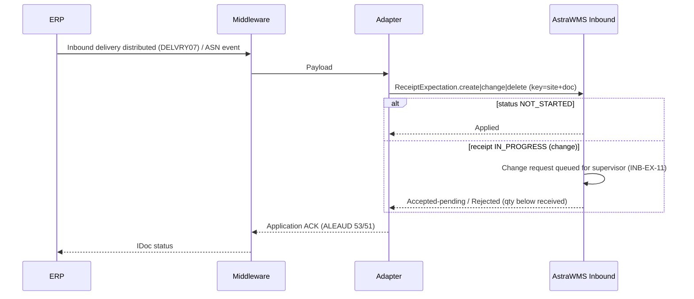

# IF-IB-001 — Inbound Delivery / ASN (ERP → WMS)

| Attribute | Value |
|---|---|
| Interface ID | IF-IB-001 |
| Name | Inbound Delivery / ASN (ERP → WMS) |
| Version / Status | 0.2 — Draft for design review |
| Direction | Inbound to AstraWMS |
| Source → Target | ERP → Middleware → AstraWMS (Inbound service) |
| Pattern | Asynchronous, document-driven; create / change / delete |
| Trigger | Inbound delivery (SAP) or ASN / expected receipt (Oracle) created, changed or deleted |
| Frequency | Event-driven |
| Design peak volume | 5,000 documents/day (peak 1,500/h) |
| Latency SLA | ≤ 2 min |
| Priority | M |
| Canonical message | `ReceiptExpectation v3` |
| Business key (ordering) | siteId + erpDocNo |
| Traced requirements | INB-001, INB-002, INB-004, INB-011, INB-EX-07, INB-EX-11, INT-002, INT-013, XDK-001 |
| Conventions | [ISD-00 Common Interface Conventions](00-common-conventions.md) apply unless stated otherwise |

---

## 1. Purpose & Scope

Creates and maintains the *Receipt Expectation* against which AstraWMS receives vendor deliveries, stock transfer receipts and other planned inbound flows (§1.1). The expectation carries the vendor, expected items and quantities, optional batches and expected SSCCs, and the ERP line references that the receipt confirmation (IF-IB-002) must return.

**In scope**

- Vendor inbound deliveries (from PO/ASN), stock transport inbound deliveries, production receipts distributed as deliveries
- Expected handling units (SSCC) with contents, where the ASN supplies them
- Changes and deletion before receipt starts; change requests after receipt started (INB-EX-11)

**Out of scope**

- Customer returns: IF-RET-001
- Dock appointment booking (carrier portal)
- Blind receipts without ERP document (created in WMS, confirmed by IF-IB-002)

## 2. Process Flow

## 3. Technical Realisation

| ERP Variant | Mechanism | Object / Endpoint | Trigger & Transport | ERP Authorisation (technical user) |
|---|---|---|---|---|
| SAP ECC / S/4HANA (decentralised WMS) | ALE IDoc DELVRY07 | Message type SHP_IBDLV_SAVE_REPLICA (create); SHP_IBDLV_CHANGE (change, full image) *(confirm)*; deletion via change message with deletion indicator | Output type for decentralised WMS on the inbound delivery (application E1, transmission medium ALE) *(confirm output type)*; storage location assigned to the external warehouse | Output processing user only |
| SAP S/4HANA (API variant) | OData API_INBOUND_DELIVERY_SRV;v=0002 (read) on business event | A_InbDeliveryHeader, A_InbDeliveryItem, A_InbDeliveryPartner | Inbound delivery created/changed event *(confirm)* → read-back | S_SERVICE, V_LIKP_VST (shipping/receiving point) display |
| Oracle EBS | Extract via OIC (DB adapter) on ASN import / approved PO schedule | RCV_SHIPMENT_HEADERS / RCV_SHIPMENT_LINES (ASN); PO_HEADERS_ALL / PO_LINES_ALL / PO_LINE_LOCATIONS_ALL (expected receipts without ASN); WSH/RCV for internal requisitions | Poll every 1 min for new/changed ASNs and schedules due within horizon (default 14 days) for WMS-managed organizations | Read-only grants on listed tables |
| Oracle Fusion | REST read on event / polling | ASN / expected shipment lines (receiving expected receipts resource *(confirm)*), purchaseOrders schedules | OIC event on ASN creation or polling every 1 min | Receiving read privileges *(confirm)* |

## 4. Canonical Message — `ReceiptExpectation v3`

Card = cardinality; Req: M mandatory, C conditional, O optional. **PII** fields follow ISD-00 §7.

| Field | Type | Card | Req | Description / Validation |
|---|---|---|---|---|
| header.ownerId / siteId | string(20) | 1 | M | Site from receiving plant / organization |
| expectation.erpDocNo | string(35) | 1 | M | ERP document number (SAP inbound delivery; Oracle shipment number or PO number + release) |
| expectation.erpDocType | code | 1 | M | VENDOR_ASN, VENDOR_PO, STO, PRODUCTION, OTHER |
| expectation.action | code | 1 | M | CREATE, CHANGE, DELETE |
| expectation.vendorId | string(40) | 0..1 | C | Mandatory for vendor flows |
| expectation.shipFromGln | string(13) | 0..1 | O |  |
| expectation.supplyingSiteId | string(20) | 0..1 | C | Mandatory for STO |
| expectation.carrierScac | string(4) | 0..1 | O |  |
| expectation.expectedArrivalUtc | date-time | 1 | M |  |
| expectation.externalRef | string(35) | 0..1 | O | Vendor ASN / delivery note number |
| expectation.billOfLading / containerNo / sealNo | string(35) | 0..1 | O | Seal used by INB-EX-01 |
| expectation.lines[] | object | 1..n | M |  |
| lines[].erpLineRef | string(10) | 1 | M | SAP delivery item (POSNR); Oracle shipment line ID or PO line location ID |
| lines[].itemNo | string(40) | 1 | M |  |
| lines[].qtyExpected / uom | decimal(15,3) / uom | 1 | M | > 0 (0 allowed only with action CHANGE for line cancellation) |
| lines[].lotNo / vendorLotNo | string(40) | 0..1 | O | Pre-assigned batch |
| lines[].poRef | object | 0..1 | C | {poNo, poLine, schedule}: mandatory for vendor flows |
| lines[].stockTypeTarget | code | 1 | M | AVAILABLE, QI, BLOCKED (ERP-determined target) |
| lines[].overTolerancePct / underTolerancePct | decimal(5,2) | 0..1 | O | From PO; default from vendor/item profile (INB-002) |
| lines[].expectedSerials[] | string(40) | 0..n | O |  |
| expectation.handlingUnits[] | object | 0..n | O | {sscc, packagingMaterial, contents[]: {erpLineRef, qty, uom, lotNo}} |
| expectation.sourceChangedAtUtc | date-time | 1 | M | Stale-message rule |

## 5. Field Mapping

| Canonical | SAP ECC / S/4HANA | Oracle EBS | Oracle Fusion | Notes |
|---|---|---|---|---|
| expectation.erpDocNo | E1EDL20-VBELN | RCV_SHIPMENT_HEADERS.SHIPMENT_NUM (ASN) / PO_HEADERS_ALL.SEGMENT1 (+ release) | ShipmentNumber / PO number |  |
| expectation.erpDocType | E1EDL21-LFART (EL → VENDOR_ASN, NL/NLCC receipt → STO) via value map | RECEIPT_SOURCE_CODE (VENDOR / INTERNAL ORDER) + ASN_TYPE | ReceiptSourceCode |  |
| expectation.action | Message type (SAVE_REPLICA → CREATE, CHANGE) + deletion indicator | Derived by adapter (new / changed / cancelled status) | Derived |  |
| expectation.vendorId | E1ADRM1 (PARTNER_Q = 'LF') PARTNER_ID | RCV_SHIPMENT_HEADERS.VENDOR_ID → supplier number + site | VendorNumber + VendorSite |  |
| expectation.carrierScac | E1ADRM1 (PARTNER_Q = 'SP') → carrier SCAC map | FREIGHT_CARRIER_CODE | Carrier |  |
| expectation.expectedArrivalUtc | E1EDT13 (QUALF = '007', delivery date) NTANF/NTANZ *(confirm qualifier)* | EXPECTED_RECEIPT_DATE / PROMISED_DATE | ExpectedReceiptDate | Convert plant local → UTC |
| expectation.externalRef | E1EDL20-LIFEX | PACKING_SLIP | PackingSlip |  |
| expectation.billOfLading | E1EDL20-BOLNR | BILL_OF_LADING | BillOfLading |  |
| expectation.containerNo | E1EDL20-TRAID | CONTAINER_NUM *(confirm)* | n/a |  |
| lines[].erpLineRef | E1EDL24-POSNR | RCV_SHIPMENT_LINES.SHIPMENT_LINE_ID / PO_LINE_LOCATIONS_ALL.LINE_LOCATION_ID | Shipment line / schedule ID | Returned unchanged in IF-IB-002 |
| lines[].itemNo | E1EDL24-MATNR | ITEM_ID → SEGMENT1 | ItemNumber |  |
| lines[].qtyExpected / uom | E1EDL24-LFIMG / VRKME | QUANTITY_SHIPPED (ASN) or open qty (QUANTITY − QUANTITY_RECEIVED) / UNIT_OF_MEASURE | Quantity / UOM | Oracle open qty for PO-based expectations |
| lines[].lotNo | E1EDL24-CHARG | ASN lot (RCV_LOTS_SUPPLY) *(confirm)* | ASN lot |  |
| lines[].vendorLotNo | E1EDL24-LICHN | Vendor lot on ASN *(confirm)* | SupplierLotNumber |  |
| lines[].poRef | E1EDL24-VGBEL / VGPOS (reference PO) | PO_HEADER_ID / PO_LINE_ID / PO_LINE_LOCATION_ID | PO number / line / schedule |  |
| lines[].stockTypeTarget | E1EDL24-INSMK ('X' → QI, 'S' → BLOCKED, space → AVAILABLE) *(confirm values)* | Routing: inspection (ROUTING_HEADER_ID = 2) → QI; direct → AVAILABLE | Routing / inspection required |  |
| lines[].overTolerancePct | Not in DELVRY: via extension segment from EKPO-UEBTO *(confirm)* | PO_LINE_LOCATIONS_ALL.QTY_RCV_TOLERANCE | Receipt tolerance *(confirm)* |  |
| lines[].expectedSerials[] | E1EDL11 (serial numbers) *(confirm segment)* | ASN serials (RCV_SERIALS_SUPPLY) *(confirm)* | ASN serials |  |
| expectation.handlingUnits[] | E1EDL37 (EXIDV = SSCC, VHILM) + E1EDL44 (contents) | ASN LPNs (WMS-enabled orgs only) *(confirm)* | ASN packing units *(confirm)* |  |

### 6.1 Change Handling Matrix

| Expectation status in WMS | CHANGE: qty increase / new line | CHANGE: qty decrease / line delete | DELETE |
|---|---|---|---|
| NOT_STARTED | Apply | Apply | Apply (expectation cancelled) |
| IN_PROGRESS | Apply; supervisor informed | Queue for supervisor; reject if new qty < received qty | Reject (IB001-E03) with reason RECEIPT_IN_PROGRESS |
| CLOSED / CONFIRMED | Reject (IB001-E04) | Reject (IB001-E04) | Reject (IB001-E04) |

## 6. Processing Rules

| ID | Rule |
|---|---|
| IB001-R01 | Expectations are versioned; every applied CHANGE creates a new version with a diff visible to the receiving supervisor. |
| IB001-R02 | Change and delete handling follows matrix §6.1. Rejections are returned as application errors (ALEAUD status 51 with reason text), so the ERP user sees why the change failed. |
| IB001-R03 | SSCCs in handlingUnits[] must be unique across all open expectations at the site. A duplicate is rejected for that HU only (INB-EX-07) and the line falls back to line-level receipt. |
| IB001-R04 | Unknown item or vendor: the whole expectation is parked (dependency) and is not partially created. |
| IB001-R05 | The cross-dock engine (§9) is notified on every create/change so that planned cross-dock allocations can be evaluated before arrival. |
| IB001-R06 | Oracle PO-based expectations (no ASN) are created for schedules due within the horizon and refreshed when the open quantity changes. Receiving stays possible beyond the horizon via PO lookup at the dock (permission INB_RECEIVE_PO_LOOKUP). |
| IB001-R07 | SSCCs are canonical 18-digit values without application identifier (ISD-00 §3.2). The adapter strips a leading AI `00` from 20-character EXIDV values and rejects anything else that is not 18 digits (error DELVRY_SSCC_INVALID, IDoc status 51). |

## 7. Error Handling

Error classes and default retry behaviour: ISD-00 §6.

| Code | Condition | Class | Handling |
|---|---|---|---|
| IB001-E01 | Schema invalid / mandatory field missing | Permanent technical | Reject; alert |
| IB001-E02 | Item or vendor unknown | Dependency (parked) | Park; auto-retry; alert after 30 min |
| IB001-E03 | Delete requested while receipt in progress | Business: conflict | Reject to ERP with reason; supervisor notified |
| IB001-E04 | Change/delete for closed expectation | Business: conflict | Reject to ERP; ERP must process via return/correction |
| IB001-E05 | Duplicate SSCC | Business: correctable | HU ignored, line-level receipt; vendor compliance event logged |
| IB001-E06 | Site not mapped (receiving plant/org not WMS-managed) | Permanent technical | Reject; configuration error in ERP distribution |

## 8. Test Scenarios

| ID | Cat | Scenario | Expected Result |
|---|---|---|---|
| TS-IB001-01 | POS | Vendor inbound delivery with 3 lines, 2 SSCCs with contents | Expectation created ≤ 2 min; SSCC single-scan receipt possible |
| TS-IB001-02 | POS | STO inbound delivery | Expectation with supplyingSiteId; STO flow at dock |
| TS-IB001-03 | VAR | Oracle PO without ASN, schedule within horizon | Expectation from PO schedule with open qty |
| TS-IB001-04 | VAR | Line with stock type QI | Received stock goes to QI |
| TS-IB001-05 | NEG | Delete while receipt in progress | IB001-E03 returned; IDoc status 51 with reason |
| TS-IB001-06 | NEG | Qty decrease below received qty | Rejected; expectation unchanged |
| TS-IB001-07 | NEG | Duplicate SSCC across two deliveries | IB001-E05; second HU ignored |
| TS-IB001-08 | DUP | Same IDoc re-processed | One expectation, no duplicate version |
| TS-IB001-09 | ORD | CHANGE arrives before CREATE (sequence gap) | CHANGE held until CREATE; then both applied in order |
| TS-IB001-10 | VOL | 1,500 deliveries in 1 h | All created; p95 ≤ 2 min |

## 9. Open Points

| # | Item to Confirm | Owner |
|---|---|---|
| 1 | Change message type and deletion indicator in customer SAP release (SHP_IBDLV_CHANGE vs. re-sent replica) | SAP integration lead |
| 2 | Output type and condition records for decentralised WMS distribution | SAP logistics lead |
| 3 | Source of over-delivery tolerance in DELVRY (extension segment) | SAP integration lead |
| 4 | Oracle horizon for PO-based expectations; ASN LPN availability | Oracle functional lead |

## Change Log

| Version | Date | Change |
|---|---|---|
| 0.1 | 2026-09-30 | Initial draft generated from scope §D |
| 0.2 | 2026-09-30 | Rule IB001-R07 (SSCC normalisation) from the sap-adapter implementation |
