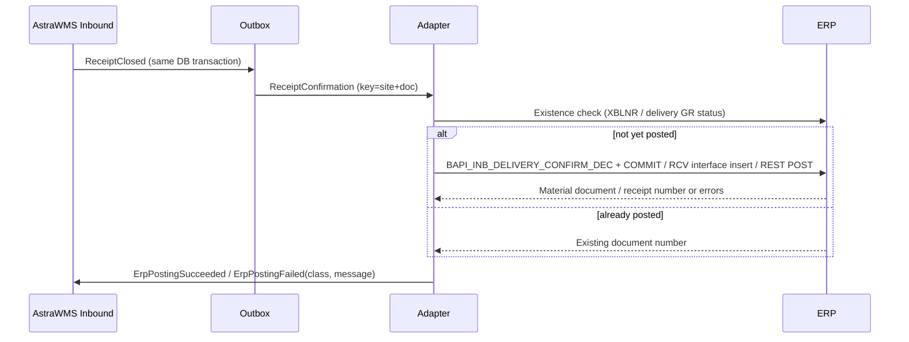

# IF-IB-002 — Receipt Confirmation / Goods Receipt (WMS → ERP)

| Attribute | Value |
|---|---|
| Interface ID | IF-IB-002 |
| Name | Receipt Confirmation / Goods Receipt (WMS → ERP) |
| Version / Status | 0.1 — Draft for design review |
| Direction | Outbound from AstraWMS |
| Source → Target | AstraWMS (Inbound) → Adapter → Middleware → ERP |
| Pattern | Asynchronous, guaranteed delivery; synchronous BAPI/REST call from adapter with application response |
| Trigger | Receipt close (per expectation), or per LPN for Oracle when configured |
| Frequency | Event-driven |
| Design peak volume | 5,000 confirmations/day (peak 1,500/h) |
| Latency SLA | ≤ 2 min to ERP document number returned |
| Priority | M |
| Canonical message | `ReceiptConfirmation v3` |
| Business key (ordering) | siteId + erpDocNo |
| Traced requirements | INB-002, INB-003, INB-006, INB-008, INB-EX-02, INB-EX-03, INB-EX-08, INB-EX-09, INT-010, INT-011, INT-012, INT-014, INT-015 |
| Conventions | [ISD-00 Common Interface Conventions](00-common-conventions.md) apply unless stated otherwise |

---

## 1. Purpose & Scope

Confirms the physically received quantities, batches, serials and handling units to the ERP and triggers the goods receipt posting (financial stock increase). It is the only interface through which planned inbound stock enters ERP inventory for WMS-managed locations.

**In scope**

- Confirmation of vendor, STO and production inbound deliveries with actual quantities
- Batch split (multiple batches per expected line), new batch creation
- Serial numbers and handling units (SSCC)
- Quantity adjustment (short/over within tolerance) and closure
- Blind (unplanned) receipt creation where permitted

**Out of scope**

- Stock status changes after receipt (e.g. QA release): IF-INV-001
- Customer returns: IF-RET-002

## 2. Process Flow

## 3. Technical Realisation

| ERP Variant | Mechanism | Object / Endpoint | Trigger & Transport | ERP Authorisation (technical user) |
|---|---|---|---|---|
| SAP ECC / S/4HANA (decentralised WMS) | RFC BAPI_INB_DELIVERY_CONFIRM_DEC + BAPI_TRANSACTION_COMMIT (alternative: IDoc SHP_IBDLV_CONFIRM_DECENTRAL) | HEADER_DATA, HEADER_CONTROL, DELIVERY, ITEM_DATA, ITEM_CONTROL, ITEM_SERIAL_NO, HANDLING_UNIT_HEADER, HANDLING_UNIT_ITEM, HEADER_DEADLINES, RETURN *(confirm structures in SE37)* | Called by adapter via Integration Suite RFC adapter / Cloud Connector; one call per delivery | S_RFC (function group of the BAPI), V_LIKP_VST, M_MSEG_BWE / M_MSEG_WWE (GR movement type / plant), M_MSEG_LGO |
| Oracle EBS | Receiving open interface | RCV_HEADERS_INTERFACE, RCV_TRANSACTIONS_INTERFACE, MTL_TRANSACTION_LOTS_INTERFACE, MTL_SERIAL_NUMBERS_INTERFACE; Receiving Transaction Processor (RVCTP) | OIC EBS adapter inserts rows with GROUP_ID; RVCTP launched in batch mode for the group; result polled from interface tables + PO_INTERFACE_ERRORS | Insert grants on interface tables; responsibility to submit RVCTP |
| Oracle Fusion | REST receivingReceiptRequests (POST) | /fscmRestApi/resources/11.13.18.05/receivingReceiptRequests (lines, lotItemLots, serialItemSerials, lotSerialItemLots) | Synchronous POST; processing status read from the response / GET by HeaderInterfaceId | Receipt creation privilege *(confirm)* |

## 4. Canonical Message — `ReceiptConfirmation v3`

Card = cardinality; Req: M mandatory, C conditional, O optional. **PII** fields follow ISD-00 §7.

| Field | Type | Card | Req | Description / Validation |
|---|---|---|---|---|
| header.ownerId / siteId | string(20) | 1 | M |  |
| confirmation.wmsTxnId | string(16) | 1 | M | Idempotency key (INT-014) |
| confirmation.erpDocNo | string(35) | 0..1 | C | Mandatory unless blindReceipt = true |
| confirmation.blindReceipt | boolean | 1 | M | True for unplanned receipts (INB-EX-09) |
| confirmation.vendorId | string(40) | 0..1 | C | Mandatory for blind vendor receipts |
| confirmation.receiptCompletedUtc | date-time | 1 | M | Physical receipt time; the posting date is derived from it (INB-008, INT-015) |
| confirmation.final | boolean | 1 | M | True = close expectation (remaining qty not expected) |
| confirmation.lines[] | object | 1..n | M |  |
| lines[].erpLineRef | string(10) | 0..1 | C | As received in IF-IB-001; absent for blind receipt lines |
| lines[].itemNo | string(40) | 1 | M |  |
| lines[].qtyReceived / uom | decimal(15,3) / uom | 1 | M | ≥ 0; 0 = nothing received for that line |
| lines[].lotSplits[] | object | 0..n | C | {lotNo, vendorLotNo, qty, expiryDate, manufacturingDate, countryOfOrigin}: mandatory for lot-controlled items; Σ qty = qtyReceived |
| lines[].serials[] | string(40) | 0..n | C | Mandatory for INBOUND/FULL serial items; count = qty in base UoM |
| lines[].stockStatus | code | 1 | M | AVAILABLE, QI, BLOCKED (see IB002-R04) |
| lines[].reasonCode | code | 0..1 | C | Mandatory if qty differs from expected: SHORT_VENDOR, OVER_ACCEPTED, DAMAGED, REFUSED |
| confirmation.handlingUnits[] | object | 0..n | O | {lpnOrSscc, packagingMaterial, grossWeightKg, contents[]: {erpLineRef, lotNo, qty}} |

## 5. Field Mapping

| Canonical | SAP ECC / S/4HANA | Oracle EBS | Oracle Fusion | Notes |
|---|---|---|---|---|
| confirmation.erpDocNo | HEADER_DATA-DELIV_NUMB / HEADER_CONTROL-DELIV_NUMB / DELIVERY | RCV_HEADERS_INTERFACE.SHIPMENT_HEADER_ID (ASN) or SHIPMENT_NUM | ShipmentNumber (header) |  |
| confirmation.wmsTxnId | HEADER_DATA reference field *(confirm)* → material document XBLNR / MKPF-BKTXT | RCV_HEADERS_INTERFACE.COMMENTS / ATTRIBUTE* (DFF) *(confirm)*; RCV_TRANSACTIONS_INTERFACE.DOCUMENT_NUM | Header attribute / Comments *(confirm)* | Used for existence check |
| confirmation.receiptCompletedUtc | HEADER_DEADLINES (TIMETYPE actual GR/GI date *(confirm value)*, TIMESTAMP_UTC) | TRANSACTION_DATE (org local) | TransactionDate | Posting-period rule INT-015 |
| confirmation.final | Remaining qty reduced via ITEM_CONTROL-CHG_DELQTY = 'X' with DLV_QTY = received | Not required (PO stays open unless closed by tolerance) | Same as EBS |  |
| post GR | HEADER_CONTROL post-GR indicator *(confirm field)* | TRANSACTION_TYPE = 'RECEIVE', AUTO_TRANSACT_CODE = 'DELIVER' (direct routing) or RECEIVE only (inspection routing) | TransactionType RECEIVE, AutoTransactCode DELIVER |  |
| lines[].erpLineRef | ITEM_DATA-DELIV_ITEM | SHIPMENT_LINE_ID or PO_LINE_LOCATION_ID (+ PO_HEADER_ID, PO_LINE_ID) | DocumentLineNumber / DocumentScheduleNumber |  |
| lines[].itemNo | ITEM_DATA-MATERIAL | ITEM_ID / ITEM_NUM | ItemNumber |  |
| lines[].qtyReceived / uom | ITEM_DATA-DLV_QTY + SALES_UNIT (+ FACT_UNIT_NOM/DENOM) | QUANTITY + UOM_CODE | Quantity + UnitOfMeasure |  |
| lines[].lotSplits[] | Batch split items: ITEM_DATA with HIERARITEM = parent, USEHIERITM = '1', new item numbers 900001+ , BATCH | MTL_TRANSACTION_LOTS_INTERFACE (PRODUCT_CODE = 'RCV', PRODUCT_TRANSACTION_ID = INTERFACE_TRANSACTION_ID, LOT_NUMBER, TRANSACTION_QUANTITY, LOT_EXPIRATION_DATE) | lotItemLots (LotNumber, TransactionQuantity, LotExpirationDate) | SAP new batch created at GR if allowed; else BAPI_BATCH_CREATE before confirm |
| lines[].serials[] | ITEM_SERIAL_NO (DELIV_NUMB, ITM_NUMBER, SERIALNO) | MTL_SERIAL_NUMBERS_INTERFACE (FM_SERIAL_NUMBER, TO_SERIAL_NUMBER, PRODUCT_CODE = 'RCV') | serialItemSerials (FromSerialNumber, ToSerialNumber) | Ranges compressed where contiguous |
| lines[].stockStatus | Determined by ERP at GR (INSMK / QM); differences corrected by IF-INV-001 after GR | SUBINVENTORY (status-bearing subinventory) / routing | Subinventory | See IB002-R04 |
| destination bucket | ITEM_DATA storage location = WMS-managed SLoc (from delivery) | SUBINVENTORY + LOCATOR_ID (bucket map) | Subinventory + Locator |  |
| confirmation.handlingUnits[] | HANDLING_UNIT_HEADER (HDL_UNIT_EXID = SSCC, HDL_UNIT_EXID_TY, SHIP_MAT) + HANDLING_UNIT_ITEM (HDL_UNIT_INTO, DELIV_ITEM, PACK_QTY) | LPN fields in RCV_TRANSACTIONS_INTERFACE (LPN / TRANSFER_LPN, WMS-enabled orgs) *(confirm)* | LicensePlateNumber on lines *(confirm)* | Only if HU-managed in ERP |
| ERP document returned | RETURN + material document via delivery document flow (VBFA) read-back | RCV_SHIPMENT_HEADERS.RECEIPT_NUM | ReceiptNumber | Stored against wmsTxnId |

## 6. Processing Rules

| ID | Rule |
|---|---|
| IB002-R01 | One confirmation per expectation at receipt close (SAP decentralised deliveries are confirmed once). Oracle may be configured for per-LPN confirmation (partial receipts), each with its own wmsTxnId. |
| IB002-R02 | Before any (re)post the adapter checks whether a document with this wmsTxnId already exists. If it does, it returns that document number without re-posting (INT-014). |
| IB002-R03 | Batch splits: SAP requires batch-split sub-items under the original delivery item; Σ split qty = qtyReceived. For Oracle, lots are children of the line. |
| IB002-R04 | Stock status: the ERP determines the stock type at GR (QM-active material or delivery INSMK). If the WMS decision differs (e.g. a WMS inspection rule sets QI), the adapter posts a status change through IF-INV-001 immediately after the GR succeeds, correlated to the same wmsTxnId. |
| IB002-R05 | Over-receipt beyond the ERP tolerance cannot be confirmed. WMS enforces INB-002 so that confirmed qty is always within ERP tolerance, and excess stays in OVERAGE status (INB-EX-02). |
| IB002-R06 | Posting date = local date of receiptCompletedUtc at the site. If that period is closed in ERP, the first open period is used and the physical date is kept in the reference text (INT-015). |
| IB002-R07 | Store-and-forward: while ERP is unavailable the warehouse continues; received stock is fully usable in WMS (INT-010). Unposted confirmations are shown in the monitor with value estimate. |
| IB002-R08 | Blind receipts (blindReceipt = true): SAP creates an inbound delivery first (BAPI_INB_DELIVERY_SAVEREPLICA *(confirm usage)*, or GR mvt 501 without PO if policy allows); Oracle creates an unordered receipt. Allowed only for vendors/items where the policy flag is set. |

## 7. Error Handling

Error classes and default retry behaviour: ISD-00 §6.

| Code | Condition | Class | Handling |
|---|---|---|---|
| IB002-E01 | ERP lock (delivery or material locked by another user) | Transient technical | Retry per ISD-00 §6 |
| IB002-E02 | Posting period closed (SAP M7 053 or equivalent) | Business: correctable | Error queue; finance opens period or rule IB002-R06 re-dates; reprocess |
| IB002-E03 | Delivery already goods-receipted (not by this wmsTxnId) | Business: conflict | Conflict workflow: compare ERP GR with WMS receipt; correct with IF-INV-001 adjustments |
| IB002-E04 | Batch does not exist and automatic creation not allowed | Business: correctable | Adapter calls batch creation (SAP BAPI_BATCH_CREATE) then retries once; else error queue |
| IB002-E05 | Serial number already exists in ERP for the material | Business: correctable | Error queue; inventory control investigates (INV-EX-03) |
| IB002-E06 | Quantity exceeds PO tolerance in ERP | Business: correctable | Error queue; buyer increases PO or excess is returned (INB-EX-02) |
| IB002-E07 | Oracle interface row in ERROR (PO_INTERFACE_ERRORS) | Business: correctable | Error text mapped to monitor; correct and reprocess (new GROUP_ID, same wmsTxnId) |

## 8. Test Scenarios

| ID | Cat | Scenario | Expected Result |
|---|---|---|---|
| TS-IB002-01 | POS | Full receipt of 3-line delivery, direct to AVAILABLE | GR posted; material document number stored; ERP stock in WMS SLoc/subinventory increased |
| TS-IB002-02 | VAR | Batch split: line received in 2 lots, one new | Split items posted; new batch created with expiry |
| TS-IB002-03 | VAR | Serial item, 25 serials in 2 ranges | Serials posted; count matches |
| TS-IB002-04 | VAR | Short receipt, final = true, reason SHORT_VENDOR | Delivery qty reduced; PO remains open per ERP config |
| TS-IB002-05 | VAR | WMS inspection sets QI where ERP GR is unrestricted | GR posted, then 322 status change via IF-INV-001 correlated |
| TS-IB002-06 | VAR | Oracle inspection routing | RECEIVE only; stock in receiving until inspection/deliver |
| TS-IB002-07 | NEG | Posting period closed | IB002-E02; succeeds after period open / re-date |
| TS-IB002-08 | DUP | Adapter crash after ERP commit, before ACK | Existence check finds document; no second GR |
| TS-IB002-09 | OUT | ERP down 4 h during receiving | Receiving continues; confirmations drain in order after recovery ≤ 30 min |
| TS-IB002-10 | VOL | 1,500 confirmations in 1 h | p95 ≤ 2 min |
| TS-IB002-11 | SEC | Technical user lacks movement type authorisation | Permanent error, alert; no partial posting |

## 9. Open Points

| # | Item to Confirm | Owner |
|---|---|---|
| 1 | Exact BAPI structure field names (post-GR flag, reference field, deadline time type) in customer release | SAP integration lead |
| 2 | HU management active in ERP storage location? (determines HANDLING_UNIT_* usage) | SAP logistics lead |
| 3 | Oracle: per-LPN vs per-expectation confirmation; routing per org | Oracle functional lead |
| 4 | Policy for blind receipts per vendor/item class | Receiving process owner |

## Change Log

| Version | Date | Change |
|---|---|---|
| 0.1 | 2026-09-30 | Initial draft generated from scope §D |
