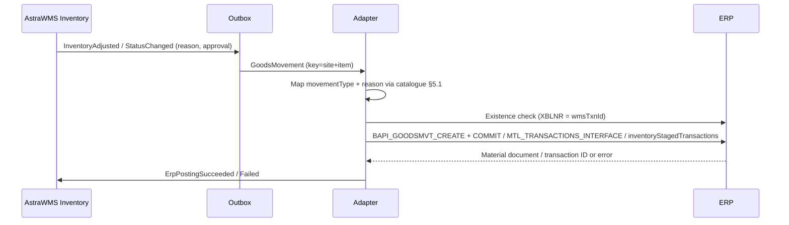

# IF-INV-001 — WMS-Initiated Goods Movements (WMS → ERP)

| Attribute | Value |
|---|---|
| Interface ID | IF-INV-001 |
| Name | WMS-Initiated Goods Movements (WMS → ERP) |
| Version / Status | 0.1 — Draft for design review |
| Direction | Outbound from AstraWMS |
| Source → Target | AstraWMS (Inventory) → Adapter → ERP |
| Pattern | Asynchronous, guaranteed delivery; one ERP posting per WMS inventory transaction (or bundle) |
| Trigger | Approved adjustment, status change, scrap, sample, transfer or conversion in WMS |
| Frequency | Event-driven |
| Design peak volume | 30,000 movements/day |
| Latency SLA | ≤ 2 min |
| Priority | M |
| Canonical message | `GoodsMovement v2` |
| Business key (ordering) | siteId + itemNo |
| Traced requirements | INV-002, INV-006, INV-007, QM-003, INB-EX-04, PCK-EX-02, RET-004, INT-010, INT-011, INT-014, INT-015 |
| Conventions | [ISD-00 Common Interface Conventions](00-common-conventions.md) apply unless stated otherwise |

---

## 1. Purpose & Scope

Posts to the ERP every WMS-originated stock change that affects ERP quantities or stock types at WMS-managed storage locations / subinventories: inventory adjustments, stock status changes (QI, blocked), scrap, sample consumption, bucket transfers, item and lot conversions, owner transfers and returns disposition.

**In scope**

- All movement types in catalogue §5.1
- Reason codes mapped to ERP movement reasons / account aliases
- Batch and serial details

**Out of scope**

- Receipts against deliveries (IF-IB-002, IF-RET-002)
- Goods issue for deliveries (IF-OB-003)
- Kitting consumption/production (IF-KIT-001)
- Physical inventory document postings (IF-INV-004)
- Movements purely inside WMS (bin-to-bin, LPN moves): never sent

## 2. Process Flow

## 3. Technical Realisation

| ERP Variant | Mechanism | Object / Endpoint | Trigger & Transport | ERP Authorisation (technical user) |
|---|---|---|---|---|
| SAP ECC / S/4HANA | RFC BAPI_GOODSMVT_CREATE + BAPI_TRANSACTION_COMMIT (IDoc MBGMCR03 alternative) | GOODSMVT_HEADER, GOODSMVT_CODE, GOODSMVT_ITEM, GOODSMVT_SERIALNUMBER, RETURN; exports MATERIALDOCUMENT, MATDOCUMENTYEAR | One call per movement (items of same GM_CODE may be bundled per wmsTxnId) | S_RFC, M_MSEG_BWA (movement types in §5.1), M_MSEG_WWA, M_MSEG_LGO |
| Oracle EBS | Inventory open interface | MTL_TRANSACTIONS_INTERFACE (+ MTL_TRANSACTION_LOTS_INTERFACE, MTL_SERIAL_NUMBERS_INTERFACE); Inventory Transaction Manager | OIC inserts with PROCESS_FLAG = 1, TRANSACTION_MODE = 3; status polled (ERROR_CODE / ERROR_EXPLANATION); result in MTL_MATERIAL_TRANSACTIONS | Insert grants on interface tables; Transaction Manager running |
| Oracle Fusion | REST inventoryStagedTransactions (POST) / FBDI 'Inventory Transaction Import' for bulk | /fscmRestApi/resources/11.13.18.05/inventoryStagedTransactions (lots, serials children) | Synchronous POST; processing status via GET / ESS job | Inventory transaction privileges *(confirm)* |

## 4. Canonical Message — `GoodsMovement v2`

Card = cardinality; Req: M mandatory, C conditional, O optional. **PII** fields follow ISD-00 §7.

| Field | Type | Card | Req | Description / Validation |
|---|---|---|---|---|
| header.ownerId / siteId | string(20) | 1 | M |  |
| movement.wmsTxnId | string(16) | 1 | M | Idempotency key |
| movement.movementType | code | 1 | M | Catalogue §5.1 |
| movement.reasonCode | code | 1 | M | WMS reason code; mapping table per ERP (INV-002) |
| movement.physicalDateTimeUtc | date-time | 1 | M | Posting-date rule INT-015 |
| movement.approvedBy | string(40) | 0..1 | C | Mandatory for adjustments above threshold; e-signature reference for regulated items |
| movement.items[] | object | 1..n | M |  |
| items[].itemNo | string(40) | 1 | M |  |
| items[].qty / uom | decimal(15,3) / uom | 1 | M | > 0; direction given by movementType |
| items[].fromBucket / toBucket | string(10) | 1 / 0..1 | M / C | ERP storage location / subinventory via bucket map |
| items[].lotNo / toLotNo | string(40) | 0..1 | C | Lot-controlled items; toLotNo for LOT_CHANGE |
| items[].toItemNo | string(40) | 0..1 | C | ITEM_CONVERT |
| items[].serials[] | string(40) | 0..n | C | Serial items |
| items[].costCenter | string(10) | 0..1 | C | SCRAP / SAMPLE (SAP) |
| items[].fromOwner / toOwner | string(20) | 0..1 | C | OWNER_TRANSFER |
| items[].text | string(50) | 0..1 | O | Item text (count ID, investigation ref) |

## 5. Field Mapping

The movement catalogue (§5.1) defines the ERP transaction per `movementType`. Field-level mapping:

| Canonical | SAP ECC / S/4HANA | Oracle EBS | Oracle Fusion | Notes |
|---|---|---|---|---|
| movement.wmsTxnId | GOODSMVT_HEADER-REF_DOC_NO (→ MKPF-XBLNR) | TRANSACTION_REFERENCE + SOURCE_LINE_ID | TransactionReference / SourceLineId | Existence check key |
| movement.physicalDateTimeUtc | GOODSMVT_HEADER-PSTNG_DATE (site local date) / DOC_DATE | TRANSACTION_DATE | TransactionDate |  |
| movement.reasonCode | GOODSMVT_ITEM-MOVE_REAS (+ HEADER_TXT) | REASON_ID + TRANSACTION_SOURCE_ID (account alias) | ReasonName / AccountAlias | Mapping table |
| movement.movementType | GOODSMVT_CODE-GM_CODE + GOODSMVT_ITEM-MOVE_TYPE | TRANSACTION_TYPE_ID (+ TRANSACTION_SOURCE_TYPE_ID) | TransactionTypeName | §5.1 |
| items[].itemNo | GOODSMVT_ITEM-MATERIAL (MATERIAL_LONG in S/4) | INVENTORY_ITEM_ID / ITEM_SEGMENT1 | ItemNumber |  |
| site | GOODSMVT_ITEM-PLANT | ORGANIZATION_ID | OrganizationCode |  |
| items[].fromBucket | GOODSMVT_ITEM-STGE_LOC | SUBINVENTORY_CODE (+ LOCATOR_ID) | SubinventoryCode / Locator |  |
| items[].toBucket | GOODSMVT_ITEM-MOVE_STLOC | TRANSFER_SUBINVENTORY | TransferSubinventory |  |
| items[].qty / uom | ENTRY_QNT / ENTRY_UOM | TRANSACTION_QUANTITY (signed) / TRANSACTION_UOM | TransactionQuantity / TransactionUnitOfMeasure | Oracle issues negative |
| items[].lotNo / toLotNo | BATCH / MOVE_BATCH | MTL_TRANSACTION_LOTS_INTERFACE.LOT_NUMBER | lots child |  |
| items[].toItemNo | MOVE_MAT | Second (receipt) interface row | Second transaction |  |
| items[].serials[] | GOODSMVT_SERIALNUMBER (MATDOC_ITM, SERIALNO) | MTL_SERIAL_NUMBERS_INTERFACE | serials child |  |
| items[].costCenter | COSTCENTER | DISTRIBUTION_ACCOUNT_ID (from alias) | Alias account |  |
| stock type | STCK_TYPE for postings from QI/blocked (e.g. 551 from blocked: 'S') | Source subinventory | Source subinventory |  |

### 5.1 Movement Catalogue

| WMS movementType | Business event | SAP GM_CODE / movement type | Oracle EBS TRANSACTION_TYPE_ID | Oracle Fusion transaction type | Extra mandatory data |
|---|---|---|---|---|---|
| ADJ_POS / ADJ_NEG | Count or investigation adjustment | 05 / 701 · 03 / 702 (or 711/712 per reason) | 41 / 31 Account alias receipt / issue (alias per reason) | Account alias receipt / issue | Reason code → MOVE_REAS / alias |
| SCRAP | Scrap / destroy | 03 / 551 | 31 Account alias issue (alias SCRAP) | Account alias issue | Cost center (SAP) / alias account |
| STATUS_AVL_TO_QI | Available → QI | 04 / 322 | 2 Subinventory transfer to QI subinventory (or status update, INV001-R05) | Subinventory transfer | — |
| STATUS_QI_TO_AVL | QI → Available | 04 / 321 | 2 Subinventory transfer | Subinventory transfer | — |
| STATUS_AVL_TO_BLK | Available → Blocked | 04 / 344 | 2 Subinventory transfer to HOLD | Subinventory transfer | — |
| STATUS_BLK_TO_AVL | Blocked → Available | 04 / 343 | 2 Subinventory transfer | Subinventory transfer | — |
| STATUS_QI_TO_BLK | QI → Blocked | 04 / 350 | 2 Subinventory transfer | Subinventory transfer | — |
| STATUS_BLK_TO_QI | Blocked → QI | 04 / 349 | 2 Subinventory transfer | Subinventory transfer | — |
| SAMPLE | Sample consumption | 03 / 333 (unrestricted) or 331 (QI) | 31 Account alias issue (alias SAMPLE) | Account alias issue | Cost center (SAP) |
| BUCKET_TRANSFER | WMS bucket change (e.g. DAMAGED zone mapped to other SLoc) | 04 / 311 | 2 Subinventory transfer | Subinventory transfer | To bucket |
| ITEM_CONVERT | Relabel / repack to other item | 04 / 309 | 31 + 41 alias issue/receipt pair | Alias issue + receipt | To item |
| LOT_CHANGE | Regrade / lot-to-lot | 04 / 309 (batch to batch) | Lot translate / split / merge transaction *(confirm IDs)* | Lot translate | To lot |
| OWNER_TRANSFER | 3PL title change (consignment) | 04 / 411 K or 412 K (special stock) *(confirm)* | Consignment ownership transfer *(confirm)* | Consumption advice / ownership change *(confirm)* | From/to owner |
| RETURNS_RELEASE | Returns disposition → unrestricted | 04 / 453 | 2 Subinventory transfer from returns subinventory | Subinventory transfer | — |

## 6. Processing Rules

| ID | Rule |
|---|---|
| INV001-R01 | Each WMS inventory transaction with ERP relevance produces one GoodsMovement with a unique wmsTxnId (≤ 16 chars). Transactions that are not ERP-relevant (bin moves, LPN moves within the same bucket and status) are never sent. |
| INV001-R02 | Ordering per (site, item): movements are posted in WMS transaction order, so that a negative adjustment never overtakes the receipt that made the stock available (INT-013). |
| INV001-R03 | Existence check before posting: SAP MKPF/MATDOC with XBLNR = wmsTxnId; Oracle MTL_MATERIAL_TRANSACTIONS with TRANSACTION_REFERENCE = wmsTxnId. |
| INV001-R04 | Adjustments above the approval threshold are sent only after approval (INV-002, INV-008); approvedBy is carried for audit. |
| INV001-R05 | Oracle stock status: where the customer uses on-hand material status (not status subinventories), status changes use the material status update API *(confirm)* instead of subinventory transfer; configured per organization. |
| INV001-R06 | A movement that has already been processed and that WMS reverses is sent as a new movement with the reverse type (never as an ERP document reversal), linked by text. |
| INV001-R07 | The posting date follows INT-015. Monthly cut-off: movements dated in a closed period are posted to the first open period and keep the physical date in the header text. |

## 7. Error Handling

Error classes and default retry behaviour: ISD-00 §6.

| Code | Condition | Class | Handling |
|---|---|---|---|
| INV001-E01 | Material locked | Transient technical | Retry |
| INV001-E02 | Stock deficit in ERP for issue/transfer (SAP M7 021) | Business: correctable | Reconciliation (IF-INV-003) to find missing prior posting; resolve and reprocess |
| INV001-E03 | Posting period closed | Business: correctable | INT-015 rule; reprocess |
| INV001-E04 | Reason code not mapped | Permanent technical | Configuration fix; reprocess |
| INV001-E05 | Cost center invalid / blocked | Business: correctable | Finance corrects mapping; reprocess |
| INV001-E06 | Oracle ERROR_CODE on interface row | Business: correctable | Error text surfaced; correct; reinsert with same wmsTxnId |

## 8. Test Scenarios

| ID | Cat | Scenario | Expected Result |
|---|---|---|---|
| TS-INV001-01 | POS | Cycle count negative adjustment 5 EA, approved | 702 / alias issue posted with reason |
| TS-INV001-02 | POS | QA release QI → Available for lot | 321 / subinventory transfer posted |
| TS-INV001-03 | VAR | Scrap of damaged serial item | 551 with serial and cost center |
| TS-INV001-04 | VAR | Item conversion (relabel) | 309 / alias pair posted |
| TS-INV001-05 | VAR | 3PL owner transfer | Owner-transfer posting per §5.1 |
| TS-INV001-06 | NEG | Unmapped reason code | INV001-E04 |
| TS-INV001-07 | NEG | ERP stock deficit | INV001-E02; error queue; reprocess after correction |
| TS-INV001-08 | DUP | Re-send after commit | Existence check; no double posting |
| TS-INV001-09 | ORD | Adjustment for item while earlier GR still in store-and-forward | Adjustment waits for GR |
| TS-INV001-10 | VOL | 30,000 movements in 8 h | p95 ≤ 2 min |

## 9. Open Points

| # | Item to Confirm | Owner |
|---|---|---|
| 1 | Reason code → movement reason / account alias mapping table | Finance + inventory process owner |
| 2 | Oracle: status subinventories vs on-hand material status per organization | Oracle functional lead |
| 3 | Owner-transfer (consignment) movement types for 3PL | SAP / Oracle functional leads |

## Change Log

| Version | Date | Change |
|---|---|---|
| 0.1 | 2026-09-30 | Initial draft generated from scope §D |
