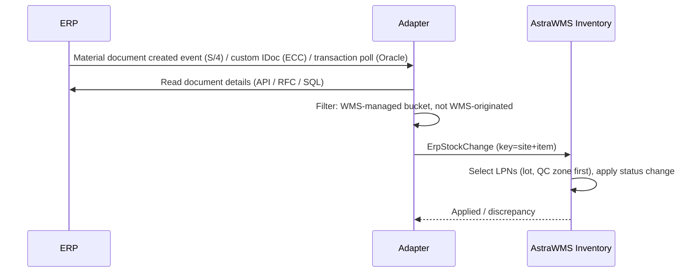

# IF-INV-002 — ERP-Originated Stock Status Changes (ERP → WMS)

| Attribute | Value |
|---|---|
| Interface ID | IF-INV-002 |
| Name | ERP-Originated Stock Status Changes (ERP → WMS) |
| Version / Status | 0.1 — Draft for design review |
| Direction | Inbound to AstraWMS |
| Source → Target | ERP → Middleware → AstraWMS (Inventory) |
| Pattern | Asynchronous notification (thin event + read-back) |
| Trigger | Stock posting in ERP at a WMS-managed location that WMS did not originate: QM usage decision, restricted-use postings, authorised ERP transfer postings |
| Frequency | Event-driven |
| Design peak volume | 2,000 notifications/day |
| Latency SLA | ≤ 60 s |
| Priority | M |
| Canonical message | `ErpStockChange v1` |
| Business key (ordering) | siteId + itemNo |
| Traced requirements | QM-004, QM-EX-01, INV-005, INV-EX-01, INT-012 |
| Conventions | [ISD-00 Common Interface Conventions](00-common-conventions.md) apply unless stated otherwise |

---

## 1. Purpose & Scope

Applies to AstraWMS the stock changes that are legitimately made in the ERP for WMS-managed stock, mainly QM usage decisions (release QI stock, move to blocked, post samples) when the usage decision is taken in the ERP (§12.1). All other physical movements at WMS-managed locations are blocked in the ERP by authorisation and configuration.

**In scope**

- Stock type changes (QI ↔ available ↔ blocked) posted in ERP
- Sample consumption posted by ERP QM
- Scrap posted from a QM usage decision

**Out of scope**

- Batch restriction flag (IF-MD-004)
- Postings originated by WMS and echoed back (filtered, rule INV002-R01)

## 2. Process Flow

## 3. Technical Realisation

| ERP Variant | Mechanism | Object / Endpoint | Trigger & Transport | ERP Authorisation (technical user) |
|---|---|---|---|---|
| SAP S/4HANA | Business event for material document creation via Event Mesh *(confirm event name)* + OData API_MATERIAL_DOCUMENT_SRV read | A_MaterialDocumentHeader, A_MaterialDocumentItem | Event subscription filtered by plant; read-back of items | S_SERVICE, M_MSEG_WMB display |
| SAP ECC | Custom outbound: BAdI MB_DOCUMENT_BADI (MB_DOCUMENT_UPDATE) → IDoc/proxy | Custom message ZWMS_STOCKCHG *(to be built)* with MKPF/MSEG fields | Asynchronous update task; filtered by plant/SLoc/movement type | Development in ERP |
| Oracle EBS | Polling of committed transactions | MTL_MATERIAL_TRANSACTIONS (filtered by organization, WMS subinventories, source ≠ AstraWMS) + MTL_TRANSACTION_LOT_NUMBERS | OIC poll every 30 s on TRANSACTION_ID watermark | Read-only grants |
| Oracle Fusion | Polling of inventory transactions (REST / BIP) *(confirm resource)* | Inventory transaction history | Poll every 30 s | Read privilege *(confirm)* |

## 4. Canonical Message — `ErpStockChange v1`

Card = cardinality; Req: M mandatory, C conditional, O optional. **PII** fields follow ISD-00 §7.

| Field | Type | Card | Req | Description / Validation |
|---|---|---|---|---|
| change.erpDocNo / erpDocYear / erpDocItem | string | 1 | M | ERP document reference (dedupe key) |
| change.changeType | code | 1 | M | STATUS_CHANGE, SAMPLE_ISSUE, SCRAP |
| change.itemNo / lotNo | string(40) | 1 / 0..1 | M / C |  |
| change.bucket | string(10) | 1 | M | ERP SLoc / subinventory (must be WMS-managed) |
| change.qty / uom | decimal(15,3) / uom | 1 | M |  |
| change.fromStatus / toStatus | code | 1 | M | AVAILABLE, QI, BLOCKED, NONE (for issues) |
| change.inspectionLot | string(12) | 0..1 | O | QM inspection lot |
| change.usageDecisionCode | string(10) | 0..1 | O | QM UD code |
| change.erpUser / postedAtUtc | string / date-time | 1 | M | Audit |

## 5. Field Mapping

| Canonical | SAP ECC / S/4HANA | Oracle EBS | Oracle Fusion | Notes |
|---|---|---|---|---|
| change.erpDocNo / Year / Item | MBLNR / MJAHR / ZEILE (A_MaterialDocumentItem) | TRANSACTION_ID | TransactionId |  |
| change.changeType / from/toStatus | BWART value map (321, 322, 343, 344, 349, 350, 331/333, 553/555 *(confirm)*) | TRANSACTION_TYPE_ID + subinventory status map | Transaction type + subinventory |  |
| change.itemNo / lotNo | MATNR / CHARG | INVENTORY_ITEM_ID / LOT_NUMBER | ItemNumber / LotNumber |  |
| change.bucket | LGORT | SUBINVENTORY_CODE | SubinventoryCode |  |
| change.qty / uom | ERFMG / ERFME (or MENGE / MEINS) | PRIMARY_QUANTITY / PRIMARY_UOM | PrimaryQuantity |  |
| change.inspectionLot | QALS-PRUEFLOS via MSEG reference *(confirm)* | Quality collection plan ref *(confirm)* | Inspection ref |  |
| WMS-origin filter | MKPF-XBLNR matches wmsTxnId pattern / technical user | SOURCE_CODE = 'ASTRAWMS' | SourceCode | Rule INV002-R01 |

## 6. Processing Rules

| ID | Rule |
|---|---|
| INV002-R01 | Loop prevention: documents created by the AstraWMS technical user or carrying a wmsTxnId reference are ignored (logged as ECHO). |
| INV002-R02 | LPN selection for status change: same lot, current status = fromStatus, preferring stock in QC zones and then FIFO by receipt date. LPNs are split if needed. Stock already allocated is de-allocated and re-allocated (INV-005). |
| INV002-R03 | If WMS stock in fromStatus is lower than the ERP quantity, the available quantity is applied and a discrepancy is logged to the reconciliation workbench (INV-EX-01, QM-EX-01). |
| INV002-R04 | Sample or scrap issues posted in the ERP create WMS pick tasks ('pull sample') when stock is still physically present, so that physical and system stock stay aligned. Until the task is done, the quantity is held in status ISSUED_PENDING. |
| INV002-R05 | Any ERP posting at a WMS-managed bucket that is not in the whitelisted movement list raises a P2 alert (policy breach) and a discrepancy entry. |

## 7. Error Handling

Error classes and default retry behaviour: ISD-00 §6.

| Code | Condition | Class | Handling |
|---|---|---|---|
| INV002-E01 | Insufficient WMS stock in fromStatus | Business: conflict | Apply partial; discrepancy workbench |
| INV002-E02 | Non-whitelisted ERP movement at WMS bucket | Business: conflict | Alert; discrepancy; no automatic change |
| INV002-E03 | Read-back failed | Transient technical | Retry |

## 8. Test Scenarios

| ID | Cat | Scenario | Expected Result |
|---|---|---|---|
| TS-INV002-01 | POS | SAP QM usage decision accept → 321 for lot | WMS QI → AVAILABLE ≤ 60 s; putaway from QC zone created |
| TS-INV002-02 | POS | UD reject → 350 | Lot BLOCKED; RTV/scrap disposition pending |
| TS-INV002-03 | VAR | QM sample posting 331 of 2 EA | Sample pull task; qty ISSUED_PENDING |
| TS-INV002-04 | NEG | ERP user posts 311 into WMS SLoc (policy breach) | Alert; discrepancy |
| TS-INV002-05 | NEG | UD for qty greater than WMS QI stock | Partial apply; discrepancy logged |
| TS-INV002-06 | DUP | Same material document event twice | Applied once |
| TS-INV002-07 | ORD | Echo of WMS-originated 322 | Ignored as ECHO |

## 9. Open Points

| # | Item to Confirm | Owner |
|---|---|---|
| 1 | S/4 material document event availability; ECC custom BAdI development effort | SAP integration lead |
| 2 | Whitelisted ERP movement types per site | QA + inventory process owners |

## Change Log

| Version | Date | Change |
|---|---|---|
| 0.1 | 2026-09-30 | Initial draft generated from scope §D |
