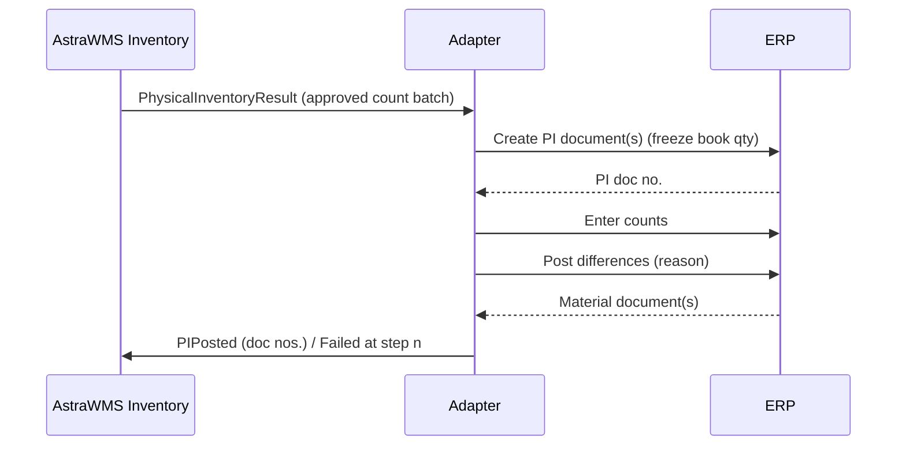

# IF-INV-004 — Physical Inventory Documents (WMS → ERP)

| Attribute | Value |
|---|---|
| Interface ID | IF-INV-004 |
| Name | Physical Inventory Documents (WMS → ERP) |
| Version / Status | 0.1 — Draft for design review |
| Direction | Outbound from AstraWMS |
| Source → Target | AstraWMS (Inventory) → Adapter → ERP |
| Pattern | Asynchronous saga of synchronous calls: create → count → post differences |
| Trigger | Approved count results where audit policy requires ERP physical inventory documents (wall-to-wall or cycle count per policy) |
| Frequency | Event-driven / end of count |
| Design peak volume | 10,000 count items/day; wall-to-wall up to 150,000 items |
| Latency SLA | ≤ 5 min per count batch |
| Priority | M |
| Canonical message | `PhysicalInventoryResult v1` |
| Business key (ordering) | siteId + countId |
| Traced requirements | INV-002, INV-003, INV-004, INV-008, INV-EX-04, RPT-062 |
| Conventions | [ISD-00 Common Interface Conventions](00-common-conventions.md) apply unless stated otherwise |

---

## 1. Purpose & Scope

Records approved WMS count results as ERP physical inventory documents, so that the audit trail of counts and differences is in the ERP where auditors expect it. Sites without this policy use IF-INV-001 net adjustments instead.

**In scope**

- PI document creation per count batch
- Count entry (including zero counts)
- Posting of differences with reason

**Out of scope**

- Count execution and approval (WMS)
- Adjustments without PI documents (IF-INV-001)

## 2. Process Flow

## 3. Technical Realisation

| ERP Variant | Mechanism | Object / Endpoint | Trigger & Transport | ERP Authorisation (technical user) |
|---|---|---|---|---|
| SAP ECC / S/4HANA | RFC BAPI_MATERIAL_PHYSINV_CREATE_MULT, BAPI_MATERIAL_PHYSINV_COUNT, BAPI_MATERIAL_PHYSINV_POST_DIFF (+ COMMIT each) | HEAD (PLANT, STGE_LOC, DOC_DATE, PLAN_DATE, reference *(confirm)*), ITEMS (MATERIAL, BATCH, ENTRY_QNT, ENTRY_UOM, ZERO_COUNT); POST_DIFF ITEMS (ITEM, REASON) | Sequential calls per count batch | S_RFC, M_ISEG_WIB (create), M_ISEG_WZB (count), M_ISEG_WDB (post differences) |
| S/4HANA (API variant) | OData API_PHYSICAL_INVENTORY_DOC_SRV | Header/item entities with count and post actions *(confirm)* | Same sequence | S_SERVICE + M_ISEG_* |
| Oracle EBS | Cycle count interface | MTL_CC_ENTRIES_INTERFACE (CYCLE_COUNT_HEADER_ID, ORGANIZATION_ID, INVENTORY_ITEM_ID, SUBINVENTORY, LOCATOR_ID, LOT_NUMBER, COUNT_QUANTITY, COUNT_UOM, COUNT_DATE, EMPLOYEE_ID, ACTION_CODE *(confirm values)*) | OIC insert + Import cycle count entries program; approval auto per tolerance or in EBS | Insert grants; cycle count responsibility |
| Oracle Fusion | Cycle count REST / FBDI *(confirm resource)* | Cycle count sequences and counts | POST counts; approval per Fusion setup | Cycle count privileges *(confirm)* |

## 4. Canonical Message — `PhysicalInventoryResult v1`

Card = cardinality; Req: M mandatory, C conditional, O optional. **PII** fields follow ISD-00 §7.

| Field | Type | Card | Req | Description / Validation |
|---|---|---|---|---|
| result.countId | string(16) | 1 | M | WMS count batch ID; idempotency key |
| result.countType | code | 1 | M | CYCLE, WALL_TO_WALL |
| result.countDateUtc | date-time | 1 | M |  |
| result.approvedBy | string(40) | 1 | M | Approver ≠ counter (INV-008) |
| result.items[] | object | 1..n | M | Aggregated to ERP key (bucket, item, lot, stock type) |
| items[].bucket / itemNo / lotNo / stockType | string / code | 1 | M |  |
| items[].countedQty / uom | decimal(15,3) / uom | 1 | M | 0 allowed (zero count) |
| items[].reasonCode | code | 0..1 | C | Mandatory when a difference is expected |

## 5. Field Mapping

| Canonical | SAP ECC / S/4HANA | Oracle EBS | Oracle Fusion | Notes |
|---|---|---|---|---|
| result.countId | PI document header reference (IKPF-XBLNI) *(confirm)* | Cycle count entry reference / DFF *(confirm)* | Reference *(confirm)* | Existence check |
| items[].bucket | HEAD-STGE_LOC | SUBINVENTORY | Subinventory |  |
| items[].itemNo / lotNo | ITEMS-MATERIAL / BATCH | INVENTORY_ITEM_ID / LOT_NUMBER | Item / Lot |  |
| items[].stockType | ITEMS stock type *(confirm field)* | Subinventory | Subinventory |  |
| items[].countedQty / uom | COUNT ITEMS-ENTRY_QNT / ENTRY_UOM / ZERO_COUNT | COUNT_QUANTITY / COUNT_UOM | CountQuantity |  |
| items[].reasonCode | POST_DIFF ITEMS-REASON (movement reason) | Adjustment reason | Reason |  |

## 6. Processing Rules

| ID | Rule |
|---|---|
| INV004-R01 | Only ERP keys with **no in-flight WMS→ERP messages** at count time are included. Otherwise the ERP book quantity frozen at PI creation would differ from WMS system stock and produce false differences. Excluded keys are counted again or adjusted via IF-INV-001. |
| INV004-R02 | The WMS aggregates location-level counts to ERP keys: counted qty per key = Σ counts across all locations of that key in the counted scope. Keys partially counted are excluded. |
| INV004-R03 | Saga: each step is idempotent by countId. A failure at step n resumes at step n and does not restart. A created but unposted PI document older than 24 h raises an alert. |
| INV004-R04 | Posting date follows INT-015. |

## 7. Error Handling

Error classes and default retry behaviour: ISD-00 §6.

| Code | Condition | Class | Handling |
|---|---|---|---|
| INV004-E01 | Posting block / PI document already exists for key | Business: conflict | Resolve existing PI document in ERP; resume |
| INV004-E02 | Key has in-flight messages (pre-check) | Business: correctable | Exclude key; alert inventory control |
| INV004-E03 | Difference exceeds ERP tolerance (Oracle approval required) | Business: correctable | Approval in ERP; resume |

## 8. Test Scenarios

| ID | Cat | Scenario | Expected Result |
|---|---|---|---|
| TS-INV004-01 | POS | Cycle count batch of 50 keys with 3 differences | PI doc created, counted and posted; 3 material documents |
| TS-INV004-02 | VAR | Zero count | ZERO_COUNT posted |
| TS-INV004-03 | NEG | Key with pending GR confirmation | Excluded, alert |
| TS-INV004-04 | DUP | Resume after failure at post step | No second PI document |
| TS-INV004-05 | VOL | Wall-to-wall 150,000 keys | Completed ≤ 2 h in batches |

## 9. Open Points

| # | Item to Confirm | Owner |
|---|---|---|
| 1 | Which sites/audit policies require PI documents vs net adjustments | Finance / internal audit |
| 2 | PI header reference field and stock type field in BAPI | SAP integration lead |
| 3 | Oracle cycle count ACTION_CODE and approval setup | Oracle functional lead |

## Change Log

| Version | Date | Change |
|---|---|---|
| 0.1 | 2026-09-30 | Initial draft generated from scope §D |
