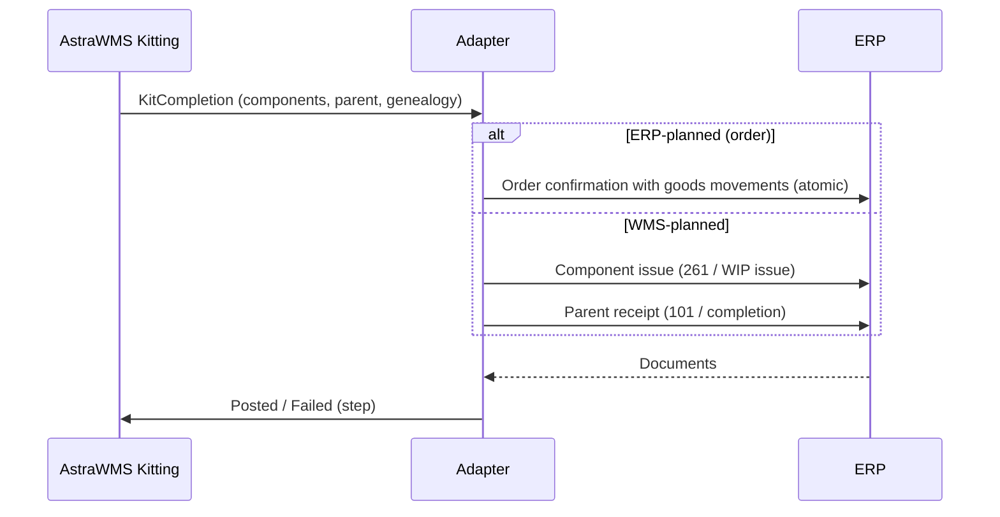

# IF-KIT-001 — Kitting Consumption and Production (WMS → ERP)

| Attribute | Value |
|---|---|
| Interface ID | IF-KIT-001 |
| Name | Kitting Consumption and Production (WMS → ERP) |
| Version / Status | 0.1 — Draft for design review |
| Direction | Outbound from AstraWMS |
| Source → Target | AstraWMS (VAS & Kitting) → Adapter → ERP |
| Pattern | Asynchronous, guaranteed delivery; atomic confirmation where the ERP supports it, otherwise ordered saga |
| Trigger | Kit work order completion (full or partial) and de-kit completion |
| Frequency | Event-driven |
| Design peak volume | 5,000 completions/day |
| Latency SLA | ≤ 5 min |
| Priority | M |
| Canonical message | `KitCompletion v1` |
| Business key (ordering) | siteId + kitOrderId |
| Traced requirements | KIT-001, KIT-002, KIT-003, KIT-004, KIT-005, KIT-EX-03 |
| Conventions | [ISD-00 Common Interface Conventions](00-common-conventions.md) apply unless stated otherwise |

---

## 1. Purpose & Scope

Posts the consumption of components and the production of kit parents (or the reverse for de-kitting) performed in the warehouse. For ERP-planned kits the postings go against the ERP production / work order. For WMS-planned kits they go against a standing cost collector or as a material-to-material conversion (§11.2).

**In scope**

- Component issue and parent receipt, full and partial completions
- Lot/serial genealogy (parent ↔ components)
- De-kitting (reverse postings)
- Scrap of defective components during assembly

**Out of scope**

- Kit BOM master (loaded with IF-MD-001 scope extension / ERP BOM extract)
- Production scheduling, routings, labour costing

## 2. Process Flow

## 3. Technical Realisation

| ERP Variant | Mechanism | Object / Endpoint | Trigger & Transport | ERP Authorisation (technical user) |
|---|---|---|---|---|
| SAP ECC / S/4HANA (ERP-planned) | RFC BAPI_PRODORDCONF_CREATE_TT with GOODSMOVEMENTS (261 components, 101 parent) + COMMIT | TIMETICKETS (order, operation, yield), GOODSMOVEMENTS, LINK_CONF_GOODSMOV, DETAIL_RETURN | One call per completion | S_RFC, C_AFRU_AWK (confirmations), M_MSEG_BWA (261/101) |
| SAP ECC / S/4HANA (WMS-planned) | RFC BAPI_GOODSMVT_CREATE ×2 (GM_CODE 03 mvt 261 against cost-collector order; GM_CODE 02 mvt 101), or 309 conversion where valuation permits | As IF-INV-001 | Sequential: issue then receipt | M_MSEG_BWA (261/101/309) |
| Oracle EBS | Inventory open interface (WIP transactions) | MTL_TRANSACTIONS_INTERFACE with TRANSACTION_SOURCE_TYPE_ID = 5 (Job), TRANSACTION_TYPE_ID = 35 (WIP component issue), 44 (WIP assembly completion); 43 / 17 for returns (de-kit) | OIC insert; Inventory Transaction Manager; WIP job per kit order | Insert grants; WIP responsibility |
| Oracle Fusion | REST work order material and completion transactions *(confirm resources)* | Work order material transactions / operation completions | Synchronous POST | Manufacturing transaction privileges *(confirm)* |

## 4. Canonical Message — `KitCompletion v1`

Card = cardinality; Req: M mandatory, C conditional, O optional. **PII** fields follow ISD-00 §7.

| Field | Type | Card | Req | Description / Validation |
|---|---|---|---|---|
| completion.wmsTxnId | string(16) | 1 | M |  |
| completion.kitOrderId | string(20) | 1 | M | WMS kit work order |
| completion.erpOrderNo | string(20) | 0..1 | C | ERP production/work order (ERP-planned) or cost collector |
| completion.mode | code | 1 | M | BUILD, DEKIT |
| completion.final | boolean | 1 | M | Final confirmation for the order |
| completion.completedAtUtc | date-time | 1 | M |  |
| completion.parent | object | 1 | M | {itemNo, qty, uom, lotNo, expiryDate, serials[], bucket} |
| completion.components[] | object | 1..n | M | {itemNo, qty, uom, lotNo, serials[], bucket, scrapQty, bomLineRef} |
| completion.genealogy[] | object | 0..n | C | {parentSerialOrLot, componentItem, componentSerialOrLot}: mandatory for serial/lot parents (KIT-002) |

## 5. Field Mapping

| Canonical | SAP ECC / S/4HANA | Oracle EBS | Oracle Fusion | Notes |
|---|---|---|---|---|
| completion.erpOrderNo | TIMETICKETS-ORDERID / GOODSMVT_ITEM-ORDERID | WIP_ENTITY_ID (TRANSACTION_SOURCE_ID) | WorkOrderNumber |  |
| parent qty (yield) | TIMETICKETS-YIELD + GOODSMOVEMENTS mvt 101 | Type 44 TRANSACTION_QUANTITY | Completion quantity |  |
| parent lot / expiry | GOODSMOVEMENTS-BATCH (+ batch creation with SLED) | Lot interface (LOT_NUMBER, LOT_EXPIRATION_DATE) | Lot | KIT-005: expiry = min(component expiry) unless overridden |
| components[] | GOODSMOVEMENTS mvt 261 (MATERIAL, BATCH, ENTRY_QNT, STGE_LOC, RESERV_NO/RES_ITEM from BOM line *(confirm)*) | Type 35 rows (negative qty) per component | Material issue lines |  |
| components[].scrapQty | Component scrap: 261 + separate 551 or scrap in confirmation *(confirm)* | Component scrap transaction *(confirm)* | Scrap *(confirm)* |  |
| genealogy[] | Batch where-used (automatic from 261/101 in same document); serial genealogy via equipment hierarchy *(confirm)* | Lot/serial genealogy from WIP transactions (automatic) | Genealogy (automatic) | Also kept in WMS genealogy (§6.2) |
| mode = DEKIT | Reverse movements 262 / 102 or 309 | 43 (component return) / 17 (assembly return) | Return transactions |  |

## 6. Processing Rules

| ID | Rule |
|---|---|
| KIT001-R01 | ERP-planned kits use the order confirmation BAPI so that component issue and parent receipt post atomically in one LUW. |
| KIT001-R02 | WMS-planned kits: component issue is posted first, then the parent receipt. If the receipt fails after the issue has succeeded, the receipt is retried and never compensated by reversing the issue. The kit parent stays usable in WMS (store-and-forward, INT-010). |
| KIT001-R03 | Partial completions are allowed (KIT-004). Remaining components stay allocated to the order. The final flag closes the ERP order only if the ERP configuration allows it. |
| KIT001-R04 | If the ERP order is closed (technically completed) before posting, the posting fails (KIT-EX-03) and goes to the supervisor, who decides between re-opening the ERP order and posting to the cost collector. |

## 7. Error Handling

Error classes and default retry behaviour: ISD-00 §6.

| Code | Condition | Class | Handling |
|---|---|---|---|
| KIT001-E01 | ERP order technically completed / closed | Business: conflict | Supervisor decision (rule KIT001-R04) |
| KIT001-E02 | Component stock deficit in ERP | Business: correctable | Reconciliation; reprocess |
| KIT001-E03 | Parent batch creation failed | Business: correctable | Create batch; reprocess receipt step |

## 8. Test Scenarios

| ID | Cat | Scenario | Expected Result |
|---|---|---|---|
| TS-KIT001-01 | POS | ERP-planned kit, 10 parents, 3 components each | Confirmation with 261/101 posted atomically |
| TS-KIT001-02 | VAR | WMS-planned kit on cost collector | Issue then receipt posted |
| TS-KIT001-03 | VAR | Serial parent with serial components | Genealogy recorded in ERP and WMS |
| TS-KIT001-04 | VAR | De-kit 2 parents | Reverse postings |
| TS-KIT001-05 | NEG | ERP order closed | KIT001-E01; supervisor decision |
| TS-KIT001-06 | DUP | Retry receipt step after timeout | No duplicate receipt |

## 9. Open Points

| # | Item to Confirm | Owner |
|---|---|---|
| 1 | Cost collector vs 309 conversion for WMS-planned kits (valuation impact) | Finance / controlling |
| 2 | Serial genealogy approach in SAP (equipment hierarchy) | SAP functional lead |
| 3 | Fusion work order transaction resources | Oracle integration lead |

## Change Log

| Version | Date | Change |
|---|---|---|
| 0.1 | 2026-09-30 | Initial draft generated from scope §D |
