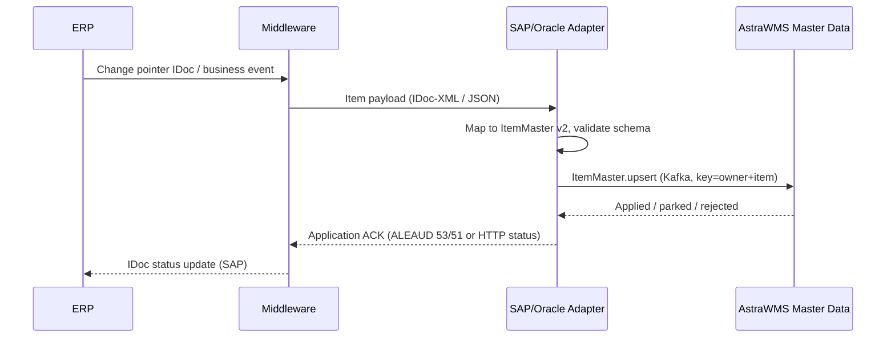

# IF-MD-001 — Item / Material Master (ERP → WMS)

| Attribute | Value |
|---|---|
| Interface ID | IF-MD-001 |
| Name | Item / Material Master (ERP → WMS) |
| Version / Status | 0.2 — Draft for design review |
| Direction | Inbound to AstraWMS |
| Source → Target | ERP → Middleware → AstraWMS (Master Data service) |
| Pattern | Asynchronous publish (change-driven) + nightly delta sweep + bulk initial load |
| Trigger | Item create/change in ERP; nightly delta; initial load at cutover |
| Frequency | Near-real-time on change |
| Design peak volume | 50,000 item-site changes/day; initial load up to 500,000 items |
| Latency SLA | ≤ 5 min from ERP change to item usable in WMS |
| Priority | M |
| Canonical message | `ItemMaster v2` |
| Business key (ordering) | ownerId + itemNo |
| Traced requirements | INT-001, INT-002, INT-003, INB-004, INB-006, PCK-004, CCH-001, CCH-003 |
| Conventions | [ISD-00 Common Interface Conventions](00-common-conventions.md) apply unless stated otherwise |

---

## 1. Purpose & Scope

Replicates the ERP item master, including units of measure, GTINs, weights and dimensions, lot/serial/shelf-life control and handling classifications, so that AstraWMS can receive, store, pick and ship the item. The ERP is the system of record. AstraWMS extends each item with warehouse-owned attributes (slotting class, putaway rule key, capture profile, home locations), which this interface never overwrites.

**In scope**

- Item create, change and logical deletion for every ERP site mapped to an AstraWMS site
- Alternative UoMs with conversion factors, GTIN per UoM level, dimensions and weights per UoM
- Lot, serial and shelf-life control flags; hazardous-goods and temperature classification references
- Initial load (bulk) and nightly delta safety sweep

**Out of scope**

- Dangerous-goods regulatory attributes beyond the flags listed here (UN number, class, packing group): delivered by the DG master extract (§D.2, *Dangerous goods*); to be specified in a separate ISD if required
- BOMs for kitting (§D.2, *BOM*), which are loaded with the kit work order data
- Write-back of WMS-measured dimensions (INT-003): optional reverse flow, specified in §6 rule MD001-R09

## 2. Process Flow

## 3. Technical Realisation

| ERP Variant | Mechanism | Object / Endpoint | Trigger & Transport | ERP Authorisation (technical user) |
|---|---|---|---|---|
| SAP ECC | ALE IDoc MATMAS05 (reduced message type recommended, BD53) | Message type MATMAS; segments E1MARAM, E1MAKTM, E1MARCM, E1MARMM, E1MEANM | Change pointers (BD50/BD52) + job RBDMIDOC (BD21) every 5 min; distribution model filter by plant; IDoc-XML over HTTPS to middleware | Job user only (outbound distribution); none for middleware |
| SAP S/4HANA | OData API_PRODUCT_SRV (read) on business event, or MATMAS05 as for ECC | A_Product, A_ProductDescription, A_ProductPlant, A_ProductUnitsOfMeasure, A_ProductUnitsOfMeasureEAN | Product changed business event via Event Mesh (event name per release *(confirm)*) → read-back of changed product | S_SERVICE (API_PRODUCT_SRV), M_MATE_WRK (plants), M_MATE_STA display |
| Oracle EBS | Business event + extract via OIC EBS adapter / DB adapter | MTL_SYSTEM_ITEMS_B, MTL_SYSTEM_ITEMS_TL, MTL_UOM_CONVERSIONS, MTL_CROSS_REFERENCES_B | Item business events oracle.apps.ego.item.postItemCreate / postItemUpdate *(confirm availability in customer release)*; nightly sweep by LAST_UPDATE_DATE | Read-only DB grants on listed tables/views; event subscription |
| Oracle Fusion | REST itemsV2 (read) + item events / BIP extract for bulk | /fscmRestApi/resources/11.13.18.05/itemsV2 (child: ItemEffCategory, uom conversions via item UOM resources *(confirm)*) | OIC Fusion adapter item event, or polling with q=LastUpdateDateTime>… every 5 min; BIP report for initial load | Custom integration role with item read privileges *(confirm privilege codes)* |

## 4. Canonical Message — `ItemMaster v2`

Card = cardinality; Req: M mandatory, C conditional, O optional. **PII** fields follow ISD-00 §7.

| Field | Type | Card | Req | Description / Validation |
|---|---|---|---|---|
| header.ownerId | string(20) | 1 | M | AstraWMS owner (3PL client or default owner) |
| item.itemNo | string(40) | 1 | M | ERP item number, external format |
| item.description | string(80) | 1 | M | Description in site default language |
| item.descriptions[] | object | 0..n | O | {language (ISO 639-1), text} |
| item.itemType | code | 1 | M | ERP item type (e.g. FERT, HAWA, ROH) passed through; mapped to WMS item class by config table |
| item.itemGroup | string(20) | 0..1 | O | Material group / item category |
| item.baseUom | uom | 1 | M | Base/primary UoM; must exist in WMS UoM catalogue |
| item.status | code | 1 | M | ACTIVE, BLOCKED_PROCUREMENT, BLOCKED_ALL, DELETED |
| item.sites[] | object | 1..n | M | One entry per ERP site extended for the item and mapped to an AstraWMS site |
| item.sites[].siteId | string(20) | 1 | M | AstraWMS site (from plant / organization via site map) |
| item.sites[].lotControlled | boolean | 1 | M | Batch/lot management active |
| item.sites[].serialControl | code | 1 | M | NONE, INBOUND, OUTBOUND, FULL (see mapping table §5.1) |
| item.sites[].status | code | 0..1 | O | Site-specific status (overrides item.status for this site) |
| item.shelfLife.totalDays | integer | 0..1 | C | Mandatory if shelf-life controlled |
| item.shelfLife.minRemainingDaysOnReceipt | integer | 0..1 | O | Used by INB-004 |
| item.shelfLife.roundingRule | code | 0..1 | O | DAY, WEEK, MONTH, YEAR (SLED period indicator) |
| item.uoms[] | object | 1..n | M | Includes base UoM with factor 1/1 |
| item.uoms[].uom | uom | 1 | M | Alternative UoM |
| item.uoms[].numerator / denominator | integer | 1 | M | Base qty = qty × numerator ÷ denominator; both > 0 |
| item.uoms[].gtin | string(14) | 0..1 | O | GTIN-8/12/13/14, check digit validated; unique per owner |
| item.uoms[].length / width / height | decimal(13,3) | 0..1 | O | With item.uoms[].dimUom |
| item.uoms[].grossWeight | decimal(13,3) | 0..1 | O | With item.uoms[].weightUom |
| item.uoms[].volume | decimal(13,3) | 0..1 | O | With item.uoms[].volumeUom |
| item.handling.temperatureClass | code | 0..1 | O | Mapped from ERP temperature condition via config table |
| item.handling.storageCondition | code | 0..1 | O | Mapped from ERP storage condition |
| item.handling.hazardous | boolean | 0..1 | O | True if a DG/hazardous indicator is set in ERP |
| item.handling.dgProfile | string(20) | 0..1 | C | ERP DG profile/hazard reference; key for DG master extract |
| item.catchWeight | boolean | 0..1 | O | Catch-weight / dual-UoM item |
| item.valuation.standardCost | decimal(18,4) | 0..1 | O | Value of one base unit in the tenant's reporting currency; used for approval value limits (§G.5.1). Converted to the base UoM and price unit by the adapter |
| item.sourceChangedAtUtc | date-time | 1 | M | ERP change timestamp; used for stale-message rule (ISD-00 §5) |

## 5. Field Mapping

| Canonical | SAP ECC / S/4HANA | Oracle EBS | Oracle Fusion | Notes |
|---|---|---|---|---|
| item.itemNo | E1MARAM-MATNR / A_Product.Product | MTL_SYSTEM_ITEMS_B.SEGMENT1 (or concatenated segments) | ItemNumber | S/4 MATNR up to 40 chars; ECC 18 |
| item.description | E1MAKTM-MAKTX (SPRAS_ISO = site language) | MTL_SYSTEM_ITEMS_TL.DESCRIPTION | ItemDescription |  |
| item.itemType | E1MARAM-MTART | ITEM_TYPE | UserItemTypeValue | Value map to WMS item class |
| item.itemGroup | E1MARAM-MATKL | Category (MTL_ITEM_CATEGORIES, inventory category set) | Item category (inventory catalog) |  |
| item.baseUom | E1MARAM-MEINS (→ ISO via T006) | PRIMARY_UOM_CODE | PrimaryUOMValue | ISD-00 §3.1 |
| item.status | E1MARAM-MSTAE + E1MARAM-LVORM | INVENTORY_ITEM_STATUS_CODE | ItemStatusValue | Status value map per customer |
| item.sites[].siteId | E1MARCM-WERKS | ORGANIZATION_ID → organization code | OrganizationCode | Site map; unmapped sites ignored |
| item.sites[].lotControlled | E1MARCM-XCHPF (or E1MARAM-XCHPF if batch mgmt at material level) | LOT_CONTROL_CODE = 2 | LotControlValue = Full lot control |  |
| item.sites[].serialControl | E1MARCM-SERNP (serial profile) → §5.1 | SERIAL_NUMBER_CONTROL_CODE → §5.1 | SerialNumberControlValue → §5.1 |  |
| item.sites[].status | E1MARCM-MMSTA | Org-level INVENTORY_ITEM_STATUS_CODE | Org-level ItemStatusValue |  |
| item.shelfLife.totalDays | E1MARAM-MHDHB | SHELF_LIFE_DAYS (SHELF_LIFE_CODE = 2) | ShelfLifeDays | SAP value in period of IPRKZ; converted to days |
| item.shelfLife.minRemainingDaysOnReceipt | E1MARAM-MHDRZ | Not standard: DFF/EFF *(confirm)* | Not standard: EFF *(confirm)* | If absent, WMS item profile default |
| item.shelfLife.roundingRule | E1MARAM-IPRKZ / RDMHD | n/a (days) | n/a (days) |  |
| item.uoms[].uom | E1MARMM-MEINH | MTL_UOM_CONVERSIONS.UOM_CODE (item-specific + standard) | Item UOM conversions *(confirm resource)* |  |
| item.uoms[].numerator / denominator | E1MARMM-UMREZ / UMREN | CONVERSION_RATE → numerator = rate × 1000, denominator = 1000 | ConversionValue (same rule) | Oracle rate is decimal; scaled to integers |
| item.uoms[].gtin | E1MARMM-EAN11 (NUMTP) / E1MEANM | MTL_CROSS_REFERENCES_B (type GTIN) | GTIN relationship *(confirm resource)* |  |
| item.uoms[].length / width / height | E1MARMM-LAENG / BREIT / HOEHE (MEABM) | UNIT_LENGTH / UNIT_WIDTH / UNIT_HEIGHT (DIMENSION_UOM_CODE), primary UoM only | UnitLengthQuantity / UnitWidthQuantity / UnitHeightQuantity | Oracle: other UoM dims derived by conversion |
| item.uoms[].grossWeight | E1MARMM-BRGEW (E1MARAM-GEWEI) | UNIT_WEIGHT (WEIGHT_UOM_CODE) | UnitWeightQuantity (WeightUOMValue) |  |
| item.uoms[].volume | E1MARMM-VOLUM (VOLEH) | UNIT_VOLUME (VOLUME_UOM_CODE) | UnitVolumeQuantity (VolumeUOMValue) |  |
| item.handling.temperatureClass | E1MARAM-TEMPB | DFF/EFF *(confirm)* | EFF *(confirm)* | Value map |
| item.handling.storageCondition | E1MARAM-RAUBE | DFF/EFF *(confirm)* | EFF *(confirm)* | Value map |
| item.handling.hazardous / dgProfile | E1MARAM-PROFL (DG indicator profile) | HAZARD_CLASS_ID / UN_NUMBER_ID not null | HazardClass / UNNumber attributes *(confirm)* |  |
| item.catchWeight | S/4 CWM active for material *(confirm field)* | TRACKING_QUANTITY_IND = 'PS' (dual UoM) | TrackingUOMValue = Primary and secondary |  |
| item.valuation.standardCost | E1MBEWM-STPRS (price control S) or E1MBEWM-VERPR (V) ÷ PEINH, valuation area = mapped plant; requires the MBEW segment in the reduced message type | CST_ITEM_COSTS.ITEM_COST (Frozen cost type) *(confirm)* | Item standard cost (Cost Accounting) *(confirm resource)* | Converted to the tenant reporting currency if the valuation currency differs |
| item.sourceChangedAtUtc | Change pointer timestamp (BDCP2-CRETIME) / A_Product.LastChangeDateTime | LAST_UPDATE_DATE (converted to UTC) | LastUpdateDateTime |  |

### 5.1 Serial Control Mapping

| AstraWMS serialControl | SAP serial profile (SERNP) behaviour | Oracle SERIAL_NUMBER_CONTROL_CODE |
|---|---|---|
| NONE | No serial profile | 1 (No control) |
| INBOUND | Profile with serialisation at GR (procedure MMSL mandatory) | 5 (At receipt) |
| OUTBOUND | Profile with serialisation at delivery (procedure PPAU/SDLS mandatory) only | 6 (At sales order issue) |
| FULL | Profile mandatory at GR and delivery | 2 (Predefined) or 5 with outbound capture |

## 6. Processing Rules

| ID | Rule |
|---|---|
| MD001-R01 | Upsert by (ownerId, itemNo). Only fields present in the message are updated; WMS-owned attributes (velocity class, putaway rule key, capture profile, home locations, slotting data) are never changed by this interface. |
| MD001-R02 | Stale-message rule applies on item.sourceChangedAtUtc (ISD-00 §5). |
| MD001-R03 | A site not present in the site map is ignored (logged at INFO). An item with no mapped site is acknowledged and not stored. |
| MD001-R04 | Removal of a UoM, or a change of its conversion factor, is rejected while inventory, open tasks or open order lines exist in that UoM (error MD001-E04). The change is parked until the Inventory Control Analyst clears the dependency. |
| MD001-R05 | A change to lot control or serial control on an item with on-hand stock at that site raises a conflict (MD001-E03). It is applied only after the Inventory Manager approves a conversion plan (e.g. assign dummy lot 'NOLOT'). |
| MD001-R06 | status = DELETED is a soft delete: the item stays usable for existing stock and open documents and cannot be used for new receipts. It is physically archived only after 0 stock and 0 open documents for 90 days. |
| MD001-R07 | Dimension/weight precedence: if the WMS item profile flag `dimsMaster = WMS`, ERP values are stored as reference only and do not overwrite measured values. |
| MD001-R08 | GTIN must be unique within an owner. A GTIN collision rejects the affected UoM row (MD001-E05); the rest of the item is applied. |
| MD001-R09 | Optional reverse flow (INT-003): approved WMS-measured dims/weights are sent to ERP (SAP BAPI_MATERIAL_SAVEDATA / API_PRODUCT_SRV PATCH on A_ProductUnitsOfMeasure; Oracle item update) only when data-governance flag `dimWriteBack = true`. |
| MD001-R10 | Initial load uses the bulk path (IDoc packets of 100, or BIP/CSV extract), validated by a record-count and checksum reconciliation report. |

## 7. Error Handling

Error classes and default retry behaviour: ISD-00 §6.

| Code | Condition | Class | Handling |
|---|---|---|---|
| MD001-E01 | Schema invalid or mandatory field missing | Permanent technical | Reject; ALEAUD 51 / HTTP 400; alert integration on-call |
| MD001-E02 | Base UoM or alternative UoM not in WMS UoM catalogue | Business: correctable | Reject item; master data team adds the UoM mapping, then reprocess |
| MD001-E03 | Lot/serial control change with stock on hand | Business: conflict | Park; conflict workflow to the Inventory Manager (rule MD001-R05) |
| MD001-E04 | UoM removed or factor changed while in use | Dependency (parked) | Park; auto-retry every 15 min; alert after 30 min (rule MD001-R04) |
| MD001-E05 | Duplicate GTIN within owner | Business: correctable | Reject affected UoM row; data-governance ticket |
| MD001-E06 | Unknown owner | Permanent technical | Reject; configuration error |

## 8. Test Scenarios

| ID | Cat | Scenario | Expected Result |
|---|---|---|---|
| TS-MD001-01 | POS | New item with 3 UoMs (EA, CS, PAL), GTIN per level, lot + shelf-life control at 2 sites | Item usable at both sites within 5 min; conversions correct (1 PAL = 60 CS = 720 EA) |
| TS-MD001-02 | POS | Description-only change | Only description updated; WMS-owned attributes unchanged |
| TS-MD001-03 | VAR | Serial profile per §5.1 for each of 4 values | serialControl mapped correctly for each value |
| TS-MD001-04 | VAR | Item with dimsMaster = WMS receives new ERP dimensions | Stored as reference; measured dims unchanged |
| TS-MD001-05 | NEG | Base UoM not in catalogue | MD001-E02; item not created |
| TS-MD001-06 | NEG | Lot control switched on for item with stock | MD001-E03; conflict workflow created; item unchanged |
| TS-MD001-07 | NEG | Duplicate GTIN on second item | MD001-E05 on that UoM row only |
| TS-MD001-08 | DUP | Same IDoc processed twice | One version applied; second logged as duplicate |
| TS-MD001-09 | ORD | Older change (earlier timestamp) arrives after newer | Discarded as STALE; newer data retained |
| TS-MD001-10 | VOL | Initial load of 200,000 items | Completed ≤ 2 h; reconciliation report shows 0 differences |
| TS-MD001-11 | OUT | AstraWMS unavailable for 1 h during ERP changes | Messages queued; all applied after recovery in order |

## 9. Open Points

| # | Item to Confirm | Owner |
|---|---|---|
| 1 | Reduced message type MATMAS segment list and change-pointer fields to activate | SAP integration lead |
| 2 | Source of minimum remaining shelf life on receipt in Oracle (DFF/EFF name) | Oracle functional lead |
| 3 | S/4 product business event name and payload in customer release | SAP integration lead |
| 4 | Fusion resource for UoM conversions and GTINs | Oracle integration lead |
| 5 | Temperature/storage condition value maps | Warehouse process owner |
| 6 | Valuation source per ERP (standard vs moving average price), the valuation area for multi-plant items, and the tenant reporting currency | Finance / ERP functional lead |

## Change Log

| Version | Date | Change |
|---|---|---|
| 0.1 | 2026-09-30 | Initial draft generated from scope §D |
| 0.2 | 2026-10-01 | Added `item.valuation.standardCost` (approval value limits, ADR-0012) |
