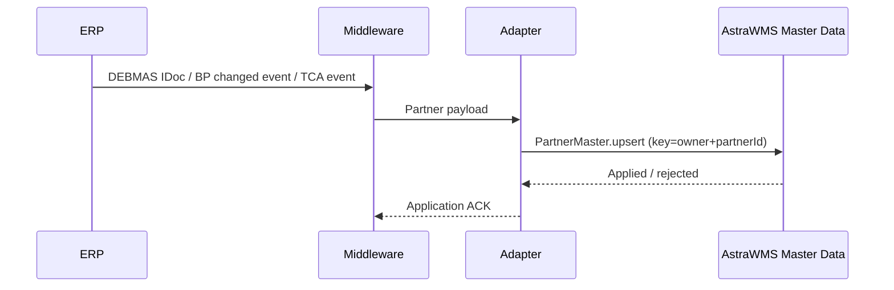

# IF-MD-002 — Customer / Ship-to Master (ERP → WMS)

| Attribute | Value |
|---|---|
| Interface ID | IF-MD-002 |
| Name | Customer / Ship-to Master (ERP → WMS) |
| Version / Status | 0.1 — Draft for design review |
| Direction | Inbound to AstraWMS |
| Source → Target | ERP → Middleware → AstraWMS (Master Data service) |
| Pattern | Asynchronous publish (change-driven) + nightly delta sweep |
| Trigger | Customer / ship-to create or change in ERP |
| Frequency | Near-real-time on change |
| Design peak volume | 10,000 changes/day; initial load up to 1,000,000 ship-to parties |
| Latency SLA | ≤ 15 min |
| Priority | M |
| Canonical message | `PartnerMaster v1 (role CUSTOMER / SHIP_TO)` |
| Business key (ordering) | ownerId + partnerId |
| Traced requirements | INT-001, INT-024, NFR-106, OUT-001, SHP-006 |
| Conventions | [ISD-00 Common Interface Conventions](00-common-conventions.md) apply unless stated otherwise |

---

## 1. Purpose & Scope

Provides the customer (sold-to) and ship-to parties that outbound orders reference. It supplies the data needed for labels, packing documents and carrier manifests, and the keys that link each customer to its AstraWMS compliance profile (labelling, carton and shelf-life rules), which is maintained in AstraWMS.

**In scope**

- Sold-to and ship-to parties with address, GLN, language, contact data
- Delivery-relevant attributes: delivery priority, shipping conditions, unloading point, receiving hours
- Central delivery block flag

**Out of scope**

- One-time (CPD) customers: their addresses travel on the outbound delivery (IF-OB-001)
- Credit data, pricing, payment terms

## 2. Process Flow

## 3. Technical Realisation

| ERP Variant | Mechanism | Object / Endpoint | Trigger & Transport | ERP Authorisation (technical user) |
|---|---|---|---|---|
| SAP ECC | ALE IDoc DEBMAS07 | E1KNA1M, E1KNVVM, E1KNVPM, E1KNVAM (unloading points) | Change pointers + BD21 every 15 min; filter by sales org/distribution channel serving AstraWMS sites | Job user only |
| SAP S/4HANA | OData API_BUSINESS_PARTNER (read) on BP event, or DEBMAS07 | A_BusinessPartner, A_BusinessPartnerAddress, A_Customer, A_CustomerSalesArea, A_CustSalesPartnerFunc | Business partner changed event via Event Mesh *(confirm event name)* → read-back | S_SERVICE, B_BUPA_GRP / B_BUPA_RLT display, F_KNA1_GEN display |
| Oracle EBS | TCA business events + extract | HZ_PARTIES, HZ_CUST_ACCOUNTS, HZ_CUST_ACCT_SITES_ALL, HZ_CUST_SITE_USES_ALL (SITE_USE_CODE = SHIP_TO), HZ_PARTY_SITES, HZ_LOCATIONS | oracle.apps.ar.hz.CustAcctSite.update and related TCA events *(confirm list)*; nightly sweep by LAST_UPDATE_DATE | Read-only grants on TCA tables/views |
| Oracle Fusion | REST customer accounts (read) + events / BIP | accounts / hubOrganizations resources, account sites and site uses *(confirm)* | OIC event or polling every 15 min | Integration role with customer account read *(confirm)* |

## 4. Canonical Message — `PartnerMaster v1 (role CUSTOMER / SHIP_TO)`

Card = cardinality; Req: M mandatory, C conditional, O optional. **PII** fields follow ISD-00 §7.

| Field | Type | Card | Req | Description / Validation |
|---|---|---|---|---|
| header.ownerId | string(20) | 1 | M | Owner |
| partner.partnerId | string(40) | 1 | M | SAP customer number; Oracle account number + '-' + ship-to site use ID |
| partner.roles[] | code | 1..n | M | SOLD_TO, SHIP_TO |
| partner.name1 / name2 | string(80) | 1 / 0..1 | M / O | **PII** when the party is a natural person |
| partner.address.street1..3 | string(60) | 1..3 | M | **PII** |
| partner.address.city / postalCode / region / country | string | 1 | M | country = ISO 3166-1 alpha-2; region = ISO 3166-2 subdivision where available |
| partner.gln | string(13) | 0..1 | O | GS1 GLN, check digit validated |
| partner.language | string(2) | 0..1 | O | ISO 639-1; used for documents |
| partner.contact.phone / email | string | 0..1 | O | **PII**; used for carrier notifications only |
| partner.deliveryPriority | code | 0..1 | O | Mapped to WMS order priority band |
| partner.shippingCondition | string(10) | 0..1 | O | Default carrier-service selection input |
| partner.unloadingPoints[] | object | 0..n | O | {code, receivingHours (weekly calendar)} |
| partner.soldToRef | string(40) | 0..1 | C | For SHIP_TO: the sold-to it belongs to; drives compliance profile lookup |
| partner.deliveryBlock | boolean | 1 | M | Central delivery block (OUT-001) |
| partner.deleted | boolean | 1 | M | Logical deletion / inactive |
| partner.sourceChangedAtUtc | date-time | 1 | M | Stale-message rule |

## 5. Field Mapping

| Canonical | SAP ECC / S/4HANA | Oracle EBS | Oracle Fusion | Notes |
|---|---|---|---|---|
| partner.partnerId | E1KNA1M-KUNNR / A_Customer.Customer | HZ_CUST_ACCOUNTS.ACCOUNT_NUMBER + HZ_CUST_SITE_USES_ALL.SITE_USE_ID | AccountNumber + SiteUseId *(confirm)* |  |
| partner.roles[] | E1KNVPM-PARVW (AG, WE) | SITE_USE_CODE (SOLD_TO/BILL_TO, SHIP_TO) | Site use purpose |  |
| partner.name1 / name2 | E1KNA1M-NAME1 / NAME2 | HZ_PARTIES.PARTY_NAME | PartyName |  |
| partner.address.street1..3 | E1KNA1M-STRAS (+ address data ADRC via BP) | HZ_LOCATIONS.ADDRESS1..3 | Address1..3 |  |
| partner.address.city / postalCode / region / country | ORT01 / PSTLZ / REGIO / LAND1 | CITY / POSTAL_CODE / STATE or PROVINCE / COUNTRY | City / PostalCode / State / Country | SAP region mapped via T005S |
| partner.gln | E1KNA1M-BBBNR + BBSNR + BUBKZ (ILN) | HZ_PARTY_SITES.GLOBAL_LOCATION_NUMBER *(confirm)* | GLN attribute *(confirm)* |  |
| partner.language | E1KNA1M-SPRAS (→ ISO) | HZ_PARTY_SITES / HZ_LOCATIONS.LANGUAGE | Language |  |
| partner.contact.phone / email | E1KNA1M-TELF1 / BP e-mail (ADR6) | HZ_CONTACT_POINTS | Contact points | Only if flag sendContactData = true |
| partner.deliveryPriority | E1KNVVM-LPRIO | Order-level SHIPMENT_PRIORITY_CODE default *(confirm)* | Shipment priority default *(confirm)* |  |
| partner.shippingCondition | E1KNVVM-VSBED | HZ_CUST_SITE_USES_ALL.SHIP_VIA | ShipMethod on site use |  |
| partner.unloadingPoints[] | E1KNVAM-ABLAD (+ receiving hours) | n/a | n/a | Oracle: maintained in AstraWMS |
| partner.deliveryBlock | E1KNA1M-LIFSD (central delivery block) | Account STATUS / hold *(confirm)* | Account status |  |
| partner.deleted | E1KNA1M-LOEVM | STATUS = 'I' | Status inactive |  |

## 6. Processing Rules

| ID | Rule |
|---|---|
| MD002-R01 | Upsert by (ownerId, partnerId). The WMS compliance profile is linked by partnerId (ship-to) with fallback to soldToRef (sold-to), and is never received from ERP. |
| MD002-R02 | PII fields are stored encrypted and masked in the monitor (ISD-00 §7). Contact data is transferred only if the customer-level flag permits it (data minimisation, NFR-106). |
| MD002-R03 | Setting deliveryBlock = true puts all non-released orders for that partner ON_HOLD. Released orders continue and the supervisor is alerted. |
| MD002-R04 | A deleted partner stays referenced by existing orders; new orders referencing it are parked (IF-OB-001 dependency rule). |
| MD002-R05 | Address changes do not alter orders already received; the order carries its own ship-to address snapshot from IF-OB-001. |

## 7. Error Handling

Error classes and default retry behaviour: ISD-00 §6.

| Code | Condition | Class | Handling |
|---|---|---|---|
| MD002-E01 | Schema invalid / mandatory field missing | Permanent technical | Reject; alert |
| MD002-E02 | Country or region code not ISO-mappable | Business: correctable | Reject; master data team corrects ERP or the region map |
| MD002-E03 | GLN check digit invalid | Business: correctable | Apply partner without GLN; warning to data governance |

## 8. Test Scenarios

| ID | Cat | Scenario | Expected Result |
|---|---|---|---|
| TS-MD002-01 | POS | New sold-to with two ship-tos | Three partners created; ship-tos linked to sold-to |
| TS-MD002-02 | POS | Ship-to address change | Partner updated; open orders keep their snapshot address |
| TS-MD002-03 | VAR | Delivery block set on ship-to with pooled and released orders | Pooled orders ON_HOLD; released orders continue with alert |
| TS-MD002-04 | NEG | Invalid country code | MD002-E02; partner not created |
| TS-MD002-05 | SEC | Non-privileged monitor user opens message | PII fields masked |
| TS-MD002-06 | DUP | Duplicate message | Single effect |
| TS-MD002-07 | ORD | Older version after newer | STALE, discarded |

## 9. Open Points

| # | Item to Confirm | Owner |
|---|---|---|
| 1 | GLN source field in Oracle release | Oracle functional lead |
| 2 | Whether contact data is needed (carrier notification) per customer | Customer service process owner |
| 3 | S/4 BP event name and filter by sales area | SAP integration lead |

## Change Log

| Version | Date | Change |
|---|---|---|
| 0.1 | 2026-09-30 | Initial draft generated from scope §D |
