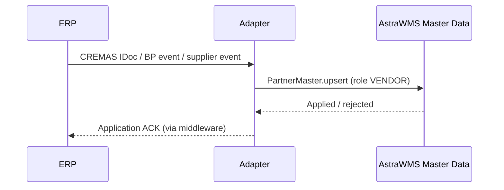

# IF-MD-003 — Vendor / Supplier Master (ERP → WMS)

| Attribute | Value |
|---|---|
| Interface ID | IF-MD-003 |
| Name | Vendor / Supplier Master (ERP → WMS) |
| Version / Status | 0.1 — Draft for design review |
| Direction | Inbound to AstraWMS |
| Source → Target | ERP → Middleware → AstraWMS (Master Data service) |
| Pattern | Asynchronous publish (change-driven) |
| Trigger | Supplier create/change in ERP |
| Frequency | Near-real-time on change |
| Design peak volume | 2,000 changes/day |
| Latency SLA | ≤ 15 min |
| Priority | M |
| Canonical message | `PartnerMaster v1 (role VENDOR)` |
| Business key (ordering) | ownerId + partnerId |
| Traced requirements | INT-001, INB-002, INB-011, INB-EX-03, RET-006 |
| Conventions | [ISD-00 Common Interface Conventions](00-common-conventions.md) apply unless stated otherwise |

---

## 1. Purpose & Scope

Provides vendors (suppliers) referenced by inbound deliveries and return-to-vendor flows. AstraWMS keeps the vendor *receiving profile* (ASN trust level, receiving tolerances override, label compliance, scorecard) against the replicated vendor key.

**In scope**

- Vendor name, address, GLN, language
- Posting/purchasing block flags
- Vendor site for Oracle

**Out of scope**

- Bank, tax and payment data (never replicated)
- Purchasing info records, conditions

## 2. Process Flow

## 3. Technical Realisation

| ERP Variant | Mechanism | Object / Endpoint | Trigger & Transport | ERP Authorisation (technical user) |
|---|---|---|---|---|
| SAP ECC | ALE IDoc CREMAS06 | E1LFA1M (+ E1LFM1M purchasing org for block) | Change pointers + BD21 every 15 min | Job user only |
| SAP S/4HANA | API_BUSINESS_PARTNER (A_Supplier, A_BusinessPartnerAddress) or CREMAS06 | A_Supplier, A_SupplierPurchasingOrg | BP changed event → read-back | S_SERVICE, B_BUPA_RLT, M_LFM1_EKO display |
| Oracle EBS | Extract via OIC | AP_SUPPLIERS, AP_SUPPLIER_SITES_ALL, HZ_PARTY_SITES | Supplier events *(confirm)* or polling by LAST_UPDATE_DATE every 15 min | Read-only grants |
| Oracle Fusion | REST suppliers (read) | /fscmRestApi/resources/11.13.18.05/suppliers (child: addresses, sites) | Polling every 15 min / OIC event | Supplier read privilege *(confirm)* |

## 4. Canonical Message — `PartnerMaster v1 (role VENDOR)`

Card = cardinality; Req: M mandatory, C conditional, O optional. **PII** fields follow ISD-00 §7.

| Field | Type | Card | Req | Description / Validation |
|---|---|---|---|---|
| header.ownerId | string(20) | 1 | M | Owner |
| partner.partnerId | string(40) | 1 | M | Vendor number (Oracle: supplier number + '-' + site code) |
| partner.roles[] | code | 1 | M | VENDOR |
| partner.name1 | string(80) | 1 | M | Vendor name |
| partner.address.* | object | 1 | M | As IF-MD-002 |
| partner.gln | string(13) | 0..1 | O | GLN (ship-from matching on ASN) |
| partner.language | string(2) | 0..1 | O | ISO 639-1 |
| partner.blocked | boolean | 1 | M | Purchasing/posting block: receipts allowed only against existing expectations |
| partner.deleted | boolean | 1 | M | Logical deletion |
| partner.sourceChangedAtUtc | date-time | 1 | M | Stale-message rule |

## 5. Field Mapping

| Canonical | SAP ECC / S/4HANA | Oracle EBS | Oracle Fusion | Notes |
|---|---|---|---|---|
| partner.partnerId | E1LFA1M-LIFNR / A_Supplier.Supplier | AP_SUPPLIERS.SEGMENT1 + AP_SUPPLIER_SITES_ALL.VENDOR_SITE_CODE | SupplierNumber + SupplierSite |  |
| partner.name1 | E1LFA1M-NAME1 | AP_SUPPLIERS.VENDOR_NAME | Supplier |  |
| partner.address.* | STRAS / ORT01 / PSTLZ / REGIO / LAND1 | AP_SUPPLIER_SITES_ALL.ADDRESS_LINE1.. / CITY / ZIP / STATE / COUNTRY | Supplier address |  |
| partner.gln | E1LFA1M-BBBNR + BBSNR + BUBKZ | Site GLN *(confirm)* | GLN *(confirm)* |  |
| partner.blocked | E1LFA1M-SPERR / SPERM or E1LFM1M-SPERM | HOLD_ALL_PAYMENTS_FLAG not used; END_DATE_ACTIVE / PURCHASING_SITE_FLAG | Status / site purpose | Only receiving-relevant blocks |
| partner.deleted | E1LFA1M-LOEVM | END_DATE_ACTIVE < today | Status inactive |  |

## 6. Processing Rules

| ID | Rule |
|---|---|
| MD003-R01 | Upsert by (ownerId, partnerId). The vendor receiving profile (ASN trust, tolerance overrides, scorecard) is WMS-owned and never overwritten. |
| MD003-R02 | A blocked vendor does not stop receipts against expectations already received, but blocks blind receipts (INB-EX-09) for that vendor. |
| MD003-R03 | The vendor GLN is used to match ASN ship-from when no vendor number is present (EDI-sourced ASNs). |

## 7. Error Handling

Error classes and default retry behaviour: ISD-00 §6.

| Code | Condition | Class | Handling |
|---|---|---|---|
| MD003-E01 | Schema invalid | Permanent technical | Reject; alert |
| MD003-E02 | Address country not ISO-mappable | Business: correctable | Reject; correct in ERP |

## 8. Test Scenarios

| ID | Cat | Scenario | Expected Result |
|---|---|---|---|
| TS-MD003-01 | POS | New vendor created | Vendor available for expectations within 15 min |
| TS-MD003-02 | VAR | Vendor blocked | Blind receipt for vendor refused; ASN receipt allowed |
| TS-MD003-03 | DUP | Duplicate message | Single effect |
| TS-MD003-04 | NEG | Missing name | MD003-E01 |

## 9. Open Points

| # | Item to Confirm | Owner |
|---|---|---|
| 1 | Which Oracle site purpose defines a receiving-relevant vendor site | Oracle functional lead |

## Change Log

| Version | Date | Change |
|---|---|---|
| 0.1 | 2026-09-30 | Initial draft generated from scope §D |
