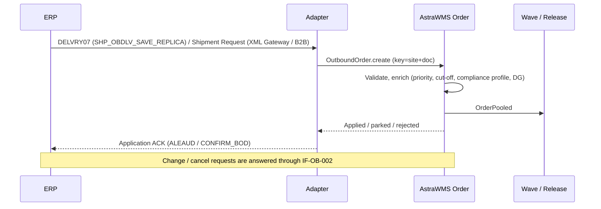

# IF-OB-001 — Outbound Delivery / Shipment Request (ERP → WMS)

| Attribute | Value |
|---|---|
| Interface ID | IF-OB-001 |
| Name | Outbound Delivery / Shipment Request (ERP → WMS) |
| Version / Status | 0.1 — Draft for design review |
| Direction | Inbound to AstraWMS |
| Source → Target | ERP → Middleware → AstraWMS (Order & Allocation service) |
| Pattern | Asynchronous, document-driven; create / change / cancel request |
| Trigger | Outbound delivery distributed (SAP) or shipment request issued at pick release (Oracle) |
| Frequency | Event-driven |
| Design peak volume | 200,000 documents/day (peak 25,000/h; bursts 150/s) |
| Latency SLA | ≤ 1 min to order in WMS pool |
| Priority | M |
| Canonical message | `OutboundOrder v4` |
| Business key (ordering) | siteId + erpDocNo |
| Traced requirements | OUT-001, OUT-002, OUT-003, OUT-004, OUT-006, OUT-EX-03, INT-002, INT-013, RET-006 |
| Conventions | [ISD-00 Common Interface Conventions](00-common-conventions.md) apply unless stated otherwise |

---

## 1. Purpose & Scope

Delivers the outbound demand that AstraWMS allocates, picks, packs and ships: customer deliveries (B2B and B2C), stock transfers, returns to vendor and other issues. The order carries everything needed for execution and for the confirmation (IF-OB-003): ERP line references, requested quantities, ship-to snapshot, carrier/service, dates, batch requirements and customer references.

**In scope**

- Create, change and cancel requests for outbound deliveries / shipment requests
- Ship-to address snapshot (including one-time customers)
- Batch pre-assignment and batch-split parents, kit/BOM header-component relationships
- Texts: delivery and packing instructions

**Out of scope**

- The WMS answer to change/cancel requests: IF-OB-002
- Freight tendering and load consolidation across sites (TMS)

## 2. Process Flow

## 3. Technical Realisation

| ERP Variant | Mechanism | Object / Endpoint | Trigger & Transport | ERP Authorisation (technical user) |
|---|---|---|---|---|
| SAP ECC / S/4HANA (decentralised WMS) | ALE IDoc DELVRY07 | Message type SHP_OBDLV_SAVE_REPLICA (create); SHP_OBDLV_CHANGE (change) *(confirm)*; deletion request via change with deletion indicator | Output type for decentralised WMS on outbound delivery (application V2, medium ALE) *(confirm)*, dispatch time immediate | Output processing user only |
| SAP S/4HANA (API variant) | OData API_OUTBOUND_DELIVERY_SRV;v=0002 (read) on event | A_OutbDeliveryHeader, A_OutbDeliveryItem, A_OutbDeliveryPartner, A_OutbDeliveryAddress2 | Outbound delivery created/changed business event *(confirm)* → read-back | S_SERVICE, V_LIKP_VST display |
| Oracle EBS (third-party warehousing) | XML Gateway outbound Shipment Request (OAG SHOW_SHIPMENT) | Transaction type WSH / subtype WSHS *(confirm map name)*; built from WSH_NEW_DELIVERIES, WSH_DELIVERY_DETAILS, WSH_DELIVERY_ASSIGNMENTS | Generated at pick release / 'Send Outbound Message' for the TPW organization; revisions for changes; action 'Cancel' for cancellation requests | XML Gateway trading partner setup for AstraWMS; no DB grants |
| Oracle Fusion | B2B outbound Shipment Request to logistics service provider *(confirm message definition)* | Shipment / shipment lines | Generated on pick release for organization marked as LSP-managed; OIC receives and forwards | B2B trading partner setup *(confirm)* |

## 4. Canonical Message — `OutboundOrder v4`

Card = cardinality; Req: M mandatory, C conditional, O optional. **PII** fields follow ISD-00 §7.

| Field | Type | Card | Req | Description / Validation |
|---|---|---|---|---|
| header.ownerId / siteId | string(20) | 1 | M | Site from shipping point / organization |
| order.erpDocNo | string(35) | 1 | M | SAP delivery number; Oracle delivery name / ID |
| order.revision | integer | 1 | M | Monotonic per erpDocNo (SAP: derived from change sequence; Oracle: shipment request revision) |
| order.action | code | 1 | M | CREATE, CHANGE, CANCEL |
| order.orderType | code | 1 | M | CUSTOMER, ECOM, TRANSFER, RTV, PRODUCTION_SUPPLY, SCRAP: value map from delivery type |
| order.priority | integer(1..9) | 0..1 | O | From delivery priority; WMS may override by rules |
| order.customerRefs | object | 0..1 | O | {customerPoNo, salesOrderNo, soldToId} |
| order.shipTo | object | 1 | M | {partnerId, name, address…, gln, contact}: snapshot. **PII** |
| order.carrier | object | 0..1 | O | {scac, service, shippingCondition, route, incoterms} |
| order.dates | object | 1 | M | {plannedGoodsIssueUtc (M), requestedDeliveryUtc, pickingDueUtc, loadingDueUtc} |
| order.shipComplete | boolean | 1 | M | OUT-004 |
| order.hold | code | 0..1 | O | Hold reason if ERP sends a block (DELIVERY_BLOCK, CREDIT) |
| order.texts[] | object | 0..n | O | {type: PACKING, DELIVERY, LABEL; language; text} |
| order.lines[] | object | 1..n | M |  |
| lines[].erpLineRef | string(10) | 1 | M | Returned in IF-OB-003 |
| lines[].parentLineRef | string(10) | 0..1 | C | Batch-split parent or BOM header line |
| lines[].lineRole | code | 1 | M | STANDARD, BATCH_SPLIT_CHILD, KIT_HEADER, KIT_COMPONENT, TEXT |
| lines[].itemNo | string(40) | 1 | M |  |
| lines[].customerItemNo | string(35) | 0..1 | O | For labels |
| lines[].qtyRequested / uom | decimal(15,3) / uom | 1 | M |  |
| lines[].lotNo | string(40) | 0..1 | O | Pre-assigned batch (hard allocation constraint) |
| lines[].minRemainingShelfLifeDays | integer | 0..1 | O | Customer requirement (allocation) |
| lines[].sourceBucket | string(10) | 0..1 | O | ERP storage location / subinventory from which to issue |
| lines[].vasCodes[] | code | 0..n | O | VAS requirements (§10) |
| order.sourceChangedAtUtc | date-time | 1 | M | Stale-message rule |

## 5. Field Mapping

| Canonical | SAP ECC / S/4HANA | Oracle EBS | Oracle Fusion | Notes |
|---|---|---|---|---|
| order.erpDocNo | E1EDL20-VBELN | DELIVERY_NAME / DELIVERY_ID (WSH_NEW_DELIVERIES) | Shipment number |  |
| order.revision | Adapter sequence per VBELN (IDoc creation timestamp order) | Shipment request revision number | Revision *(confirm)* |  |
| order.orderType | E1EDL21-LFART (LF → CUSTOMER, NL/NLCC → TRANSFER, RL/returns to vendor → RTV) value map | Order type of source line (OE_TRANSACTION_TYPES) / internal order flag | Order type / transfer order flag |  |
| site | E1EDL20-VSTEL (shipping point) → site map | ORGANIZATION_ID → org code | ShipFromOrganizationCode |  |
| order.priority | E1EDL21-LPRIO | SHIPMENT_PRIORITY_CODE | ShipmentPriority | Value map |
| order.customerRefs.customerPoNo | E1EDL41-BSTNR *(confirm segment)* | CUST_PO_NUMBER | CustomerPONumber |  |
| order.customerRefs.salesOrderNo | E1EDL24-VGBEL | SOURCE_HEADER_NUMBER | Order number |  |
| order.shipTo | E1ADRM1 (PARTNER_Q = 'WE') + E1ADRE1 address fields | Ship-to location (HZ_LOCATIONS via SHIP_TO_LOCATION_ID) in Shipment Request | Ship-to party/address | Snapshot stored on order |
| order.carrier | E1ADRM1 'SP' + E1EDL21-VSBED + E1EDL20-ROUTE + INCO1/INCO2 | CARRIER_ID, SHIP_METHOD_CODE, SERVICE_LEVEL, FOB_CODE, FREIGHT_TERMS_CODE | Carrier, ShipMethod, ServiceLevel |  |
| order.dates.plannedGoodsIssueUtc | E1EDT13 QUALF '006' (goods issue) *(confirm)* | INITIAL_PICKUP_DATE | Scheduled ship date | Local → UTC |
| order.dates.requestedDeliveryUtc | E1EDT13 QUALF '007' *(confirm)* | ULTIMATE_DROPOFF_DATE | Requested delivery date |  |
| order.dates.pickingDueUtc | E1EDT13 QUALF '010' *(confirm)* | n/a | n/a |  |
| order.shipComplete | Complete delivery flag of the sales order (via extension) *(confirm)* | SHIP_SET / SHIP_MODEL_COMPLETE_FLAG | Ship set |  |
| order.texts[] | E1TXTH8 / E1TXTP8 (text IDs mapped by config) | Shipping / packing instructions | Packing / shipping instructions |  |
| lines[].erpLineRef | E1EDL24-POSNR | DELIVERY_DETAIL_ID | Shipment line ID |  |
| lines[].parentLineRef / lineRole | E1EDL24-HIPOS (BOM) / E1EDL24-UECHA (batch split) + PSTYV | TOP_MODEL_LINE_ID (PTO/kit) / split_from_delivery_detail_id | Parent line *(confirm)* |  |
| lines[].itemNo | E1EDL24-MATNR | INVENTORY_ITEM_ID → item number | ItemNumber |  |
| lines[].customerItemNo | E1EDL24-KDMAT | CUSTOMER_ITEM_ID → customer item | CustomerItem |  |
| lines[].qtyRequested / uom | E1EDL24-LFIMG / VRKME | REQUESTED_QUANTITY / REQUESTED_QUANTITY_UOM | RequestedQuantity / UOM |  |
| lines[].lotNo | E1EDL24-CHARG | LOT_NUMBER | LotNumber |  |
| lines[].sourceBucket | E1EDL24-LGORT | SUBINVENTORY | Subinventory | Bucket map |

## 6. Processing Rules

| ID | Rule |
|---|---|
| OB001-R01 | CREATE for an existing erpDocNo with a higher revision is treated as CHANGE. A lower or equal revision is STALE (ISD-00 §5). |
| OB001-R02 | CHANGE and CANCEL are *requests*. The order service decides using the matrix in IF-OB-002 §6.1 and always answers through IF-OB-002. This interface only acknowledges receipt. |
| OB001-R03 | Validation failures that need data correction (unknown ship-to country, invalid carrier/service, DG item not permitted for the service) place the order in ON_HOLD – DATA and raise an alert (OUT-EX-03). They are not rejected. |
| OB001-R04 | Unknown item → order parked (dependency) and not pooled; it is released automatically when the item arrives. |
| OB001-R05 | Enrichment at receipt: release-by time from carrier cut-off calendar (OUT-003), compliance profile from ship-to/sold-to, DG classification from item master (OUT-006), VAS codes from customer profile. |
| OB001-R06 | Kit header lines are not picked; component lines are picked and reported under their own erpLineRef. Batch-split children from ERP are treated as hard lot allocations. |
| OB001-R07 | The ship-to snapshot on the order is used for labels and documents even if the partner master changes later. |

## 7. Error Handling

Error classes and default retry behaviour: ISD-00 §6.

| Code | Condition | Class | Handling |
|---|---|---|---|
| OB001-E01 | Schema invalid / mandatory field missing | Permanent technical | Reject; alert |
| OB001-E02 | Item unknown | Dependency (parked) | Park order; alert after 30 min |
| OB001-E03 | Ship-to data invalid, carrier/service unmapped, DG not allowed | Business: correctable | Order ON_HOLD – DATA; alert order control; release after correction |
| OB001-E04 | Site not mapped (shipping point/org) | Permanent technical | Reject; configuration error |
| OB001-E05 | Revision gap (revision n+2 before n+1) | Transient technical | Hold key up to 5 min; then process and alert |

## 8. Test Scenarios

| ID | Cat | Scenario | Expected Result |
|---|---|---|---|
| TS-OB001-01 | POS | B2B delivery, 10 lines, carrier LTL | Order pooled ≤ 1 min with release-by time |
| TS-OB001-02 | POS | B2C delivery, 1 line, parcel | Order pooled; cartonization eligible |
| TS-OB001-03 | VAR | ERP batch-split delivery (parent + 2 batch children) | Hard lot allocation per child |
| TS-OB001-04 | VAR | Kit (BOM header + 3 components) | Components picked; header not picked |
| TS-OB001-05 | VAR | One-time customer address on delivery | Snapshot used on label |
| TS-OB001-06 | VAR | Oracle Shipment Request with ship set | shipComplete = true; OUT-004 applied |
| TS-OB001-07 | NEG | DG item with air service not permitted | ON_HOLD – DATA; alert |
| TS-OB001-08 | DUP | Same IDoc twice | One order |
| TS-OB001-09 | ORD | Revision 3 received before revision 2 | Held; processed in order |
| TS-OB001-10 | VOL | 25,000 deliveries in 1 h with 150/s burst | p95 ≤ 1 min; no loss |
| TS-OB001-11 | OUT | WMS unavailable 30 min | ERP messages queue in middleware; drained in order |

## 9. Open Points

| # | Item to Confirm | Owner |
|---|---|---|
| 1 | Change message type and deletion handling in customer SAP release | SAP integration lead |
| 2 | E1EDT13 qualifiers for GI / delivery / picking dates | SAP integration lead |
| 3 | Fusion LSP shipment request message definition and transport | Oracle integration lead |
| 4 | Source of ship-complete flag in SAP delivery | SAP SD lead |

## Change Log

| Version | Date | Change |
|---|---|---|
| 0.1 | 2026-09-30 | Initial draft generated from scope §D |
