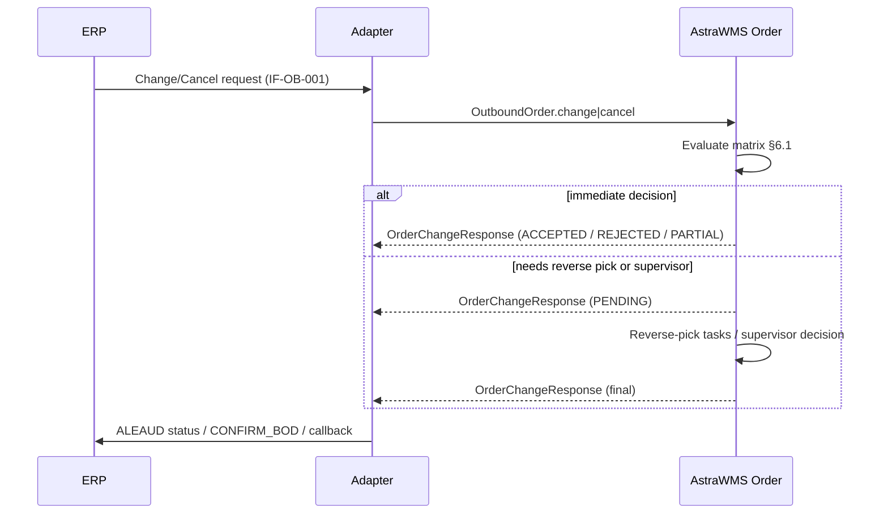

# IF-OB-002 — Outbound Change / Cancel Response (WMS → ERP)

| Attribute | Value |
|---|---|
| Interface ID | IF-OB-002 |
| Name | Outbound Change / Cancel Response (WMS → ERP) |
| Version / Status | 0.1 — Draft for design review |
| Direction | Outbound from AstraWMS |
| Source → Target | AstraWMS (Order) → Adapter → ERP |
| Pattern | Asynchronous application response correlated to the request |
| Trigger | Change or cancel request received via IF-OB-001 |
| Frequency | Event-driven |
| Design peak volume | 5,000 responses/day |
| Latency SLA | ≤ 1 min from request receipt (or from supervisor decision when manual) |
| Priority | M |
| Canonical message | `OrderChangeResponse v1` |
| Business key (ordering) | siteId + erpDocNo |
| Traced requirements | OUT-002, OUT-EX-02, INT-012, INT-013 |
| Conventions | [ISD-00 Common Interface Conventions](00-common-conventions.md) apply unless stated otherwise |

---

## 1. Purpose & Scope

Tells the ERP whether a requested change or cancellation of an outbound delivery was accepted, partly accepted or rejected, based on the execution status in the warehouse. This prevents the ERP from assuming a cancellation succeeded while the goods are already on a trailer.

**In scope**

- Responses to CHANGE (qty up/down, line add/delete, date/carrier change) and CANCEL requests
- Deferred responses when a supervisor decision or reverse-pick is needed

**Out of scope**

- Final shipped quantities: IF-OB-003
- Splits initiated by WMS: IF-OB-004

## 2. Process Flow

## 3. Technical Realisation

| ERP Variant | Mechanism | Object / Endpoint | Trigger & Transport | ERP Authorisation (technical user) |
|---|---|---|---|---|
| SAP ECC / S/4HANA | Application acknowledgement on the change IDoc: ALEAUD01 (status 53 accepted / 51 rejected with message), plus status message for deferred decisions *(confirm)* | ALEAUD01 referencing original IDoc number; message text holds reasonCode | Sent via middleware; ERP delivery remains locked for change until final status | ALE inbound for ALEAUD (standard) |
| Oracle EBS | XML Gateway CONFIRM_BOD for Shipment Request revision/cancel *(confirm)* | CONFIRM_BOD 004 with status and reason | Inbound to EBS; delivery status updated (cancel accepted / rejected) | XML Gateway trading partner |
| Oracle Fusion | B2B acknowledgment / shipment request response *(confirm)* | Response message | OIC → Fusion | B2B setup |

## 4. Canonical Message — `OrderChangeResponse v1`

Card = cardinality; Req: M mandatory, C conditional, O optional. **PII** fields follow ISD-00 §7.

| Field | Type | Card | Req | Description / Validation |
|---|---|---|---|---|
| response.erpDocNo | string(35) | 1 | M |  |
| response.requestRevision | integer | 1 | M | Revision of the request being answered |
| response.requestMessageId | UUID | 1 | M | messageId of the request (correlation) |
| response.requestType | code | 1 | M | CHANGE, CANCEL |
| response.result | code | 1 | M | ACCEPTED, REJECTED, PARTIAL, PENDING |
| response.reasonCode | code | 0..1 | C | Mandatory unless ACCEPTED: RELEASED_TO_PICK, PICKED, PACKED, LOADED, SHIPPED, QTY_BELOW_PICKED, SUPERVISOR_REJECTED |
| response.wmsStatus | code | 1 | M | Order status at decision time (§3.2 lifecycle) |
| response.lines[] | object | 0..n | C | For PARTIAL: {erpLineRef, acceptedQty, reasonCode} |

## 5. Field Mapping

| Canonical | SAP ECC / S/4HANA | Oracle EBS | Oracle Fusion | Notes |
|---|---|---|---|---|
| response.result = ACCEPTED | ALEAUD status 53 | CONFIRM_BOD status success | Response success |  |
| response.result = REJECTED | ALEAUD status 51 + message (reasonCode) | CONFIRM_BOD error + reason | Response error |  |
| response.result = PARTIAL | Status 51 with reasonCode + per-line text; ERP user re-requests the acceptable change | CONFIRM_BOD error with line details | Response with lines | ERP decentral interfaces accept/reject the whole request |
| response.result = PENDING | Status 51 'pending' is **not** sent; ERP stays locked until final ALEAUD *(confirm behaviour)* | No message until final | No message until final |  |

### 6.1 Decision Matrix

| WMS Order Status | CANCEL | Qty decrease | Qty increase / line add | Date / carrier change |
|---|---|---|---|---|
| RECEIVED / POOLED / ON_HOLD | ACCEPTED | ACCEPTED | ACCEPTED | ACCEPTED |
| ALLOCATED | ACCEPTED (de-allocate) | ACCEPTED (partial de-allocation) | ACCEPTED (allocate delta; short handling) | ACCEPTED (re-plan) |
| RELEASED / IN_PICK | PENDING → reverse-pick unstarted/picked → ACCEPTED | PENDING → reduce tasks → ACCEPTED | ACCEPTED (delta released) | ACCEPTED if wave allows; else REJECTED |
| PICKED / IN_PACK / PACKED | PENDING → supervisor: unpack & return-to-stock → ACCEPTED, or REJECTED | PENDING → supervisor | REJECTED (new delivery required) | PENDING → supervisor (carrier label void/redo) |
| STAGED / LOADED | REJECTED (LOADED) unless supervisor unloads | REJECTED | REJECTED | REJECTED |
| SHIPPED | REJECTED (SHIPPED) | REJECTED | REJECTED | REJECTED |

## 6. Processing Rules

| ID | Rule |
|---|---|
| OB002-R01 | Every change/cancel request receives exactly one final response (ACCEPTED, REJECTED or PARTIAL). PENDING is internal to WMS unless the ERP variant supports interim status. |
| OB002-R02 | A cancellation is confirmed as ACCEPTED only after all stock is back in an allocable status (OUT-EX-02). Labels are voided with the carrier before acceptance. |
| OB002-R03 | Supervisor decisions have an SLA (default 30 min). On expiry the request is auto-REJECTED with reason SUPERVISOR_TIMEOUT and an alert is raised. |
| OB002-R04 | Responses for the same erpDocNo are sequenced after any in-flight IF-OB-004 split and before IF-OB-003 (INT-013). |

## 7. Error Handling

Error classes and default retry behaviour: ISD-00 §6.

| Code | Condition | Class | Handling |
|---|---|---|---|
| OB002-E01 | ERP rejects ALEAUD (original IDoc not found) | Permanent technical | Alert; manual correlation |
| OB002-E02 | Response not deliverable (ERP down) | Transient technical | Store-and-forward |
| OB002-E03 | Supervisor decision timeout | Business: conflict | Auto-REJECT with SUPERVISOR_TIMEOUT |

## 8. Test Scenarios

| ID | Cat | Scenario | Expected Result |
|---|---|---|---|
| TS-OB002-01 | POS | Cancel pooled order | ACCEPTED ≤ 1 min; order CANCELLED |
| TS-OB002-02 | POS | Cancel released order with 2 of 5 lines picked | Reverse-pick tasks; ACCEPTED after stock returned |
| TS-OB002-03 | VAR | Qty decrease below picked qty | REJECTED QTY_BELOW_PICKED |
| TS-OB002-04 | VAR | Cancel loaded order | REJECTED LOADED |
| TS-OB002-05 | NEG | Supervisor does not decide in 30 min | REJECTED SUPERVISOR_TIMEOUT |
| TS-OB002-06 | DUP | Duplicate cancel request | Single response, same result |
| TS-OB002-07 | ORD | Cancel arrives while split in flight | Response sent after split confirmation |

## 9. Open Points

| # | Item to Confirm | Owner |
|---|---|---|
| 1 | SAP behaviour for deferred decisions on decentral delivery changes (lock/unlock) | SAP integration lead |
| 2 | Oracle CONFIRM_BOD support for shipment request cancel in customer release | Oracle integration lead |

## Change Log

| Version | Date | Change |
|---|---|---|
| 0.1 | 2026-09-30 | Initial draft generated from scope §D |
