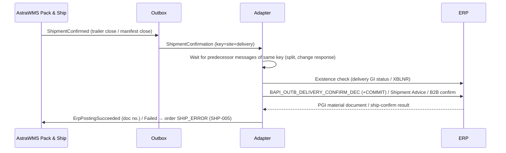

# IF-OB-003 — Shipment Confirmation and Goods Issue (WMS → ERP)

| Attribute | Value |
|---|---|
| Interface ID | IF-OB-003 |
| Name | Shipment Confirmation and Goods Issue (WMS → ERP) |
| Version / Status | 0.1 — Draft for design review |
| Direction | Outbound from AstraWMS |
| Source → Target | AstraWMS (Pack & Ship) → Adapter → ERP |
| Pattern | Asynchronous, guaranteed delivery; BAPI / XML Gateway / B2B with application response |
| Trigger | Trailer close (LTL/FTL) or parcel manifest close / carton ship (parcel) |
| Frequency | Event-driven |
| Design peak volume | 200,000 deliveries/day (peak 30,000/h at carrier cut-offs) |
| Latency SLA | ≤ 2 min to ERP goods issue document |
| Priority | M |
| Canonical message | `ShipmentConfirmation v4` |
| Business key (ordering) | siteId + erpDocNo |
| Traced requirements | SHP-004, SHP-005, SHP-007, SHP-EX-05, INT-010, INT-011, INT-012, INT-013, INT-014, INT-015, RPT-049 |
| Conventions | [ISD-00 Common Interface Conventions](00-common-conventions.md) apply unless stated otherwise |

---

## 1. Purpose & Scope

Confirms what physically left the warehouse for each ERP delivery: picked and shipped quantities by batch and serial, packing into handling units (SSCC), weights, carrier and tracking data. It triggers the goods issue posting (PGI / ship confirm), which reduces ERP stock and enables billing and the customer ASN.

**In scope**

- Pick/pack/ship quantities per delivery line with batch splits and serials
- Handling units (SSCC) with contents, packaging material, weights and tracking numbers
- Carrier, service, BOL/PRO, trailer and seal
- Post goods issue / ship confirm
- Short shipment with remaining quantity handling per ERP configuration

**Out of scope**

- EDI 856/DESADV to the customer (generated by the ERP or the EDI layer from the posted data)
- Freight cost settlement

## 2. Process Flow

## 3. Technical Realisation

| ERP Variant | Mechanism | Object / Endpoint | Trigger & Transport | ERP Authorisation (technical user) |
|---|---|---|---|---|
| SAP ECC / S/4HANA (decentralised WMS) | RFC BAPI_OUTB_DELIVERY_CONFIRM_DEC + BAPI_TRANSACTION_COMMIT (alternative: IDoc SHP_OBDLV_CONFIRM_DECENTRAL; legacy WHSCON) | HEADER_DATA, HEADER_CONTROL (post GI flag, weight/volume change flags), HEADER_DEADLINES, ITEM_DATA, ITEM_CONTROL, ITEM_SERIAL_NO, HANDLING_UNIT_HEADER, HANDLING_UNIT_ITEM, RETURN *(confirm in SE37)* | One call per delivery; commit; material document read from document flow (VBFA, type R) | S_RFC, V_LIKP_VST, M_MSEG_BWA / M_MSEG_WWA (movement types 601/641), M_MSEG_LGO |
| Oracle EBS (third-party warehousing) | XML Gateway inbound Shipment Advice (OAG SHOW_SHIPMENT) | Transaction type WSH / subtype WSHA *(confirm map name)* → ship confirm of the delivery; Interface Trip Stop | AS2/HTTPS via OIC to XML Gateway; ship-confirm rule of the TPW org defines backorder/cancel of unshipped qty | XML Gateway trading partner |
| Oracle Fusion | B2B inbound shipment confirmation from logistics service provider *(confirm message definition)* | Shipment confirmation (lines, lots, serials, packing units, tracking) | OIC → Fusion B2B; result via response / shipment status read | B2B setup |

## 4. Canonical Message — `ShipmentConfirmation v4`

Card = cardinality; Req: M mandatory, C conditional, O optional. **PII** fields follow ISD-00 §7.

| Field | Type | Card | Req | Description / Validation |
|---|---|---|---|---|
| header.ownerId / siteId | string(20) | 1 | M |  |
| shipment.wmsTxnId | string(16) | 1 | M | Idempotency key |
| shipment.erpDocNo | string(35) | 1 | M |  |
| shipment.shipDateTimeUtc | date-time | 1 | M | Trailer departure / carrier handover; drives GI date |
| shipment.carrier | object | 1 | M | {scac, service, proNumber, billOfLading, trailerNo, sealNo, masterTrackingNo} |
| shipment.grossWeightKg / netWeightKg / volumeM3 | decimal(13,3) | 0..1 | O | Actual totals |
| shipment.lines[] | object | 1..n | M | All lines of the delivery, including zero-shipped lines |
| lines[].erpLineRef | string(10) | 1 | M |  |
| lines[].itemNo | string(40) | 1 | M |  |
| lines[].qtyShipped / uom | decimal(15,3) / uom | 1 | M | ≥ 0 |
| lines[].shortReason | code | 0..1 | C | Mandatory if qtyShipped < requested: NO_STOCK, DAMAGED, CUSTOMER_CANCEL, CUT_OFF |
| lines[].lotSplits[] | object | 0..n | C | {lotNo, qty}: mandatory for lot-controlled items; Σ = qtyShipped |
| lines[].serials[] | string(40) | 0..n | C | Mandatory for OUTBOUND/FULL serial items (SHP-007) |
| lines[].catchWeightKg | decimal(13,3) | 0..1 | C | Catch-weight items |
| shipment.handlingUnits[] | object | 0..n | O | {sscc, parentSscc, packagingMaterial, grossWeightKg, lengthCm, widthCm, heightCm, trackingNo, contents[]: {erpLineRef, lotNo, qty}} |

## 5. Field Mapping

| Canonical | SAP ECC / S/4HANA | Oracle EBS | Oracle Fusion | Notes |
|---|---|---|---|---|
| shipment.erpDocNo | HEADER_DATA-DELIV_NUMB / HEADER_CONTROL-DELIV_NUMB / DELIVERY | DELIVERY_ID / NAME in Shipment Advice | Shipment |  |
| shipment.wmsTxnId | Delivery header reference field *(confirm, e.g. LIKP-LIFEX or XABLN)* + GI material document XBLNR | Shipment Advice document reference | Reference *(confirm)* | Existence check |
| post GI | HEADER_CONTROL post-GI flag = 'X' *(confirm field)* | Implicit (ship confirm on advice) | Implicit |  |
| shipment.shipDateTimeUtc | HEADER_DEADLINES (actual GI time type *(confirm)*) | SHIP_DATE / CONFIRM_DATE | ActualShipDate | INT-015 posting-date rule |
| shipment.carrier.billOfLading / proNumber | HEADER_DATA-BOL_NR *(confirm)*; E1EDL20-BOLNR | WAYBILL / BILL_OF_LADING | Waybill / BillOfLading |  |
| shipment.carrier.trailerNo / sealNo | HEADER_DATA means-of-transport ID (TRAID) *(confirm)*; seal via text or HU | VEHICLE_NUMBER / SEAL_CODE | Vehicle / seal *(confirm)* |  |
| shipment.grossWeightKg | HEADER_DATA-GROSS_WT + UNIT_OF_WT, HEADER_CONTROL-GROSS_WT_FLG | GROSS_WEIGHT / WEIGHT_UOM_CODE | GrossWeight |  |
| lines[].erpLineRef | ITEM_DATA-DELIV_ITEM | DELIVERY_DETAIL_ID | Shipment line |  |
| lines[].qtyShipped / uom | ITEM_DATA-DLV_QTY + SALES_UNIT, ITEM_CONTROL-CHG_DELQTY = 'X' | SHIPPED_QUANTITY / UOM | ShippedQuantity | Unshipped qty: SAP per delivery/copy control (reduce or backorder); Oracle per ship-confirm rule |
| lines[].lotSplits[] | Batch-split sub-items: ITEM_DATA (HIERARITEM = parent, USEHIERITM = '1', items 900001+, BATCH) | Split delivery details with LOT_NUMBER | Lot details |  |
| lines[].serials[] | ITEM_SERIAL_NO (DELIV_NUMB, ITM_NUMBER, SERIALNO) | Serial ranges (FM/TO_SERIAL_NUMBER) | Serial numbers |  |
| shipment.handlingUnits[] | HANDLING_UNIT_HEADER (HDL_UNIT_EXID = SSCC, SHIP_MAT, TOTAL_WGHT, tracking in HDL_UNIT_EXID_2 *(confirm)*), HANDLING_UNIT_ITEM (HDL_UNIT_INTO nesting, DELIV_ITEM, PACK_QTY) | LPN / container details in advice (CONTAINER_NAME, tracking) | Packing units + tracking | Nesting via parentSscc |
| ERP document returned | PGI material document from document flow; RETURN messages | Delivery status 'Shipped' + trip stop closed | Shipment status |  |

## 6. Processing Rules

| ID | Rule |
|---|---|
| OB003-R01 | Atomic per delivery: one confirmation contains all lines and HUs of the delivery. A delivery shipped on two trailers requires an IF-OB-004 split first. |
| OB003-R02 | Sequencing: an in-flight IF-OB-004 split or IF-OB-002 response for the same erpDocNo must reach a terminal state before this message is sent (INT-013). |
| OB003-R03 | Zero-shipped lines are sent with qtyShipped = 0 and a shortReason. The ERP applies its standard handling of the remainder. |
| OB003-R04 | Serial count must equal qtyShipped in base UoM for OUTBOUND/FULL serial items. The adapter rejects mismatches before calling the ERP (OB003-E05). |
| OB003-R05 | If the ERP rejects the PGI with a business error, the delivery goes to SHIP_ERROR. It stays physically shipped and never reverses in WMS. Resolution happens in the integration workbench and must finish before period close (SHP-005, INT-011). |
| OB003-R06 | Parcel: the confirmation is sent when the carton is manifested and the manifest closed for the day (SHP-004), not at label print. |
| OB003-R07 | RPT-049 (integration timeliness) measures this interface: confirmations posted ≤ 2 min ÷ total. |

## 7. Error Handling

Error classes and default retry behaviour: ISD-00 §6.

| Code | Condition | Class | Handling |
|---|---|---|---|
| OB003-E01 | Delivery or material locked | Transient technical | Retry |
| OB003-E02 | Insufficient stock in ERP for PGI (SAP M7 021 / deficit) | Business: correctable | Error queue; reconciliation check (IF-INV-003) for missing GR/transfer; post correction; reprocess |
| OB003-E03 | Posting period closed | Business: correctable | INT-015 re-dating or period open; reprocess |
| OB003-E04 | Delivery already goods-issued (not by this wmsTxnId) | Business: conflict | Conflict workflow; compare ERP GI with WMS shipment |
| OB003-E05 | Serial count mismatch (adapter pre-check) | Business: correctable | Block send; inventory control corrects serial capture |
| OB003-E06 | Batch does not exist / not in stock in ERP | Business: correctable | Reconciliation; correct batch via IF-INV-001; reprocess |
| OB003-E07 | Oracle ship-confirm error (e.g. delivery in wrong status) | Business: correctable | Error queue with WSH message text |

## 8. Test Scenarios

| ID | Cat | Scenario | Expected Result |
|---|---|---|---|
| TS-OB003-01 | POS | LTL delivery, 12 lines, 4 pallets (SSCC), trailer close | PGI posted ≤ 2 min; HUs and weights in ERP; BOL stored |
| TS-OB003-02 | POS | Parcel order, 2 cartons, manifest close | GI posted; tracking numbers per HU |
| TS-OB003-03 | VAR | Line with 2 batches | Batch-split items posted |
| TS-OB003-04 | VAR | Serialized item 10 units | 10 serials posted per line |
| TS-OB003-05 | VAR | Short line (0 shipped, NO_STOCK) | ERP reduces/backorders per config |
| TS-OB003-06 | VAR | Nested HUs (cartons on pallet) | HU hierarchy in ERP |
| TS-OB003-07 | NEG | ERP stock deficit | OB003-E02; delivery SHIP_ERROR; resolved via reconciliation |
| TS-OB003-08 | NEG | Serial count mismatch | OB003-E05; not sent |
| TS-OB003-09 | DUP | Adapter restart after commit | Existence check; no second GI |
| TS-OB003-10 | ORD | Split in flight for same delivery | Confirmation waits for split result |
| TS-OB003-11 | OUT | ERP down 2 h at cut-off peak | Shipping continues; all GIs posted after recovery; monitor shows unposted value |
| TS-OB003-12 | VOL | 30,000 confirmations in 1 h | p95 ≤ 2 min |

## 9. Open Points

| # | Item to Confirm | Owner |
|---|---|---|
| 1 | BAPI field names: post-GI flag, deadline time type, reference field for wmsTxnId, tracking field in HU header | SAP integration lead |
| 2 | Remainder handling for short-shipped lines (delivery copy control / Oracle ship-confirm rule) | SD / OM leads |
| 3 | Fusion LSP shipment confirmation message definition | Oracle integration lead |

## Change Log

| Version | Date | Change |
|---|---|---|
| 0.1 | 2026-09-30 | Initial draft generated from scope §D |
