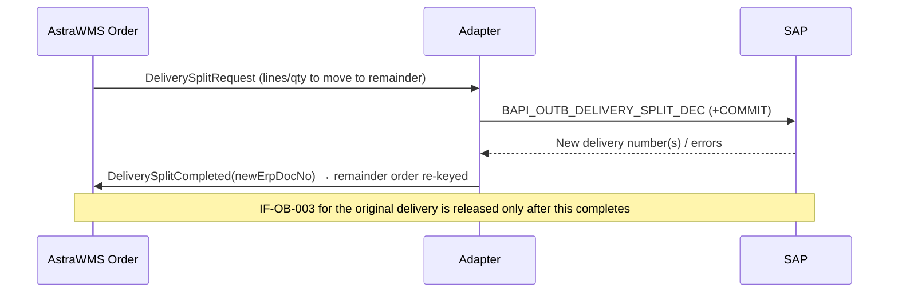

# IF-OB-004 — Outbound Delivery Split (WMS → ERP)

| Attribute | Value |
|---|---|
| Interface ID | IF-OB-004 |
| Name | Outbound Delivery Split (WMS → ERP) |
| Version / Status | 0.1 — Draft for design review |
| Direction | Outbound from AstraWMS |
| Source → Target | AstraWMS (Order) → Adapter → SAP ERP |
| Pattern | Synchronous BAPI call from adapter (asynchronous to WMS users) with returned new delivery number |
| Trigger | Partial shipment where the remainder must ship later on a separate delivery: short allocation with backorder, trailer capacity split (SHP-EX-04), missing carton (SHP-EX-03) |
| Frequency | Event-driven |
| Design peak volume | 5,000 splits/day |
| Latency SLA | ≤ 2 min |
| Priority | M |
| Canonical message | `DeliverySplitRequest v1` |
| Business key (ordering) | siteId + erpDocNo |
| Traced requirements | OUT-EX-01, SHP-EX-03, SHP-EX-04, INT-013 |
| Conventions | [ISD-00 Common Interface Conventions](00-common-conventions.md) apply unless stated otherwise |

---

## 1. Purpose & Scope

Splits an ERP outbound delivery into the part that ships now and a remainder that ships later, so that the goods issue (IF-OB-003) can be posted for the shipped part while the remainder stays open with its own ERP delivery number. SAP only: in Oracle, the remainder is handled as a backorder by the Shipment Advice (IF-OB-003).

**In scope**

- Line- and quantity-level split of an SAP outbound delivery
- Linking the new ERP delivery number to the WMS remainder order

**Out of scope**

- Oracle EBS / Fusion (backorder through IF-OB-003)
- Merging deliveries

## 2. Process Flow

## 3. Technical Realisation

| ERP Variant | Mechanism | Object / Endpoint | Trigger & Transport | ERP Authorisation (technical user) |
|---|---|---|---|---|
| SAP ECC / S/4HANA (decentralised WMS) | RFC BAPI_OUTB_DELIVERY_SPLIT_DEC + BAPI_TRANSACTION_COMMIT | Delivery number + split item/quantity table; returns new delivery *(confirm parameter names in SE37)* | Adapter call; the new delivery must not be re-distributed to WMS (suppress output or dedupe, rule OB004-R03) | S_RFC, V_LIKP_VST change |
| Oracle EBS | Not used | Remainder handled by ship-confirm rule via Shipment Advice | — | — |
| Oracle Fusion | Not used | Remainder handled as backorder via shipment confirmation | — | — |

## 4. Canonical Message — `DeliverySplitRequest v1`

Card = cardinality; Req: M mandatory, C conditional, O optional. **PII** fields follow ISD-00 §7.

| Field | Type | Card | Req | Description / Validation |
|---|---|---|---|---|
| split.wmsTxnId | string(16) | 1 | M | Idempotency key |
| split.erpDocNo | string(35) | 1 | M | Original delivery |
| split.reason | code | 1 | M | BACKORDER, CAPACITY, MISSING_UNIT, CUSTOMER_REQUEST |
| split.lines[] | object | 1..n | M | {erpLineRef, qtyToRemainder, uom}: quantity that moves to the new delivery |
| result.newErpDocNo | string(35) | 1 | M | Returned by ERP |
| result.lineMap[] | object | 1..n | M | {originalLineRef, newLineRef, qty} |

## 5. Field Mapping

| Canonical | SAP ECC / S/4HANA | Oracle EBS | Oracle Fusion | Notes |
|---|---|---|---|---|
| split.erpDocNo | Delivery parameter of BAPI_OUTB_DELIVERY_SPLIT_DEC *(confirm)* | n/a | n/a |  |
| split.lines[] | Split item table: item + quantity to split off *(confirm)* | n/a | n/a |  |
| result.newErpDocNo / lineMap | Returned new delivery + item mapping; read LIPS of new delivery if not returned | n/a | n/a |  |

## 6. Processing Rules

| ID | Rule |
|---|---|
| OB004-R01 | The split is executed **before** the goods issue of the original delivery. IF-OB-003 for the original erpDocNo is held until the split is terminal (INT-013). |
| OB004-R02 | Allocations, picked stock and tasks for the remainder move to a new WMS order keyed by newErpDocNo. No stock movement happens. |
| OB004-R03 | The new delivery created by the split is already known to WMS. If the ERP distributes it via IF-OB-001, the order service recognises it by lineMap and treats it as a no-op CHANGE. |
| OB004-R04 | If the split fails with a business error, shipping can continue only by shipping the full quantity or short-shipping with backorder via IF-OB-003 (supervisor choice). |

## 7. Error Handling

Error classes and default retry behaviour: ISD-00 §6.

| Code | Condition | Class | Handling |
|---|---|---|---|
| OB004-E01 | Delivery locked | Transient technical | Retry |
| OB004-E02 | Delivery status does not allow split (already GI'd, in shipment document) | Business: conflict | Supervisor decision (rule OB004-R04) |
| OB004-E03 | Split item not found | Permanent technical | Alert; data inconsistency investigation |

## 8. Test Scenarios

| ID | Cat | Scenario | Expected Result |
|---|---|---|---|
| TS-OB004-01 | POS | Split 2 of 8 lines to remainder (capacity) | New delivery returned; remainder order re-keyed; original GI posted after split |
| TS-OB004-02 | VAR | Partial quantity split of one line | Line split between deliveries |
| TS-OB004-03 | NEG | Delivery already in shipment document | OB004-E02; supervisor decision |
| TS-OB004-04 | DUP | Retry after timeout | Existence check (document flow) finds split; no second split |
| TS-OB004-05 | ORD | IF-OB-003 queued for same delivery | Sent only after split success |

## 9. Open Points

| # | Item to Confirm | Owner |
|---|---|---|
| 1 | BAPI_OUTB_DELIVERY_SPLIT_DEC parameters and whether the new delivery is re-distributed | SAP integration lead |
| 2 | Whether shipment documents (VT01N) are used; they block splits | SAP transportation lead |

## Change Log

| Version | Date | Change |
|---|---|---|
| 0.1 | 2026-09-30 | Initial draft generated from scope §D |
