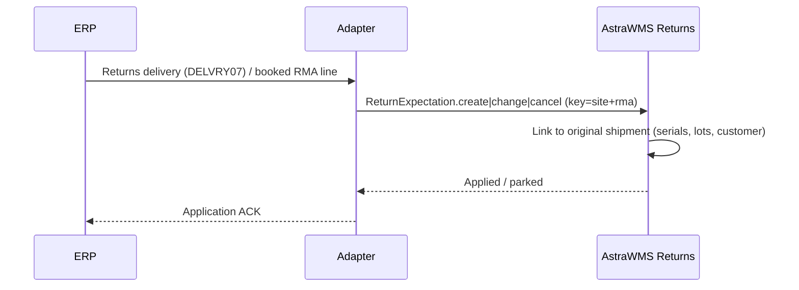

# IF-RET-001 — Returns Expectation / RMA (ERP → WMS)

| Attribute | Value |
|---|---|
| Interface ID | IF-RET-001 |
| Name | Returns Expectation / RMA (ERP → WMS) |
| Version / Status | 0.1 — Draft for design review |
| Direction | Inbound to AstraWMS |
| Source → Target | ERP → Middleware → AstraWMS (Returns service) |
| Pattern | Asynchronous, document-driven |
| Trigger | Returns delivery created (SAP) or RMA line booked and awaiting return (Oracle) |
| Frequency | Event-driven |
| Design peak volume | 10,000 RMA lines/day |
| Latency SLA | ≤ 5 min |
| Priority | M |
| Canonical message | `ReturnExpectation v1` |
| Business key (ordering) | siteId + rmaNo |
| Traced requirements | RET-001, RET-002, RET-003, RET-EX-01, RET-EX-03 |
| Conventions | [ISD-00 Common Interface Conventions](00-common-conventions.md) apply unless stated otherwise |

---

## 1. Purpose & Scope

Provides the expected customer returns, with the reference to the original sale, so that AstraWMS can identify arriving returns, validate items and serial numbers against what was shipped, and apply the disposition rules (§8.3).

**In scope**

- Customer returns (B2B and e-commerce) with RMA
- Recall returns with campaign ID
- Return reason, original order/delivery/invoice references, expected serials

**Out of scope**

- Returns to vendor (outbound: IF-OB-001 with order type RTV)
- Refund/credit decisions (ERP)

## 2. Process Flow

## 3. Technical Realisation

| ERP Variant | Mechanism | Object / Endpoint | Trigger & Transport | ERP Authorisation (technical user) |
|---|---|---|---|---|
| SAP ECC / S/4HANA | ALE IDoc DELVRY07 for returns delivery (delivery type LR) distributed to decentralised WMS *(confirm message type: SHP_IBDLV_SAVE_REPLICA)* | E1EDL20 / E1EDL24 with reference to returns order (VGBEL) and billing/delivery reference | Output on returns delivery (application E1/V2 per config) *(confirm)* | Output processing user only |
| SAP S/4HANA (Advanced Returns Management) | As above, plus ARM returns order data read via API *(confirm)* | Returns order with inspection requirement | Event / read-back | S_SERVICE |
| Oracle EBS | Extract of booked RMA lines via OIC | OE_ORDER_HEADERS_ALL / OE_ORDER_LINES_ALL (LINE_CATEGORY_CODE = 'RETURN', FLOW_STATUS_CODE = 'AWAITING_RETURN', RETURN_REASON_CODE, REFERENCE_LINE_ID) | Poll every 5 min by LAST_UPDATE_DATE for WMS-managed receiving orgs (SHIP_FROM_ORG_ID) | Read-only grants |
| Oracle Fusion | REST read of return orders / expected receipts *(confirm resource)* | Sales order return lines | Poll every 5 min / event | Order read privilege *(confirm)* |

## 4. Canonical Message — `ReturnExpectation v1`

Card = cardinality; Req: M mandatory, C conditional, O optional. **PII** fields follow ISD-00 §7.

| Field | Type | Card | Req | Description / Validation |
|---|---|---|---|---|
| rma.rmaNo | string(35) | 1 | M | SAP returns delivery (or returns order); Oracle RMA order number |
| rma.action | code | 1 | M | CREATE, CHANGE, CANCEL |
| rma.returnType | code | 1 | M | CUSTOMER, ECOM, RECALL |
| rma.campaignId | string(20) | 0..1 | C | Mandatory for RECALL |
| rma.customer | object | 1 | M | {partnerId, name}: **PII** |
| rma.expectedArrivalUtc | date-time | 0..1 | O |  |
| rma.trackingNos[] | string(40) | 0..n | O | Return label tracking numbers (blind-return lookup) |
| rma.lines[] | object | 1..n | M |  |
| lines[].erpLineRef | string(10) | 1 | M | Returned in IF-RET-002 |
| lines[].itemNo | string(40) | 1 | M |  |
| lines[].qtyExpected / uom | decimal(15,3) / uom | 1 | M |  |
| lines[].returnReason | code | 1 | M | Mapped reason (DEFECTIVE, WRONG_ITEM, NOT_NEEDED, DAMAGED_IN_TRANSIT, RECALL, …) |
| lines[].originalRef | object | 0..1 | O | {salesOrderNo, deliveryNo, invoiceNo, shipDate} |
| lines[].expectedSerials[] / expectedLots[] | string(40) | 0..n | O | From original shipment |
| lines[].inspectionRequired | boolean | 1 | M | ERP (e.g. ARM) requires inspection result |

## 5. Field Mapping

| Canonical | SAP ECC / S/4HANA | Oracle EBS | Oracle Fusion | Notes |
|---|---|---|---|---|
| rma.rmaNo | E1EDL20-VBELN (returns delivery) | OE_ORDER_HEADERS_ALL.ORDER_NUMBER | OrderNumber |  |
| rma.returnType | E1EDL21-LFART + order reason value map | Order type value map | Order type value map |  |
| rma.customer | E1ADRM1 'AG' / 'WE' | SOLD_TO_ORG_ID | Customer |  |
| lines[].erpLineRef | E1EDL24-POSNR | LINE_ID | Line ID |  |
| lines[].itemNo / qty / uom | MATNR / LFIMG / VRKME | INVENTORY_ITEM_ID / ORDERED_QUANTITY / ORDER_QUANTITY_UOM | Item / quantity / UOM |  |
| lines[].returnReason | Order reason VBAK-AUGRU via extension *(confirm)* | RETURN_REASON_CODE | ReturnReason | Value map |
| lines[].originalRef | E1EDL24-VGBEL/VGPOS (returns order) → reference billing/delivery via document flow *(confirm)* | REFERENCE_HEADER_ID / REFERENCE_LINE_ID | Original order line |  |
| lines[].expectedSerials[] | E1EDL11 *(confirm)* | OE_LOT_SERIAL_NUMBERS | Lot/serial on return line |  |

## 6. Processing Rules

| ID | Rule |
|---|---|
| RET001-R01 | The returns service links each line to the original WMS shipment (by originalRef, serial or lot) to support RET-001 serial validation and fraud detection (RET-EX-03). |
| RET001-R02 | RECALL returns are expected with the campaign ID and are always received into QUARANTINE. |
| RET001-R03 | CANCEL after receipt has started is rejected (application error), as in IF-IB-001. |
| RET001-R04 | E-commerce returns without a pre-advised RMA are handled as blind returns with lookup by tracking number, order number or serial (RET-EX-01). |

## 7. Error Handling

Error classes and default retry behaviour: ISD-00 §6.

| Code | Condition | Class | Handling |
|---|---|---|---|
| RET001-E01 | Item unknown | Dependency (parked) | Park |
| RET001-E02 | Cancel after receipt started | Business: conflict | Reject to ERP |
| RET001-E03 | Original shipment not found for expected serial | Business: correctable | Apply; flag line for serial verification at receipt |

## 8. Test Scenarios

| ID | Cat | Scenario | Expected Result |
|---|---|---|---|
| TS-RET001-01 | POS | B2B RMA, 2 lines with original delivery reference | Expectation created; linked to original shipment |
| TS-RET001-02 | VAR | Recall return with campaign | Expectation with campaign; quarantine rule |
| TS-RET001-03 | VAR | Serialised return | Expected serials match shipped serials |
| TS-RET001-04 | NEG | Cancel after receipt started | Rejected |
| TS-RET001-05 | DUP | Duplicate message | Single expectation |

## 9. Open Points

| # | Item to Confirm | Owner |
|---|---|---|
| 1 | Returns delivery distribution to decentralised WMS (message type, output) and ARM usage | SAP SD lead |
| 2 | Return reason value maps | Customer service process owner |

## Change Log

| Version | Date | Change |
|---|---|---|
| 0.1 | 2026-09-30 | Initial draft generated from scope §D |
