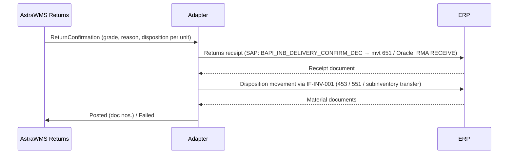

# IF-RET-002 — Returns Receipt and Disposition (WMS → ERP)

| Attribute | Value |
|---|---|
| Interface ID | IF-RET-002 |
| Name | Returns Receipt and Disposition (WMS → ERP) |
| Version / Status | 0.2 — Implemented for SAP (restock disposition); other dispositions open |
| Direction | Outbound from AstraWMS |
| Source → Target | AstraWMS (Returns) → Adapter → ERP |
| Pattern | Asynchronous, guaranteed delivery: receipt confirmation, then disposition movements |
| Trigger | Return unit graded and dispositioned (per RMA line or per unit for e-commerce) |
| Frequency | Event-driven |
| Design peak volume | 10,000 lines/day |
| Latency SLA | ≤ 5 min |
| Priority | M |
| Canonical message | `ReturnConfirmation v1` |
| Business key (ordering) | siteId + rmaNo |
| Traced requirements | RET-001, RET-002, RET-003, RET-004, RET-005, RET-EX-02, RPT-048 |
| Conventions | [ISD-00 Common Interface Conventions](00-common-conventions.md) apply unless stated otherwise |

---

## 1. Purpose & Scope

Confirms returned quantities with condition grade, return reason and disposition to the ERP. It posts the returns goods receipt, and the subsequent stock movement for the disposition, so that the ERP can issue credit or refund and hold the stock in the right stock type.

**In scope**

- Returns receipt confirmation against RMA / returns delivery
- Condition grade, reason, disposition, photos reference per unit
- Disposition postings: restock, scrap, quarantine, RTV pool

**Out of scope**

- RTV shipment (outbound order type RTV through IF-OB-001/IF-OB-003)
- Refurbishment work orders (VAS, internal)

## 2. Process Flow

## 3. Technical Realisation

| ERP Variant | Mechanism | Object / Endpoint | Trigger & Transport | ERP Authorisation (technical user) |
|---|---|---|---|---|
| SAP ECC / S/4HANA | RFC BAPI_INB_DELIVERY_CONFIRM_DEC for returns delivery (+ disposition via BAPI_GOODSMVT_CREATE, IF-INV-001) | As IF-IB-002; condition/disposition in item extension (EXTENSION2 / custom fields) *(confirm)*; ARM inspection results via ARM API *(confirm)* | Adapter call per RMA (B2B) or per unit batch (e-com, every 15 min) | As IF-IB-002 + M_MSEG_BWA for 453/551 |
| Oracle EBS | Receiving open interface with RMA source | RCV_HEADERS_INTERFACE (RECEIPT_SOURCE_CODE = 'CUSTOMER'), RCV_TRANSACTIONS_INTERFACE (SOURCE_DOCUMENT_CODE = 'RMA', OE_ORDER_HEADER_ID, OE_ORDER_LINE_ID, TRANSACTION_TYPE RECEIVE / ACCEPT / REJECT / DELIVER) | OIC insert + RVCTP; disposition by subinventory at DELIVER or later transfer | As IF-IB-002 |
| Oracle Fusion | REST receivingReceiptRequests with ReceiptSourceCode = CUSTOMER and RMA references | Lines with RMA number/line *(confirm fields)* | Synchronous POST | Receipt privileges |

## 4. Canonical Message — `ReturnConfirmation v1`

Card = cardinality; Req: M mandatory, C conditional, O optional. **PII** fields follow ISD-00 §7.

| Field | Type | Card | Req | Description / Validation |
|---|---|---|---|---|
| confirmation.wmsTxnId | string(16) | 1 | M |  |
| confirmation.rmaNo | string(35) | 0..1 | C | Absent for blind returns → ERP creates/links RMA per policy |
| confirmation.receivedAtUtc | date-time | 1 | M |  |
| confirmation.lines[] | object | 1..n | M |  |
| lines[].erpLineRef | string(10) | 0..1 | C |  |
| lines[].itemNo / qty / uom | string / decimal / uom | 1 | M | Actual item (may differ from RMA: RET-EX-02) |
| lines[].lotNo / serials[] | string | 0..n | C |  |
| lines[].conditionGrade | code | 1 | M | A, B, C, D, E (§8.2) |
| lines[].returnReasonActual | code | 0..1 | O | Reason found at inspection |
| lines[].disposition | code | 1 | M | RESTOCK, REFURBISH, RTV, SCRAP, QUARANTINE, LIQUIDATE |
| lines[].wrongItem | boolean | 1 | M | RET-EX-02 |
| lines[].evidenceRefs[] | string(200) | 0..n | O | URLs of photos (RET-005) |

## 5. Field Mapping

| Canonical | SAP ECC / S/4HANA | Oracle EBS | Oracle Fusion | Notes |
|---|---|---|---|---|
| confirmation.rmaNo | Returns delivery DELIV_NUMB | OE_ORDER_HEADER_ID (via order number) | RMA number |  |
| lines[].erpLineRef | ITEM_DATA-DELIV_ITEM | OE_ORDER_LINE_ID | RMA line |  |
| lines[].qty | ITEM_DATA-DLV_QTY | QUANTITY | Quantity |  |
| receipt stock type | Returns stock (mvt 651, blocked returns) | Returns subinventory (RMA routing) | Returns subinventory |  |
| lines[].conditionGrade / disposition / reason | Item extension fields *(confirm)* / ARM inspection code | ACCEPT/REJECT + DFF on RCV_TRANSACTIONS *(confirm)* | Inspection / DFF *(confirm)* | Used for credit decision |
| disposition RESTOCK | 453 (returns → unrestricted) via IF-INV-001 | Subinventory transfer to available sub | Subinventory transfer |  |
| disposition SCRAP | 551 from returns / blocked via IF-INV-001 | Alias issue (SCRAP) | Alias issue |  |
| disposition QUARANTINE / RTV / REFURBISH | Stays blocked (no further posting until final disposition) | Stays in returns / hold sub | Same |  |

## 6. Processing Rules

| ID | Rule |
|---|---|
| RET002-R01 | Two-step posting: the receipt into returns stock first, then the disposition movement. Each step has its own 16-character transaction ID (`receiptTxnId`, `dispositionTxnId`; a suffix would not fit XBLNR) and is idempotent by it. |
| RET002-R02 | A wrong item received (RET-EX-02) is confirmed as the actual item. For SAP, a new returns delivery item is required *(confirm approach: ERP adds line vs WMS reports discrepancy for credit adjustment)*; the discrepancy is always reported for credit adjustment. |
| RET002-R03 | Regulated items (pharma, food) default to QUARANTINE regardless of grade until QA release (RET-003). |
| RET002-R04 | E-commerce: units are confirmed in batches every 15 min per RMA to reduce ERP load, while grading is visible in WMS immediately. |
| RET002-R05 | RPT-048 (returns processing time) is measured from arrival scan to disposition posted. |

## 7. Error Handling

Error classes and default retry behaviour: ISD-00 §6.

| Code | Condition | Class | Handling |
|---|---|---|---|
| RET002-E01 | RMA closed / quantity exceeds RMA | Business: correctable | Error queue; customer service extends RMA or over-return handled per RET-002 |
| RET002-E02 | Wrong item not on RMA | Business: correctable | Discrepancy workflow; ERP line added or credit adjusted |
| RET002-E03 | Disposition movement failed after receipt posted | Business: correctable | Receipt kept; disposition reprocessed (no receipt reversal) |

## 8. Test Scenarios

| ID | Cat | Scenario | Expected Result |
|---|---|---|---|
| TS-RET002-01 | POS | B2B return, grade A, restock | Returns receipt + 453 posted; stock available |
| TS-RET002-02 | VAR | Grade D, scrap | Receipt + 551 |
| TS-RET002-03 | VAR | Pharma item grade A | QUARANTINE; no restock posting |
| TS-RET002-04 | VAR | E-com 40 units in 15-min batch | Single confirmation per RMA |
| TS-RET002-05 | NEG | Wrong item returned | RET002-E02; discrepancy for credit |
| TS-RET002-06 | DUP | Retry after timeout on step D | No duplicate disposition |

## 9. Open Points

| # | Item to Confirm | Owner |
|---|---|---|
| 1 | Where condition/disposition is stored for credit decision (ARM vs custom fields) | SAP SD lead / Oracle OM lead |
| 2 | Wrong-item handling in ERP | Customer service process owner |

## Change Log

| Version | Date | Change |
|---|---|---|
| 0.1 | 2026-09-30 | Initial draft generated from scope §D |
| 0.2 | 2026-10-02 | Two transaction IDs instead of -R/-D suffixes (XBLNR is 16 characters). Implemented in AstraWMS and the SAP adapter: step 1 = 651 into returns stock (GM code 01), step 2 = 453 for RESTOCK units (GM code 04). SCRAP (551) and the follow-ups of QUARANTINE/RTV/REFURBISH/LIQUIDATE are not posted yet (ADR-0017). |
