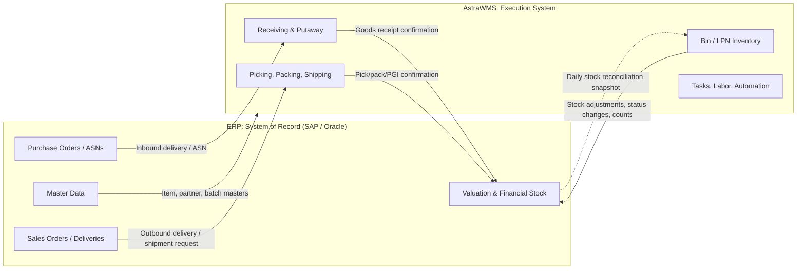

# A — Executive Summary

## A.1 Purpose

AstraWMS controls the physical execution of every warehouse movement: receiving, inspection, putaway, storage, replenishment, picking, packing, value-added services, loading, returns, and counting. It does this at the level of **bin, license plate (LPN), handling unit, lot, and serial**, and at the pace of the floor, which means sub-second RF response and real-time task release.

The ERP (SAP or Oracle) decides *what* must be received or shipped and *who* owns the stock financially. AstraWMS decides *where* the stock goes, *which* unit is used, *who* moves it, *in what sequence*, and with *what equipment*, and it confirms the physical result back to the ERP.

## A.2 Business Value

| Value Driver | Mechanism in AstraWMS | Typical Target (benchmark range, validated in the business case) |
|---|---|---|
| Inventory accuracy | Directed putaway, mandatory scan validation, cycle counting by ABC/velocity/exception, LPN tracking | Location accuracy ≥ 99.5%; ERP↔WMS variance 0 units at reconciliation |
| Order accuracy | Scan-to-confirm at pick, pack verification, weight check, cartonization | ≥ 99.9% lines shipped correctly |
| Labor productivity | Task interleaving, engineered labor standards (LMS), pick-path optimisation, zone/batch/cluster picking | 15–30% improvement in units per labor hour over a paper/RF-basic baseline |
| Space utilisation | Slotting engine, cube-aware putaway, dynamic bin assignment | 10–20% increase in effective storage capacity |
| Throughput and cut-off | Wave/waveless release, cartonization, automation orchestration | Meet carrier cut-offs ≥ 99%; same-day ship for orders received before cut-off |
| Compliance | Lot/serial genealogy, FEFO, temperature logging, DG segregation, e-signatures (21 CFR Part 11) | Recall trace ≤ 1 hour; zero DG segregation violations |
| Working capital | Real-time available-to-promise at bin level, faster dock-to-stock | Dock-to-stock ≤ 4 h (standard), ≤ 1 h (priority / cross-dock) |

## A.3 Role Relative to the ERP

**Ownership rules**

| Data / Event | Owner | Direction |
|---|---|---|
| Item master, UoM conversions, batch classification | ERP | ERP → WMS |
| Warehouse-specific item attributes (slotting class, case dims measured by cubiscan, pick UoM) | AstraWMS | WMS only (dimensions optionally sent back to ERP) |
| Bin master, zones, equipment, labor standards | AstraWMS | WMS only |
| Deliveries and quantities ordered | ERP | ERP → WMS |
| Physical receipt, pick, pack, and ship quantities | AstraWMS | WMS → ERP |
| Goods issue / goods receipt financial posting | ERP (triggered by WMS confirmation) | WMS → ERP |
| Stock status (unrestricted / QI / blocked) | Shared; the change is initiated in either system and synchronised | Bidirectional with conflict rules (§D) |

## A.4 High-Level Capability Map

| Domain | Capabilities |
|---|---|
| **Inbound** | Dock appointment scheduling, ASN / blind receipt, SSCC and LPN receiving, over/under/damage handling, QC sampling, directed putaway, cross-dock |
| **Storage & Inventory** | Multi-level location hierarchy, LPN nesting, lot/serial/expiry, stock status, cycle counting, physical inventory, adjustments with reason codes, holds |
| **Outbound** | Order pooling, wave and waveless release, allocation rules (FIFO/FEFO/LIFO/lot-match), discrete/batch/cluster/zone/pick-to-light/goods-to-person, cartonization, packing, labels, manifesting, loading |
| **Replenishment** | Min/max, demand-driven (wave-triggered), top-off, emergency, cross-zone |
| **Returns** | RMA receipt, grading and disposition, refurbish, return-to-vendor |
| **VAS & Kitting** | Labelling, bundling, gift wrap, kit build/break with component consumption |
| **Quality & Compliance** | Inspection plans, holds and quarantine, recall, 21 CFR Part 11, GDP, FSMA 204 traceability, DG/HazMat |
| **Multi-site & 3PL** | Multi-warehouse, multi-owner stock, client-specific rules, billing events |
| **Advanced** | Slotting optimisation, LMS, interleaving, cartonization, robotics orchestration (AMR/AGV/ASRS), IoT, AI forecasting, digital twin, computer vision |
| **Integration** | SAP (IDoc/BAPI/RFC/OData), Oracle (XML Gateway/Open Interfaces/REST), carriers, MHE/WCS, EDI |
| **Platform** | Cloud-native microservices, event-driven, multi-tenant, 99.95% availability, RPO ≤ 5 min, RTO ≤ 1 h |

## A.5 Scope Boundaries at a Glance

- **In scope:** everything inside the four walls, from dock appointment to trailer departure, plus the integrations that feed and confirm that execution.
- **Adjacent (integrated, not owned):** TMS, MES, OMS, WCS/WES from MHE vendors, carrier platforms, EDI VAN, BI/data lake.
- **Out of scope:** finance, costing, procurement, sales order entry, and production planning.
