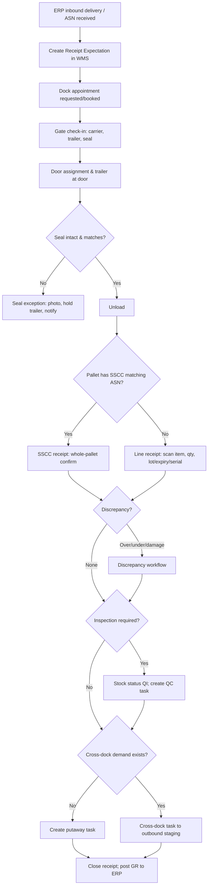
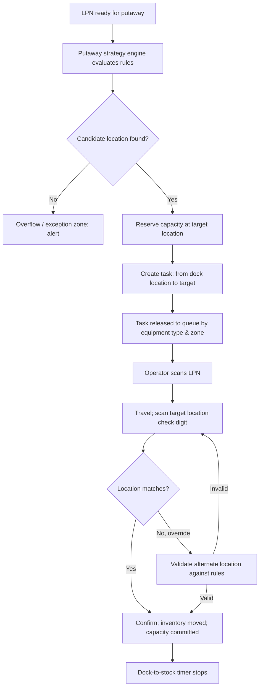

# B1 — Functional Scope: Inbound, Putaway & Storage

Each process section below follows the same structure: **Workflow → System Rules → Data Requirements → Exception Handling → User Roles**.

---

## 1. Inbound Logistics

### 1.1 Scope

Covers every inbound flow from receipt of the ERP expectation through dock scheduling, arrival, unloading, identification, receipt confirmation, and handover to putaway, quality, or cross-dock.

| Inbound Type | ERP Source (SAP) | ERP Source (Oracle) | Notes |
|---|---|---|---|
| Vendor receipt against PO | Inbound delivery (from vendor ASN / confirmation control) | ASN (RCV_HEADERS_INTERFACE / Fusion ASN) or expected receipt | Primary flow |
| Stock transport order (STO) receipt | Inbound delivery from replenishment delivery (NL/NLCC) | Internal requisition / in-transit shipment | Inter-site transfer |
| Customer return | Returns delivery (LR) | RMA receipt | See §8 |
| Production receipt | Goods receipt for process/production order (MIGO 101 against order), or decentral HU | WIP completion (Job/WO completion) | From MES/line |
| Blind receipt | None; ERP document created after the fact | Unordered receipt | Controlled by permission |
| 3PL client inbound | Client ASN via EDI 856 / 943 | Same | See §13 |

### 1.2 Workflow



**Step detail**

| # | Step | System Behaviour |
|---|---|---|
| 1 | Expectation creation | The inbound delivery IDoc/API creates a *Receipt Expectation* (header: vendor, carrier, expected date, PO refs; lines: item, qty, UoM, batch if vendor-managed, expected SSCCs). Expectations are versioned; ERP changes overwrite only while the status is `NOT_STARTED`. |
| 2 | Appointment | Carrier self-service portal or clerk books a slot. Slot capacity is defined per door group and time window, in pallets or in labor minutes. Load-type rules apply, e.g. floor-loaded containers take a 90-minute slot and palletised 26-pallet trailers take 45 minutes. |
| 3 | Gate check-in | Record trailer ID, license plate, seal number, driver, and temperature reading for reefers. The system assigns the door by rule: dedicated door for reefer, closest door to the putaway zone of the dominant item, or door availability. |
| 4 | Seal verification | Scan or enter the seal. A mismatch against the ASN seal raises exception `INB-EX-01`. |
| 5 | Unload & identify | RF prompts for SSCC scan. SSCC present on the ASN leads to whole-pallet receipt with the LPN = SSCC. Otherwise the user scans the item (GTIN/UPC/internal) and the system resolves the UoM from the GTIN level (each/inner/case/pallet). |
| 6 | Attribute capture | Captured according to the item's *capture profile*: lot, manufacturing date, expiry date, serials (per unit or by range), country of origin, catch weight, temperature. GS1-128 / DataMatrix application identifiers are parsed automatically (AI 01, 10, 11, 15, 17, 21, 310x, 00). |
| 7 | LPN assignment | The system builds the LPN (pallet) on the fly. It prints a WMS LPN label if there is no SSCC. It enforces a Ti-Hi check against the item pallet configuration. |
| 8 | Quality decision | The inspection rule is evaluated (§12). The stock status is set to `QI`/`QUARANTINE` or `AVAILABLE`. |
| 9 | Disposition | The next task is generated: putaway, cross-dock, QC sample pull, or rework (relabel/repalletise). |
| 10 | Receipt close | Manual close or auto-close on 100% receipt. The GR confirmation is sent to the ERP per delivery (SAP: inbound delivery confirmation with PGR; Oracle: receiving transaction RECEIVE+DELIVER or RECEIVE only, depending on routing). |

### 1.3 System Rules

| ID | Rule | Pri |
|---|---|---|
| INB-001 | Receipt against an expectation must validate the item against the expectation lines. Unexpected items are blocked unless the user holds `INB_RECEIVE_UNEXPECTED`. | M |
| INB-002 | Over-receipt tolerance is configurable per vendor, item class, and warehouse, as % and absolute units. Exceeding it requires supervisor override with a reason code. The default mirrors the ERP PO over-delivery tolerance (SAP `UEBTO`, Oracle `QTY_RCV_TOLERANCE`). | M |
| INB-003 | Under-receipt: a receipt may close short. The residual is reported back so the ERP can adjust the delivery or leave the PO open, as configured per flow. | M |
| INB-004 | Expiry validation: reject or hold when remaining shelf life < the item's *minimum remaining shelf life on receipt* (SAP `MHDRZ`; Oracle shelf-life days). | M |
| INB-005 | Lot uniqueness: the same lot number for the same item from different vendors is allowed; the system key is (item, lot, vendor-lot). | M |
| INB-006 | Serial capture: for serial-controlled items the count of serials must equal the received quantity in base UoM; duplicate serials within the item are rejected. | M |
| INB-007 | Catch weight: for catch-weight items, capture actual weight per case or per pallet within tolerance (±x%) of nominal. | S |
| INB-008 | Receipt date and time are stamped in site local time and UTC; the GR posting date follows ERP period rules (no posting into a closed period; next-open-period logic). | M |
| INB-009 | Door assignment respects temperature class, HazMat door restrictions, and door equipment (leveller, dock lock). | S |
| INB-010 | Appointment no-show: auto-release the slot after N minutes past the slot start; the carrier scorecard is updated. | S |
| INB-011 | ASN SSCC receipt must be a *single-scan* confirmation for a homogeneous pallet; mixed pallets require line-level verification, or ASN trust mode per vendor (trusted vendors can skip line-level verification). | S |
| INB-012 | Dock-to-stock timer starts at unload scan and ends at putaway confirmation. The timer is visible on the dashboard; an SLA breach raises an alert. | S |

### 1.4 Data Requirements

| Entity | Key Attributes |
|---|---|
| Receipt Expectation (header) | expectation_id, erp_doc_type, erp_doc_no, vendor_id, ship_from GLN, carrier SCAC, pro/BOL no., expected_arrival, seal_no, container_no, owner_id (3PL), status |
| Receipt Expectation (line) | line_no, erp_item_no, erp_line_ref (PO/PO line/schedule), qty_expected, uom, batch/lot (optional), expected SSCCs, stock_type_target, over/under tolerance |
| Appointment | appt_id, door_group, start/end, load_type, pallet_count, carrier, status, check-in / check-out timestamps |
| Receipt Transaction | txn_id, expectation_line, lpn, item, qty, uom, lot, expiry, serials[], status, user, device, timestamp, reason_code |
| Item capture profile | lot_ctrl, serial_ctrl (none/inbound/outbound/full), expiry_ctrl, catch_weight, coo_capture, temperature_capture, label_rule |

### 1.5 Exception Handling

| Code | Exception | Detection | Resolution Flow | ERP Impact |
|---|---|---|---|---|
| INB-EX-01 | Seal mismatch or broken | Seal scan ≠ ASN seal | Hold trailer; photo capture; supervisor decides to accept (record) or reject (trailer refused) | None until receipt; claim flagged |
| INB-EX-02 | Over-receipt beyond tolerance | Qty validation | Supervisor override (reason) **or** receive excess into `OVERAGE` status location pending buyer decision | ERP PO increase or return-to-vendor |
| INB-EX-03 | Short receipt | Receipt closed < expected | Reason code (vendor short, damaged, in transit); auto-generate vendor discrepancy report (EDI 861 optional) | Delivery quantity adjusted; PO remains open or closed per config |
| INB-EX-04 | Damaged goods | User flags damage | Received into `DAMAGED` status; photo evidence; creates claim record; route to damage cage | GR to blocked stock (SAP stock type `S`; Oracle hold status) |
| INB-EX-05 | Unknown item or GTIN not in master | Scan resolution fails | Item placed in `UNKNOWN` holding location; master data request to ERP; auto-retry mapping when the master arrives | None until resolved |
| INB-EX-06 | Expiry below minimum | INB-004 | Reject (refuse at dock) or receive to `QI` for QA decision | Blocked or QI stock |
| INB-EX-07 | ASN SSCC not found / duplicate SSCC | SSCC lookup | Convert to line-level receipt; relabel with WMS LPN | None |
| INB-EX-08 | Lot/serial mismatch with ASN | Attribute validation | Accept actual lot (ERP batch created by message) or hold, per vendor rule | Batch creation (SAP `BATMAS`/`BAPI_BATCH_CREATE`) |
| INB-EX-09 | Receipt with no expectation (blind) | No ASN | Permission-controlled; creates unplanned receipt; ERP document requested/created by inbound message | ERP creates inbound delivery / unordered receipt |
| INB-EX-10 | Temperature excursion on arrival | Reefer reading outside range | Hold entire load; QA notification; §14 cold-chain flow | QI stock |
| INB-EX-11 | ERP change after receipt started | Delivery update message for an `IN_PROGRESS` expectation | Change queued; supervisor must accept/reject; qty reduction below the received qty is rejected back to ERP | Error reply to ERP |

### 1.6 User Roles

| Role | Responsibilities |
|---|---|
| Dock Scheduler | Appointment management, door plan, carrier communications |
| Gate / Yard Clerk | Check-in/out, seal verification, trailer moves to door |
| Receiver (RF) | Unload, scan, capture attributes, LPN build, label |
| Receiving Supervisor | Discrepancy approval, overrides, receipt close, blind receipt authorisation |
| QA Inspector | Inspection decisions (§12) |
| Inventory Control Analyst | Unknown-item resolution, ERP discrepancy follow-up |

---

## 2. Putaway & Storage

### 2.1 Location Model

A seven-level hierarchy, with each level carrying attributes that are inherited downward:

```
Site (ERP plant / inventory org)
 └─ Warehouse
     └─ Building
         └─ Area (Ambient / Chilled / Frozen / HazMat / Bonded / Returns)
             └─ Zone (functional: Reserve, Forward Pick, Bulk, Staging, Dock, QC, Pack, VAS)
                 └─ Aisle / Rack / Level / Position  → Location (bin)
                     └─ Sub-location (slot / shelf divider / tote position)
```

| Location Attribute | Purpose |
|---|---|
| location_type | Rack, shelf, flow rack, carton flow, floor block stack, drive-in, pallet flow, ASRS slot, mezzanine, staging lane, dock door |
| dimensions (L×W×H), max weight, max volume | Capacity checks |
| max LPNs, mixed item allowed, mixed lot allowed | Consolidation rules |
| storage class (temperature, HazMat class, security level, bonded) | Compatibility checks |
| pick sequence, putaway sequence, travel coordinates (x, y, z) | Path optimisation and travel-time LMS |
| handling equipment required (reach truck, VNA, order picker, pallet jack, walk) | Equipment-based task routing |
| status (active, blocked-for-count, blocked-damage, inactive) | Operational control |
| ERP storage location mapping | Stock reconciliation to SAP SLoc / Oracle subinventory |

### 2.2 Putaway Workflow



### 2.3 Putaway Strategy Engine

Rules are evaluated as an **ordered strategy list**. Each strategy is a filter-plus-sort over candidate locations. The first strategy that yields a location wins. Strategies are assigned by *putaway rule key* = (warehouse, owner, item class, stock status, UoM, inbound type).

| Strategy | Logic |
|---|---|
| Fixed location (home) | Item's assigned forward pick location if it has capacity (used for case pick / each pick replenish-on-receipt) |
| Consolidate with same item/lot | Locations holding the same item (and lot if `mixed_lot=false`) with remaining capacity |
| Empty location, nearest to pick | Empty locations of the matching type, sorted by distance to the item's forward pick |
| Velocity zone | A-movers to golden zone / low levels; C-movers to high levels / far aisles |
| Bulk / block stack | Floor lanes with stacking limits (max stack height, stackability flag) |
| Directed to ASRS / automation | Send to induction point; ASRS WCS assigns the internal slot |
| Temperature / HazMat compatibility | Hard filter applied before all other strategies (never overridden) |
| Weight/height rule | Heavy pallets (> x kg) restricted to levels ≤ n |
| Cross-dock / flow-through | Direct to outbound staging when demand exists (§9) |

**Capacity algorithm:** a location accepts an LPN if `used_volume + lpn_volume ≤ max_volume × fill_factor`, `used_weight + lpn_weight ≤ max_weight`, `lpn_height ≤ location_height - clearance`, and the LPN count is below the maximum. Capacity is *reserved* when the task is created and *committed* on confirmation. Reservations expire if the task is cancelled.

### 2.4 System Rules

| ID | Rule | Pri |
|---|---|---|
| PUT-001 | Compatibility filters (temperature, HazMat segregation, bonded, owner segregation) are hard constraints; overrides are impossible for any role. | M |
| PUT-002 | Scan of location check digit required to confirm. Alternate location override requires permission `PUT_OVERRIDE` and is validated against PUT-001 plus capacity. | M |
| PUT-003 | Multi-LPN putaway: an operator may carry up to N LPNs (per equipment type); the system sequences drops by optimal route. | S |
| PUT-004 | Partial putaway: the operator may split an LPN when the target is full; the remainder gets a new task. | M |
| PUT-005 | Putaway to QI locations only for QI-status stock; available stock cannot be put into QC zones. | M |
| PUT-006 | Stock at dock is visible but *not allocable* until it is put away, unless cross-dock/flow-through is enabled. | M |
| PUT-007 | Putaway tasks are prioritised by: cross-dock urgency > dock congestion (door needed) > dock age > FIFO. | S |
| PUT-008 | Storage zone moves (internal relocation) use the same engine with source ≠ dock. | M |

### 2.5 Storage Management

| Capability | Description |
|---|---|
| LPN nesting | Pallet LPN → case LPN → inner → each; up to 5 levels. Moving the parent moves all children. |
| Mixed storage | Per-location flags for mixed item and mixed lot; mixed owner is never allowed in 3PL unless shared storage is enabled per contract. |
| Stock statuses | `AVAILABLE`, `QI`, `QUARANTINE`, `DAMAGED`, `HOLD` (with hold code), `ALLOCATED` (derived), `IN_TRANSIT` (internal move), `RETURNS_PENDING`, `EXPIRED`. |
| Internal moves | Ad-hoc (user-initiated with permission) or system-directed (consolidation, re-slotting, zone clearance). |
| Consolidation | A nightly job identifies partially filled locations of the same item/lot and generates consolidation tasks that are released when capacity-constrained. |
| Location blocking | Block for count, damage, or maintenance; blocked locations are excluded from putaway and allocation. |

### 2.6 Data Requirements

| Entity | Key Attributes |
|---|---|
| Location | location_id, barcode, check_digit, hierarchy, type, dims, capacity, class, pick/putaway seq, coordinates, status, erp_sloc |
| LPN | lpn_id (SSCC or internal), parent_lpn, type (pallet/case/tote), dims, weight, location, status, owner |
| Inventory record | item, lot, serial (optional), lpn, location, qty (base UoM), stock_status, owner, receipt_date, expiry, attributes (COO, grade) |
| Putaway rule | rule_key, ordered strategies, parameters |
| Item warehouse profile | storage class, pallet config (Ti/Hi), case/inner dims and weights, velocity class, home location(s), putaway rule key |

### 2.7 Exception Handling

| Code | Exception | Resolution |
|---|---|---|
| PUT-EX-01 | No location available | Route to overflow zone; alert inventory control; capacity report; slotting review flag |
| PUT-EX-02 | Target location occupied or damaged on arrival | Operator reports "location blocked", with location auto-blocked and a count task created; engine re-directs |
| PUT-EX-03 | LPN over-height / overweight for target | Operator reports; LPN dims updated; re-evaluate |
| PUT-EX-04 | LPN not found at dock | Search task; if not found in X min, LPN flagged missing; inventory held; supervisor investigation |
| PUT-EX-05 | Wrong LPN scanned | Hard stop; directs to the correct LPN or swaps the task to the scanned LPN if valid |
| PUT-EX-06 | Equipment breakdown mid-task | Task suspended with LPN at a drop location (P&D point); re-queued for other equipment |

### 2.8 User Roles

| Role | Responsibilities |
|---|---|
| Putaway Operator (reach truck / VNA / pallet jack) | Execute putaway, report location issues |
| Inventory Control Analyst | Overflow management, location maintenance, consolidation |
| Warehouse Engineer / Slotting Analyst | Location master, capacity parameters, putaway rules |
| Shift Supervisor | Task priority and queue management |
