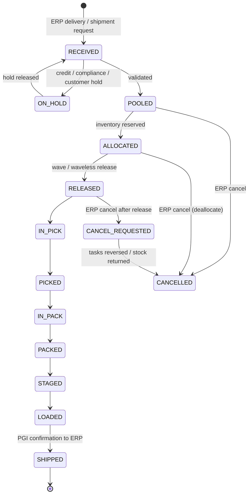
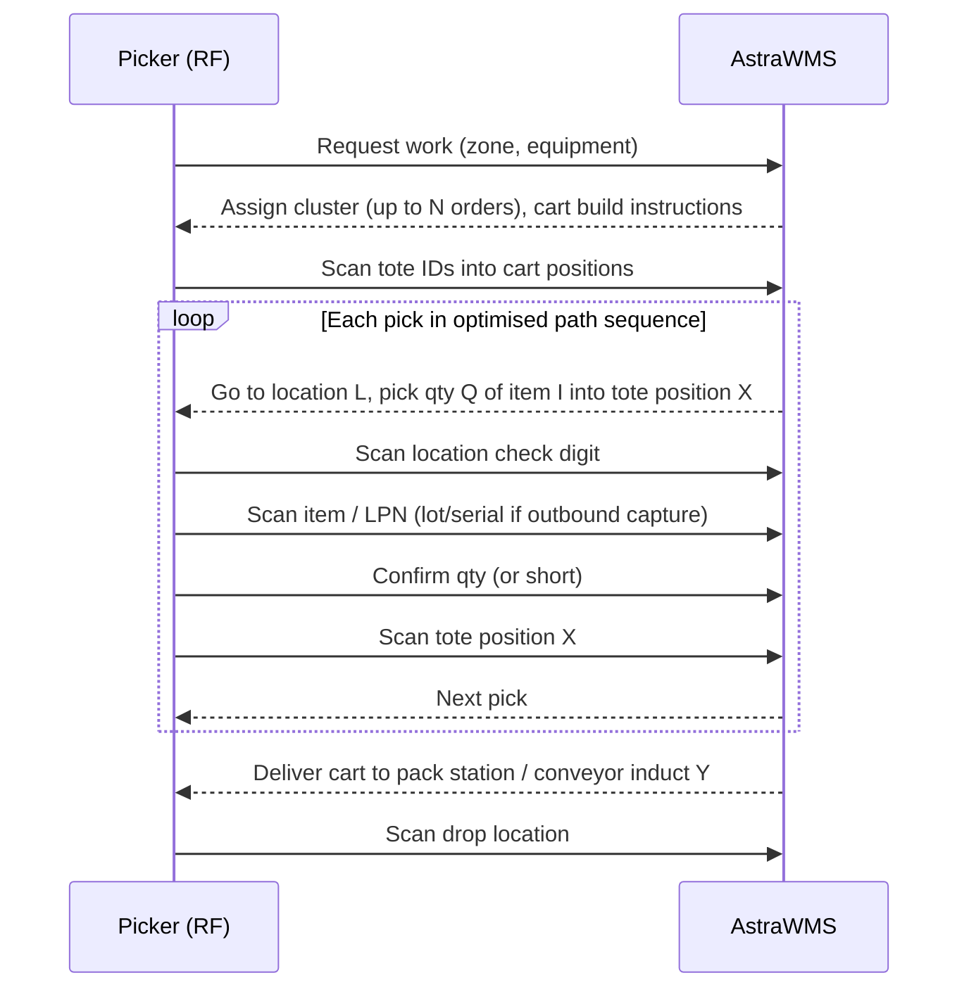
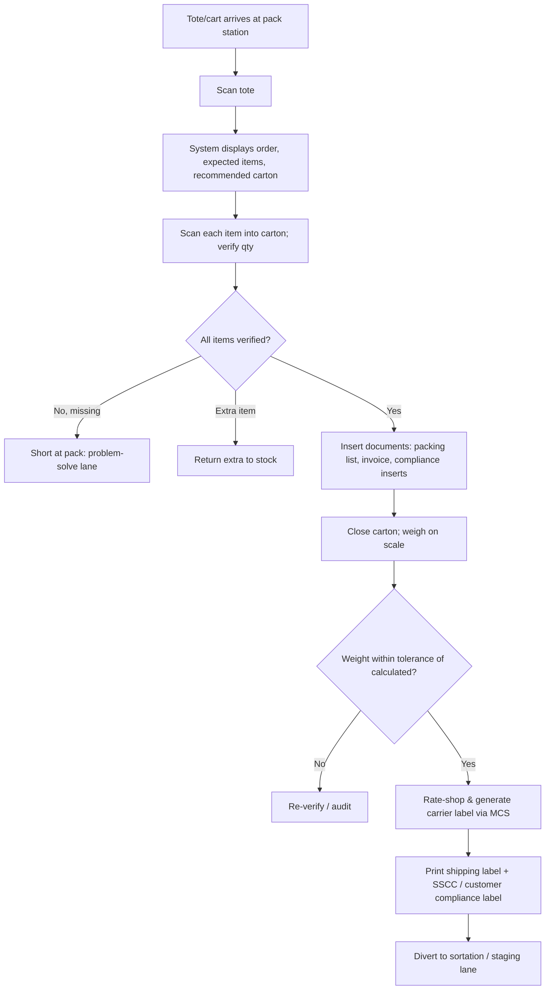

# B2 — Functional Scope: Outbound Execution

---

## 3. Outbound Logistics (Order Management & Release)

### 3.1 Scope

Covers receipt of outbound demand from the ERP, order pooling, allocation, release (wave or waveless), and order lifecycle tracking up to the handover to picking.

| Outbound Type | SAP Source | Oracle Source |
|---|---|---|
| Customer order (B2B) | Outbound delivery (LF) from sales order | Shipment Request (EBS WSH / Fusion shipment) |
| E-commerce (B2C) | Outbound delivery, typically 1–3 lines, high volume | Same |
| Stock transfer | Replenishment delivery (NL / NLCC) | Internal order / transfer order |
| Return to vendor | Returns delivery to vendor | RTV transaction / return-to-supplier |
| Production issue / staging | Reservation / production supply (PSA) | WIP component pick release / move order |
| Scrap / disposal | Goods issue for scrapping (mvt 551) initiated by WMS | Miscellaneous issue |

### 3.2 Order Lifecycle

### 3.3 Workflow

| # | Step | System Behaviour |
|---|---|---|
| 1 | Order receipt | Delivery message is validated: items exist, ship-to exists, carrier/service valid, quantities > 0, owner valid. Failures go to the integration error queue (§D.6). |
| 2 | Enrichment | Derive order type, priority, cut-off time (from carrier service × ship-to zone), required ship date, VAS requirements, customer compliance profile (labels, packing list, carton rules), hazmat flags. |
| 3 | Pooling | Orders sit in the pool with a computed *release-by time* = carrier cut-off − (pick + pack + load standard time) − buffer. |
| 4 | Allocation | Allocation engine reserves inventory (§3.4). Supports hard allocation at pooling (B2B) or soft allocation until release (B2C). |
| 5 | Release | Wave planning (§C.4) or waveless continuous release creates pick tasks, replenishment tasks, and cartonization results. |
| 6 | Status feedback | Optional status messages to ERP/OMS (released, picked, packed) for customer visibility; mandatory PGI/ship confirm at the end. |

### 3.4 Allocation Engine

The allocation engine is rule-driven. Rules are keyed by (owner, customer, item class, order type).

| Rule Dimension | Options |
|---|---|
| Rotation | FIFO (receipt date), FEFO (expiry), LIFO, lot-number sequence, manufacturing-date |
| Customer shelf-life | Minimum remaining shelf life per customer (e.g. retailer requires ≥ 70% remaining) |
| Lot control | Specific lot (ERP-assigned batch), single-lot-per-line, lot-mix limits, same-lot-as-previous-shipment for the customer |
| UoM optimisation | Allocate full pallets from reserve first, then full cases, then eaches from forward pick ("pallet > case > each" rule), with configurable thresholds |
| Location preference | Forward pick before reserve; minimise number of locations; clean-out (empty partial locations first) |
| Stock status | Only `AVAILABLE`; optional allocation of `QI` stock for customers that accept QI-release-on-ship (pharma distribution typically disallows) |
| Owner segregation | 3PL: only stock of order owner |
| Attribute match | Grade, COO, customer-specific attribute (e.g., "Halal-certified lot") |

**Short allocation handling:** configurable per order type: *ship partial & backorder*, *ship complete (hold order)*, *cancel remainder*, or *substitute item* (only if the ERP sends substitution rules). The result is reported back to the ERP for delivery quantity adjustment.

### 3.5 System Rules

| ID | Rule | Pri |
|---|---|---|
| OUT-001 | Orders with ERP delivery block or credit hold are received but not allocable. | M |
| OUT-002 | ERP delivery changes (qty increase/decrease, line add/delete) accepted while status < RELEASED; after release, change requests generate supervisor workflow. | M |
| OUT-003 | Cut-off-driven priority: orders not released by `release_by_time` escalate to priority 1 and raise an alert. | M |
| OUT-004 | Ship-complete orders are never partially released unless all lines are allocated (configurable exception: release to pick and hold at pack). | S |
| OUT-005 | Order consolidation: multiple deliveries to the same ship-to, carrier, and ship date may be consolidated into one shipment if the ERP permits (SAP delivery grouping honoured; WMS does not merge ERP deliveries into one ERP document). | S |
| OUT-006 | Hazmat orders validated for carrier/service eligibility before release. | M |

### 3.6 Exception Handling

| Code | Exception | Resolution |
|---|---|---|
| OUT-EX-01 | Insufficient inventory | Short allocation rule; notify ERP; backorder |
| OUT-EX-02 | Cancel after release | Tasks cancelled if not started; if picked, generate *reverse pick* (return-to-stock) tasks; confirm cancellation to ERP only after stock is back in an allocable status |
| OUT-EX-03 | Invalid ship-to / carrier | Order to `ON_HOLD – DATA`; integration alert |
| OUT-EX-04 | Missed cut-off | Auto re-plan to next carrier pickup; customer service notified; optional service upgrade rule |
| OUT-EX-05 | Allocated stock becomes unavailable (count variance, damage, QA hold) | Automatic re-allocation; if fails → short handling |

### 3.7 User Roles

Outbound Planner, Order Control Clerk, Customer Service (read-only visibility), Shift Supervisor.

---

## 4. Picking Strategies & Execution

### 4.1 Picking Methods

| Method | Description | Typical Use | Equipment |
|---|---|---|---|
| Discrete (order) picking | One picker, one order | Large B2B orders, heavy items | Pallet jack, order picker |
| Batch picking | One picker, multiple orders, same SKU aggregated then sorted | High-volume B2C with SKU overlap | Cart, put wall |
| Cluster picking | One picker, multiple orders into separate totes on a cart, pick-to-tote | B2C, small items | Multi-tote cart with position lights/scans |
| Zone picking (pick-and-pass) | Order container travels across zones | Large SKU range, conveyor | Conveyor, zone routing |
| Zone picking (parallel, consolidate later) | Each zone picks its part; consolidation at pack | Multi-temp orders | Consolidation wall |
| Full pallet picking | Allocate entire LPN | B2B / cross-site | Reach truck, forklift |
| Case picking / pick-to-pallet | Cases built to an outbound pallet with pallet-build sequencing (heavy first, crush class) | Grocery, retail DC | Pallet jack, LGV |
| Pick-to-light / put-to-light | Light-directed confirmation | High-velocity each pick | PTL hardware |
| Goods-to-person (GTP) | Automation brings stock to picker station | ASRS / AMR shelf robots | Shuttle, cube storage, AMR |
| Voice picking | Voice-directed with check-digit confirmation | Freezer, case pick | Headset + mobile |
| Pick-and-pack (pick-to-shipping-carton) | Cartonization upfront; picker picks directly into the shipper | B2C | Carton erector, cart |

### 4.2 Pick Execution Workflow (RF, cluster example)

### 4.3 Path Optimisation

- **Pick sequence** uses each location's `pick_seq` (serpentine/S-shape by default). With `travel optimisation = dynamic`, the system solves a TSP heuristic (nearest-neighbour with 2-opt improvement) over location coordinates, subject to one-way aisles and equipment constraints.
- **Pallet build constraints** override pure travel: heavy/non-crushable items first, crushables last, and item stacking groups per customer (store-friendly aisle-sequence builds).

### 4.4 System Rules

| ID | Rule | Pri |
|---|---|---|
| PCK-001 | Every pick requires a location scan (check digit accepted); item scan required unless the location is single-SKU and the item is flagged `trust_location` (configurable, off for regulated goods). | M |
| PCK-002 | Lot/serial scan at pick for items with outbound serial capture; system validates the scanned lot against allocation. A different valid lot is allowed via *lot substitution* if the allocation rule permits it; this triggers re-allocation. | M |
| PCK-003 | Short pick triggers: (a) record short with reason, (b) automatic cycle count on location, (c) re-allocation attempt from other locations, (d) if unsuccessful → short-ship handling. | M |
| PCK-004 | Pick UoM enforcement: the picker is prompted in the pick UoM (case/each), with conversion displayed; confirming in the wrong UoM is prevented. | M |
| PCK-005 | Pick container validation: tote/carton IDs must be unused and of the correct type; LPN is created on first pick. | M |
| PCK-006 | Task interleaving eligible (§C.3). | S |
| PCK-007 | Catch-weight capture at pick for variable-weight items. | S |
| PCK-008 | Pick-by-line vs. pick-by-order confirmation configurable; partial confirmation allowed. | M |
| PCK-009 | Picking from locations blocked for counting is prohibited; allocation automatically avoids them. | M |

### 4.5 Exception Handling

| Code | Exception | Resolution |
|---|---|---|
| PCK-EX-01 | Short pick / location empty | PCK-003 flow; location count task with priority |
| PCK-EX-02 | Damaged item at location | Pick alternate; move damaged unit to `DAMAGED` status via RF; inventory adjustment workflow |
| PCK-EX-03 | Wrong item scanned | Hard stop; audible alert; supervisor unlock after 3 consecutive errors |
| PCK-EX-04 | Tote full | "Tote full" function: close tote, scan new tote, continue (order split across containers) |
| PCK-EX-05 | Picker abandons task (shift end/break) | Task suspended; containers dropped at drop location; task re-assigned with pick progress preserved |
| PCK-EX-06 | Replenishment not complete when pick arrives | Pick task held in `WAIT_REPLEN`; interleaved; priority boost on the replenishment task |
| PCK-EX-07 | Expired stock at pick | Rejected by validation; stock set to `EXPIRED`; re-allocate |

### 4.6 User Roles

Picker (RF / voice / PTL), Equipment Operator, Pick Supervisor, Replenishment Operator.

---

## 5. Packing, Staging & Shipping

### 5.1 Packing Workflow

### 5.2 Packing Capabilities

| Capability | Description |
|---|---|
| Pack verification | Scan-to-verify each unit (or each case), serial capture at pack for outbound serial items |
| Carton recommendation | Cartonization output (§C.5) displayed; packer may override with reason (feeds engine tuning) |
| Weight verification | Expected weight = Σ(item weight) + carton tare + dunnage; tolerance ±% and absolute g; failures to audit |
| Document printing | Packing slip (customer template), commercial invoice for international, DG declaration, certificate of analysis (CoA) where required |
| Compliance labels | GS1-128 SSCC label, retailer-specific (e.g., store/DC routing, mark-for), RFID tag encoding (EPC SGTIN/SSCC) |
| Carrier integration | Rate shop, label generation, tracking number, via multi-carrier shipping platform APIs; parcel manifest close-out at end of day |
| Auto-pack lines | Integration with auto-bagger / carton-on-demand / print-and-apply via WCS |
| Over-pack / multi-carton | One order into many cartons; one carton with multiple orders only if same ship-to and allowed |

### 5.3 Staging & Loading

| Step | System Behaviour |
|---|---|
| Staging lane assignment | Lanes allocated by door, carrier, route, or stop sequence; lane capacity in pallet positions |
| Pallet build (outbound) | Cartons consolidated to shipping pallets; outbound pallet LPN (SSCC); stretch-wrap and label; pallet dims/weight captured |
| Load planning | Stop sequence (LIFO loading for multi-stop routes), weight distribution (axle limits), temperature compartments for multi-temp trailers |
| Load verification | Scan each pallet/carton into trailer; system blocks loading of wrong-destination units |
| Trailer close | Seal scan; BOL generation (VICS BOL for LTL/FTL); trailer departure → ship confirm |
| Ship confirm | Posts goods issue in ERP (SAP: delivery update with PGI; Oracle: ship confirm / shipment advice), sends EDI 856 ASN to customer (via EDI layer) |

### 5.4 System Rules

| ID | Rule | Pri |
|---|---|---|
| SHP-001 | A carton cannot be closed with unverified items unless supervisor override. | M |
| SHP-002 | Order cannot be loaded unless all cartons are packed and labelled (or partial-ship allowed). | M |
| SHP-003 | Load verification prevents cross-loading (scanned unit's ship-to/route ≠ trailer). | M |
| SHP-004 | Parcel manifest must be closed with the carrier before trailer departure; failure blocks ship confirm for that carrier. | M |
| SHP-005 | Ship confirm is atomic per ERP delivery; if the ERP rejects PGI, the delivery goes to `SHIP_ERROR` and remains physically shipped. The integration team resolves it within the SLA (§D.6). | M |
| SHP-006 | DG shipments require DG documentation, UN labels, and package marks validated before close. | M |
| SHP-007 | Serial numbers shipped are reported to ERP per delivery item (SAP serial number profile, Oracle serial transaction). | M |

### 5.5 Exception Handling

| Code | Exception | Resolution |
|---|---|---|
| SHP-EX-01 | Weight mismatch | Audit lane: full re-verify; root cause captured (pick error, master data weight error; master data correction request generated) |
| SHP-EX-02 | Carrier label API failure | Retry with exponential backoff; fallback to alternate carrier/service if rule permits; otherwise queue and alert |
| SHP-EX-03 | Missing carton at loading | Trailer cannot close; search task; supervisor may ship short → delivery adjusted (carton re-assigned to next shipment) |
| SHP-EX-04 | Trailer capacity exceeded | Split load; remaining pallets assigned to new trailer / next pickup |
| SHP-EX-05 | ERP PGI failure (e.g., period closed, stock inconsistency) | Retry; if business error, integration workbench with root cause; must be resolved before ERP period close |
| SHP-EX-06 | Order cancelled after pack | Unpack workflow; items to return-to-stock; labels voided with carrier |

### 5.6 User Roles

Packer, Pack Auditor, Shipping Clerk, Loader, Dock Supervisor, Transportation Coordinator.
