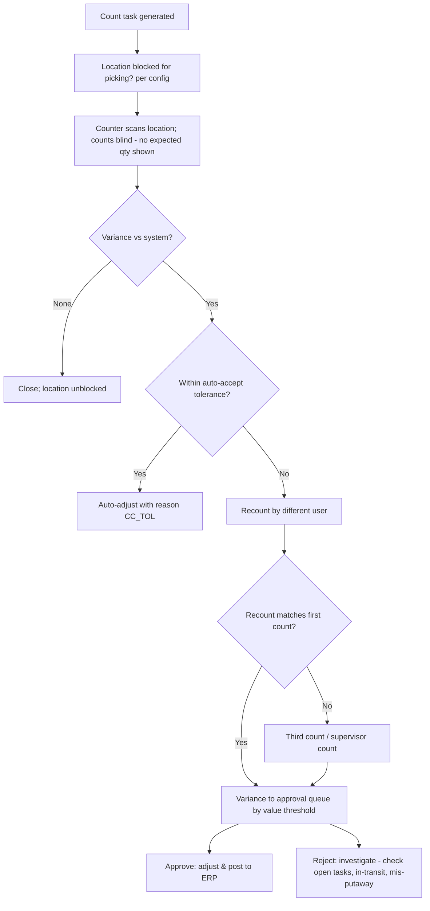
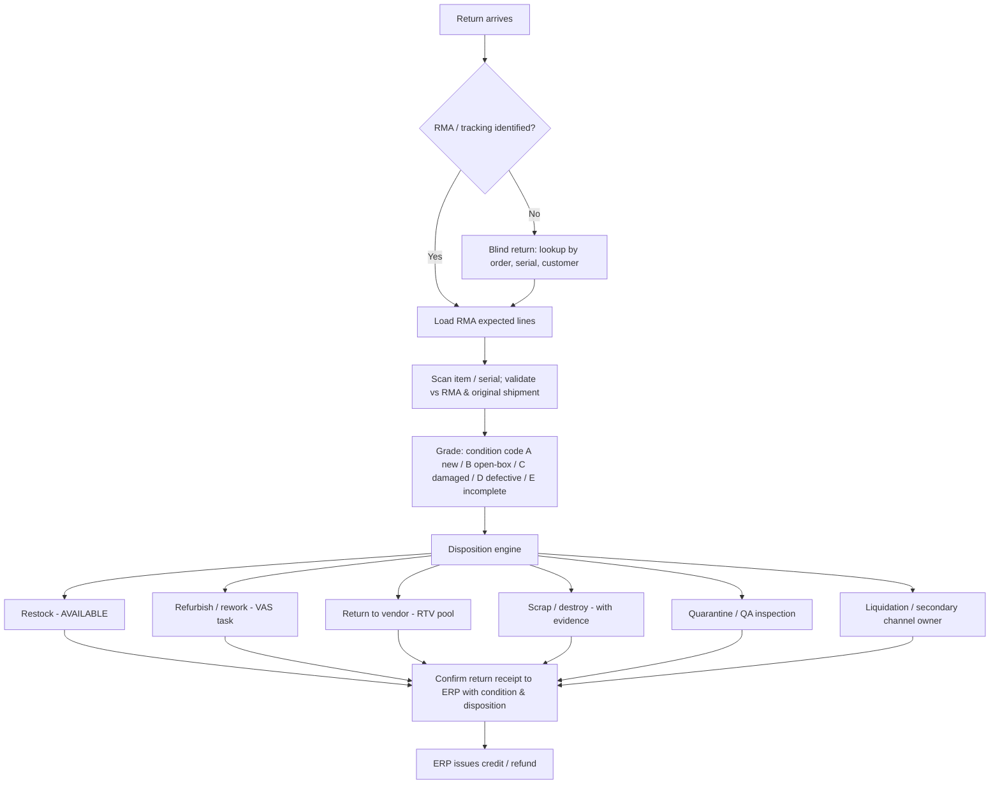

# B3 — Functional Scope: Inventory Control, Replenishment, Returns & Cross-Docking

---

## 6. Inventory Management

### 6.1 Inventory Model

Inventory is held at the grain of **(owner, item, lot, serial, stock status, LPN, location)**. The quantity is stored in the base UoM, with configurable UoM conversions per item. Every change is recorded as an immutable *inventory transaction*. Balances are materialised views that are kept consistent within the same database transaction.

| Stock Bucket | Allocable | Maps to SAP | Maps to Oracle |
|---|---|---|---|
| AVAILABLE | Yes | Unrestricted (stock type ' ') | Available onhand, status "Active" |
| QI | No (optional exception) | Quality inspection (X) | Status "Quality Hold" (material status) |
| QUARANTINE / HOLD | No | Blocked (S) | Status "Hold" |
| DAMAGED | No | Blocked (S), optional separate SLoc | Separate subinventory (e.g., DAMAGE) |
| RETURNS_PENDING | No | Returns stock (mvt 651 → blocked returns) | RMA receiving (inspection routing) |
| EXPIRED | No | Blocked or separate SLoc | Hold status / expired lots |
| ALLOCATED | Derived | Not sent (ERP sees unrestricted) | Reservation (optional sync) |
| IN_TRANSIT (internal) | No | Not sent | Not sent |

### 6.2 Inventory Control Functions

| Function | Description |
|---|---|
| Inventory inquiry | By item, location, LPN, lot, serial, owner, status; with history drill-down |
| Adjustments | Positive/negative adjustment with mandatory reason code; reason code maps to ERP movement type / transaction type and GL account determination (SAP 701/702, 711/712 or 551; Oracle Account Alias / misc receipt/issue) |
| Status change | Available ↔ QI ↔ Blocked; ERP-synchronised (SAP 321/322, 343/344, 349/350; Oracle material status update / subinventory transfer) |
| Lot attribute change | Expiry correction, lot re-grade; ERP batch update |
| Item-to-item conversion | Relabel/repack SKU conversion (e.g., each → pre-pack) posted as issue + receipt |
| Owner transfer (3PL) | Title change between owners (consignment) |
| Holds | Holds by item, lot, location, LPN, vendor, owner, or attribute query (e.g., "all lots from vendor X manufactured between dates"); hold reason, expected release, approval workflow |
| Serial tracking | Full serial lifecycle: received, located, picked, packed, shipped, returned |
| Genealogy | Lot-to-lot parent/child through kitting, repack, and cross-reference to inbound and outbound documents |

### 6.3 Cycle Counting

| Count Type | Trigger |
|---|---|
| ABC count | Frequency by class (A: monthly, B: quarterly, C: semi-annually; configurable) |
| Location-based | Every location counted N times per year, schedule levelled daily |
| Exception / event | Short pick, zero-crossing (location goes to 0 or negative expectation), putaway location blocked, customer complaint |
| Opportunistic | Low quantity threshold (count when ≤ x units remain; the picker counts at the pick) |
| Ad-hoc | Supervisor-created by item/location/zone |
| Physical inventory (wall-to-wall) | Freeze zone/warehouse; count; recount; approve; post |

**Count workflow**

**Tolerance matrix:** auto-accept only if |variance units| ≤ U **and** |variance value| ≤ V **and** item is not serial/regulated. Approval levels escalate by value (e.g., < $500 supervisor, < $5,000 inventory manager, above that finance controller).

**Posting:** the counting of physically-checked quantities uses ERP physical inventory documents when required by audit policy (SAP: PI document create/count/post via `BAPI_MATERIAL_PHYSINV_CREATE_MULT`, `…_COUNT`, `…_POST_DIFF`; Oracle: cycle count entries / physical inventory adjustments). Otherwise net adjustments are posted as goods movements.

### 6.4 System Rules

| ID | Rule | Pri |
|---|---|---|
| INV-001 | No negative inventory at location level, ever. | M |
| INV-002 | All adjustments require a reason code; each reason code defines the ERP movement mapping, approval requirement, and whether the adjustment counts against inventory accuracy KPIs. | M |
| INV-003 | Count tasks are blind (expected qty not shown). | M |
| INV-004 | Counts in locations with open tasks (pending pick/putaway) are either deferred or computed with open-task awareness ("snapshot at count start" logic). | M |
| INV-005 | Status changes on stock allocated to released orders require de-allocation first; system performs auto re-allocation. | M |
| INV-006 | Every inventory transaction captures: user, device, timestamp (UTC), before/after qty, reason, source document, correlation ID for ERP message. | M |
| INV-007 | Expiry monitor: nightly job moves expired lots to `EXPIRED` and generates ERP status change; pre-expiry alerts at configurable days. | M |
| INV-008 | Segregation of duties: a user who counted cannot approve their own variance. | M |

### 6.5 Exception Handling

| Code | Exception | Resolution |
|---|---|---|
| INV-EX-01 | ERP↔WMS stock variance at reconciliation | Reconciliation workbench (§D.6.4): classify (timing, failed message, genuine); re-post or adjust |
| INV-EX-02 | Found stock (no system record) | Receive into `FOUND` status via adjustment; investigate mis-putaway; ERP positive adjustment post-approval |
| INV-EX-03 | Serial mismatch at count | Serial exception report; hold serial; investigation |
| INV-EX-04 | Count exceeds approval threshold | Escalation workflow with SLA timer |

### 6.6 User Roles

Cycle Counter, Inventory Control Analyst, Inventory Manager, Finance Controller (approver, read-only elsewhere), Auditor (read-only).

---

## 7. Replenishment

### 7.1 Replenishment Types

| Type | Trigger | Quantity Logic |
|---|---|---|
| Min/Max | Forward location qty ≤ min | Replenish up to max (rounded to replenishment UoM: full case / full pallet) |
| Demand-driven (wave) | Wave release: demand for pick location > on-hand + open replen | Replenish demand shortfall rounded up to UoM, capped by location capacity |
| Top-off | Low-activity period; location below top-off % | Fill to max to reduce replen during peak |
| Emergency | Picker at empty location or pick in `WAIT_REPLEN` | Minimum to satisfy pick; highest priority |
| Predictive | Forecasted demand next N hours (§C.8) | Pre-position before wave |
| Cross-zone / inter-building | Forward area served from remote reserve (other building / ASRS) | Transfer order in full LPNs |

### 7.2 Workflow

1. The trigger evaluates → creates a replenishment request (item, target location, qty, priority).
2. Source selection uses the allocation rules (FEFO/FIFO, full LPN preference, and "clean-out" preference).
3. The task is created. The putaway into forward pick is *reserved* so that the same location is not over-replenished.
4. Execution: the operator picks from reserve (scan LPN) → drops at forward location (scan check digit) → confirms.
5. Two-step replenishment option: reserve → drop zone (P&D) → forward-pick location, by two different equipment types (e.g., VNA drops, pallet jack puts into flow rack).

### 7.3 System Rules

| ID | Rule | Pri |
|---|---|---|
| RPL-001 | Replenishment respects FEFO/FIFO so that the forward location does not receive newer stock while older stock remains in reserve (optional "lot homogeneity" at forward pick). | M |
| RPL-002 | Replen priority dynamically increases when dependent pick tasks exist; emergency > wave-driven > min/max > top-off. | M |
| RPL-003 | Overflow at forward location: excess returns to reserve or goes to overflow location adjacent. | S |
| RPL-004 | Replenishment must complete X minutes before dependent pick release (wave lead-time setting). | S |
| RPL-005 | Min/max parameters recalculated by the slotting engine weekly from velocity (days-of-cover model), subject to approval. | S |

### 7.4 Exception Handling

| Code | Exception | Resolution |
|---|---|---|
| RPL-EX-01 | No reserve stock | Short in forward → pick shorts → backorder; purchase signal report to ERP planner |
| RPL-EX-02 | Reserve LPN short | Count task on reserve; re-source |
| RPL-EX-03 | Forward location full / mis-slotted item present | Location exception; count; relocation task |

### 7.5 User Roles

Replenishment Operator, Inventory Control Analyst, Slotting Analyst.

---

## 8. Returns & Reverse Logistics

### 8.1 Return Types

| Type | ERP Reference | Notes |
|---|---|---|
| Customer return (B2B) | SAP returns order → returns delivery (LR); Oracle RMA | Expected by RMA |
| E-commerce return | RMA from OMS/ERP; or return label barcode | High volume, single unit |
| Unexpected return / refused delivery | Carrier return; no RMA | Blind return with lookup by tracking no./order no. |
| Return to vendor (RTV) | SAP returns delivery to vendor (mvt 122/161); Oracle Return to Supplier | Outbound flow |
| Internal return from production | Reservation return | Component return to stock |
| Recall return | Recall campaign ID | Mandatory quarantine |

### 8.2 Workflow

### 8.3 Disposition Engine

Decision table keyed by (owner, item class, return reason, condition grade, days since ship, serial warranty status, item value).

| Example Condition | Disposition |
|---|---|
| Grade A, within 30 days, non-regulated | Restock |
| Grade B, electronics, value > $100 | Refurbish (test + repack) |
| Grade C/D, vendor warranty active | RTV |
| Pharma / food any grade | Quarantine → destroy (regulatory) unless QA release |
| Recall campaign | Quarantine; campaign counter updated |
| Value < handling cost threshold | Scrap / donate ("returnless refund" candidates flagged back to OMS) |

### 8.4 System Rules

| ID | Rule | Pri |
|---|---|---|
| RET-001 | Serial returned must match a serial previously shipped to that customer; mismatches flag potential fraud. | M |
| RET-002 | Returned quantity > RMA quantity requires override. | M |
| RET-003 | Regulated products (pharma, food) default to non-saleable unless QA release. | M |
| RET-004 | Condition, reason, and disposition captured per unit and sent to ERP for credit decision. | M |
| RET-005 | Photos attachable per unit (mandatory for grade C/D above value threshold). | S |
| RET-006 | RTV consolidation per vendor with RTV authorisation number required before shipment. | S |

### 8.5 Exception Handling

| Code | Exception | Resolution |
|---|---|---|
| RET-EX-01 | No RMA / unidentifiable | Hold in returns problem-solve location with photo; customer service case |
| RET-EX-02 | Wrong item returned | Receive as actual item with flag; ERP notified for credit adjustment |
| RET-EX-03 | Serial not shipped by us | Quarantine; fraud workflow |
| RET-EX-04 | RTV refused by vendor | Re-disposition (scrap / liquidate) |

### 8.6 User Roles

Returns Processor, Returns Grader / Technician, QA Inspector, Returns Supervisor, Customer Service (read).

---

## 9. Cross-Docking

### 9.1 Cross-Dock Types

| Type | Description |
|---|---|
| Planned (pre-distributed) | Inbound ASN carries store/customer allocation (e.g., EDI 856 with mark-for); pallets are pre-labelled per destination |
| Planned (post-distribution) | Inbound bulk quantity allocated to outbound orders at receipt; break-bulk and sort |
| Opportunistic | At receipt, system detects backorders/open demand for the item and diverts |
| Flow-through (merge-in-transit) | Inbound components merged with stock picks for the same outbound shipment |
| Transload | Full pallets from inbound container to outbound trailer without break |

### 9.2 Workflow

1. At receipt, the cross-dock engine evaluates open demand: backorders, orders due ≤ N hours, and planned cross-dock allocations.
2. The received quantity is split: the cross-dock portion goes to an outbound staging/sort task and the remainder goes to putaway.
3. Break-bulk: cases are sorted to destination (sorter induction or put-to-store).
4. Outbound LPN/SSCC is created and staged at the outbound door.
5. ERP postings: GR (inbound) and GI (outbound) are posted as separate documents. Stock never shows as available in between; it is allocated immediately to the outbound delivery.

### 9.3 System Rules

| ID | Rule | Pri |
|---|---|---|
| XDK-001 | Cross-dock priority: backorders of priority customers > planned cross-dock > regular orders due today. | S |
| XDK-002 | Cross-dock only for stock received as `AVAILABLE` (QI stock never cross-docked). | M |
| XDK-003 | Lot/expiry constraints of the outbound customer still apply. | M |
| XDK-004 | Dwell time SLA (e.g., ≤ 24 h in staging) with alerting. | S |

### 9.4 Exception Handling

| Code | Exception | Resolution |
|---|---|---|
| XDK-EX-01 | Inbound short vs planned cross-dock allocation | Fair-share or priority allocation across destinations; shortfall to regular fulfilment |
| XDK-EX-02 | Outbound trailer not available | Staged stock remains allocated; after dwell SLA → putaway with allocation kept |
| XDK-EX-03 | Outbound order cancelled after cross-dock split | Redirect to putaway |

### 9.5 User Roles

Cross-Dock Coordinator, Receiver, Sorter, Loader.
