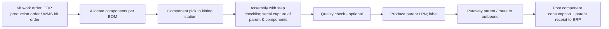
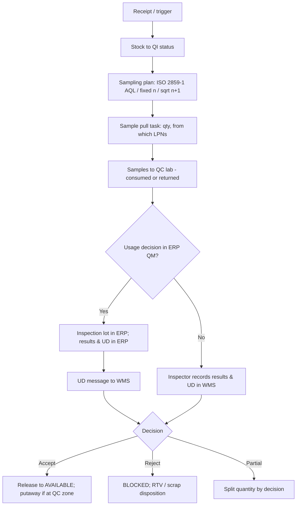

# B4 — Functional Scope: Specialised Operations

---

## 10. Value-Added Services (VAS)

### 10.1 VAS Catalogue

| VAS Code | Service | Trigger | Output |
|---|---|---|---|
| LBL | Labelling / relabelling (price tags, retailer labels, country-specific) | Customer compliance profile or order line instruction | Labelled units |
| TAG | RFID tagging / encoding | Customer requirement | EPC-encoded units, encode log |
| BND | Bundling / multipack | Order line VAS code | Bundle as new SKU or as instruction only |
| GFT | Gift wrap / personalisation message | E-com order attribute | Wrapped unit, printed message |
| KIT | Kitting | See §11 | Kit SKU |
| PRP | Pre-pack / pack-out to retailer ratio packs | Pre-pack BOM | Pre-pack SKU |
| INS | Insert / literature | Customer profile | Carton with insert |
| STK | Sticker, security tag, hanger | Retailer profile | Store-ready unit |
| QCK | Inspection / functional test | Returns refurbish or customer request | Test result record |
| SHR | Shrink-wrap / display build (PDQ) | Promotion order | Display unit |

### 10.2 Workflow

1. VAS requirements are derived at order enrichment (from order-line VAS codes, customer profile, or item profile).
2. At release, the system creates a *VAS work order* linked to the order lines. Picks are routed to a VAS station instead of pack.
3. At the VAS station, the operator scans the tote. The system displays the instructions (text, images, video link), the materials required (labels, wrap, inserts), and the labor standard.
4. The operator confirms each step (optional step-by-step checklist with photo capture).
5. Consumables are consumed from VAS station stock (optional inventory tracking of consumables).
6. Completion triggers routing to pack. A billable event is logged (3PL).

### 10.3 System Rules

| ID | Rule | Pri |
|---|---|---|
| VAS-001 | VAS work orders are sequenced to complete before the order's pack deadline; VAS lead time is included in the release-by calculation. | M |
| VAS-002 | VAS station capacity (operators × standard minutes) is a constraint in wave planning. | S |
| VAS-003 | Each VAS completion generates a billable event (3PL) with quantity, service code, and owner. | M |
| VAS-004 | Label print jobs are data-driven templates (ZPL/label designer) versioned per customer. | M |

### 10.4 Exceptions

| Code | Exception | Resolution |
|---|---|---|
| VAS-EX-01 | Consumable out of stock | Replenish consumable; order held at VAS with alert |
| VAS-EX-02 | Unit damaged during VAS | Damage adjustment; re-pick replacement |
| VAS-EX-03 | Instruction missing / ambiguous | Hold with "instruction required"; customer service/3PL account manager task |

### 10.5 Roles

VAS Operator, VAS Lead, 3PL Account Manager.

---

## 11. Kitting, De-kitting & Light Manufacturing

### 11.1 Scope

This covers assembly operations inside the warehouse that consume components and produce a parent item, and the reverse. Full production with routings, scheduling, and machine integration stays in the MES/ERP. AstraWMS supports **single-level and multi-level BOMs of up to 3 levels, without routing costs**.

| Mode | Description |
|---|---|
| Build-to-stock kitting | Kit work order (from ERP or WMS-planned) builds N kits into inventory |
| Build-to-order kitting | Outbound order for kit SKU triggers kit build, with components picked as part of the order |
| Virtual kit (pick-list kit) | Kit SKU exploded into components at allocation; shipped as components in one carton; no kit inventory |
| De-kitting | Break kit into components (returns, overstock, component shortage) |
| Light assembly | Simple assembly steps (e.g., attach accessory, configure device) with test record |

### 11.2 Workflow

**ERP posting pattern**

| Scenario | SAP | Oracle |
|---|---|---|
| ERP-planned kit (production/process order) | Component GI mvt 261 + parent GR mvt 101 against the order (`BAPI_GOODSMVT_CREATE`, code 03/02) or confirmation (`BAPI_PRODORDCONF_CREATE_TT`) | WIP component issue + assembly completion (`WIP_MOVE_TXN_INTERFACE` / `MTL_TRANSACTIONS_INTERFACE`; Fusion work order material and completion transactions) |
| WMS-planned kit (no ERP order) | Component issue mvt 261 against a standing kitting cost-collector order, or 311/309 material-to-material transfer if valuation permits | Account alias issue + receipt, or Fusion "Inventory Transaction" with kit alias |
| De-kit | Reverse movements (262 / 102) or 309 | Reverse transactions |

### 11.3 System Rules

| ID | Rule | Pri |
|---|---|---|
| KIT-001 | BOM version effective at the work-order date is used; BOM master is received from ERP (SAP `BOMMAT` / CS BOM; Oracle `BOM_STRUCTURES_B`). | M |
| KIT-002 | Component lot/serial genealogy is recorded against the parent serial/lot. | M |
| KIT-003 | Kit cannot be completed with missing components unless an approved substitute component is defined. | M |
| KIT-004 | Partial completion allowed; remaining components stay allocated to the work order. | S |
| KIT-005 | Parent lot expiry = min(component expiry) unless rule overrides. | M |

### 11.4 Exceptions

| Code | Exception | Resolution |
|---|---|---|
| KIT-EX-01 | Component short | Hold WO; partial build; substitution workflow |
| KIT-EX-02 | Component defective during assembly | Scrap component with reason; re-pick |
| KIT-EX-03 | ERP order closed / technically completed during build | Posting rejected → integration workbench; supervisor decides |

### 11.5 Roles

Kitting Planner, Kitting Operator, Kitting Lead, QA Inspector.

---

## 12. Quality Management & Compliance

### 12.1 Scope

This covers warehouse-level quality: receipt inspection, holds, sampling, release, recall, and regulatory compliance controls. The **usage decision is in AstraWMS or in the ERP QM module**, configurable per site. When SAP QM or Oracle Quality is active, AstraWMS executes the physical sampling and the ERP records the usage decision, which is sent back to release the stock.

### 12.2 Inspection Triggers

| Trigger | Example |
|---|---|
| New vendor / new item | First N receipts are 100% inspected |
| Skip-lot | Vendor rated A: inspect every 5th lot |
| Item class | Pharmaceuticals: always QI on receipt |
| Return | Any regulated item returned |
| Periodic | Re-test date reached (pharma re-test) |
| Event | Temperature excursion, customer complaint, recall |

### 12.3 Workflow

### 12.4 Compliance Controls

| Regulation / Standard | AstraWMS Control |
|---|---|
| 21 CFR Part 11 (FDA electronic records/signatures) | Electronic signatures (user ID + password re-entry + meaning) for QA release, adjustments of regulated stock, and master changes; audit trail immutable; validated system (GAMP 5 Category 4 configuration) |
| EU GDP (2013/C 343/01) | Temperature-controlled storage verification, quarantine segregation, returns re-qualification, falsified medicines awareness |
| DSCSA (US) / EU FMD | Serialized product tracking; aggregation (case ↔ unit) capture; verification of product identifier on returns; EPCIS event export |
| FSMA 204 (Food Traceability Rule) | Key Data Elements (KDEs) captured for Critical Tracking Events (CTEs): receiving, shipping, transformation; 24-hour record production |
| ISO 9001 / ISO 22000 | Non-conformance records, CAPA links, document control of work instructions |
| C-TPAT / AEO | Seal verification, trailer inspection checklist (17-point), access logging |
| Customs bonded warehouse | Bonded status, duty-unpaid stock segregation, customs reference per receipt/shipment |

### 12.5 Recall Management

1. Recall is initiated by item + lot range (or serial list, or a date range + vendor).
2. The system executes a *trace forward* (where shipped: customers, shipments, quantities) and a *trace backward* (source receipt, vendor, component lots).
3. Remaining on-hand stock is automatically placed on hold with hold code `RECALL-<id>`. Open allocations are cancelled and re-allocated.
4. Output: a recall report within 1 hour, including the customer contact list (from ERP), quantities by location, and quantities shipped.
5. Return receipt against the recall campaign, with reconciliation (shipped vs returned vs destroyed).

### 12.6 System Rules

| ID | Rule | Pri |
|---|---|---|
| QM-001 | QI/blocked stock is never allocable; never pickable except for sample pull, RTV, or scrap tasks. | M |
| QM-002 | QA release requires e-signature for regulated item classes. | M |
| QM-003 | Sample quantities consumed are posted to ERP as sample consumption (SAP mvt 333 / 331; Oracle misc issue with alias). | M |
| QM-004 | Hold placed by ERP (batch status restricted) must be reflected in WMS within 60 seconds. | M |
| QM-005 | Recall trace across genealogy (kits, repacks) must return complete results. | M |

### 12.7 Exceptions

| Code | Exception | Resolution |
|---|---|---|
| QM-EX-01 | UD received for stock already moved/consumed | Apply to remaining qty; discrepancy report |
| QM-EX-02 | Sample pull short | Adjust sample plan; inspector notified |
| QM-EX-03 | Recall of lot partially in transit | Carrier intercept request; flag shipments |

### 12.8 Roles

QA Inspector, QA Manager (e-signature authority), Regulatory Compliance Officer, Qualified Person (QP, EU pharma).

---

## 13. Multi-Warehouse & Multi-Client (3PL)

### 13.1 Multi-Warehouse

| Capability | Description |
|---|---|
| Single instance, many sites | All sites share one AstraWMS tenant; configuration is inherited from *global → region → site* with site overrides |
| Site-specific time zones, calendars, shifts | Cut-offs and SLAs computed in local time |
| Inter-site transfers | Outbound at site A creates in-transit record; inbound expectation auto-generated at site B (if both on AstraWMS) and reconciled with ERP STO |
| Network visibility | Enterprise inventory view across sites (read-only for non-home users) |
| Site templates | New site created from template: zones, rules, roles, reports |

### 13.2 Multi-Client (3PL)

| Capability | Description |
|---|---|
| Owner (client) as a first-class dimension | All inventory, orders, rules, and master data carry `owner_id`; row-level security enforces isolation |
| Client-specific master data | Items keyed by (owner, item_no); same SKU code across clients never collides |
| Client-specific rules | Allocation, putaway, carton, labels, VAS, shelf-life, packing slips per client |
| Client ERP integration | Each client has its own integration channel (SAP, Oracle, other ERP, EDI 940/943/944/945/947, CSV/SFTP, REST) mapped to the canonical model |
| Client portal | Web portal: inventory, orders, ASN creation, shipment tracking, reports, invoices; client users restricted to own data |
| Billing | Billable events captured at the source (receipt per pallet/case/unit, storage per pallet-day/cubic-ft-day/location, pick per line/unit, VAS, special handling); rate cards per client contract; invoice export to 3PL's ERP/billing |
| Storage billing snapshots | Daily snapshot at configurable time (anniversary or calendar billing); split-month rules |
| Shared vs dedicated space | Location-level ownership assignment (dedicated) or shared with commingling rules |

### 13.3 System Rules

| ID | Rule | Pri |
|---|---|---|
| MWH-001 | Cross-owner data access is impossible for owner-scoped users (enforced at data layer, not UI only). | M |
| MWH-002 | Mixed-owner LPN or location forbidden unless shared storage enabled; even then, inventory record carries single owner. | M |
| MWH-003 | Billing events are immutable; corrections are credit/debit adjustment events. | M |
| MWH-004 | Inter-site in-transit visible in both sites and reconciled against ERP in-transit stock. | M |
| MWH-005 | Onboarding of a new client is achievable via configuration only (no code), within 10 business days for a standard profile. | S |

### 13.4 Exceptions

| Code | Exception | Resolution |
|---|---|---|
| MWH-EX-01 | Inter-site shipment received short | Discrepancy recorded at receiving site; ERP in-transit difference; claim workflow |
| MWH-EX-02 | Billing rate missing for event | Event held in `UNRATED`; account manager alert; invoice blocked until resolved |
| MWH-EX-03 | Client master item conflict | Integration reject with explicit owner + item key error |

### 13.5 Roles

Site Manager, Network Inventory Planner, 3PL Account Manager, Billing Analyst, Client Portal User (external).

---

## 14. Cold Chain & Hazardous Materials Handling

### 14.1 Cold Chain

| Capability | Description |
|---|---|
| Temperature classes | Frozen (≤ -18 °C), Chilled (2–8 °C), Cool (8–15 °C), Controlled Ambient (15–25 °C), Ambient; defined per item and per location/area |
| Compatibility enforcement | Item temperature class must match location class (PUT-001); staging lanes and doors also classed |
| Time-out-of-refrigeration (TOR) | Each LPN accumulates exposure time when scanned at non-classed locations (dock, staging); alert at threshold; hard block at maximum allowed excursion minutes (item-level parameter) |
| Sensor integration | Area/room sensors and in-trailer loggers stream readings (§C.7); excursions correlate to all LPNs in the zone during the interval |
| Receiving check | Reefer set-point and product core temperature capture (probe) at receipt; logger data upload (PDF/CSV from USB loggers) attached to receipt |
| Excursion workflow | Automatic hold of affected LPNs → QA assessment (stability data) → release or reject with e-signature |
| Outbound | Pack-out qualification: insulated shipper selection by lane and transit time (cartonization with thermal profiles: gel packs, dry ice quantity), dry ice as DG UN1845 |
| Freezer labor | Freezer exposure time per worker tracked; enforced warm-up breaks (LMS integration) |

### 14.2 Hazardous Materials (Dangerous Goods)

| Capability | Description |
|---|---|
| DG master data | UN number, proper shipping name, hazard class/division, subsidiary risk, packing group, limited/excepted quantity flags, flash point, ADR tunnel code, marine pollutant, NFPA/HMIS ratings, SDS reference; sourced from ERP EHS (SAP EHS / Oracle Product Hub) |
| Storage segregation | Segregation matrix by hazard class (e.g., oxidisers 5.1 not adjacent to flammables 3); location-level classes; maximum quantity per fire compartment (local fire code / EU Seveso thresholds); aggregate quantity monitoring |
| Putaway / allocation | Hard constraints based on the segregation matrix and compartment limits |
| Transport compliance | ADR (road EU), 49 CFR (US), IATA DGR (air), IMDG (sea) rules applied at carrier/service selection; forbidden-by-air flags |
| Packaging & labelling | UN specification packaging validation; hazard labels, orientation arrows, limited quantity marks, lithium battery marks (UN3480/3481/3090/3091) |
| Documentation | DG declaration (IATA Shipper's Declaration, multimodal DG form), emergency response info, placarding summary per trailer |
| Load segregation | Trailer load compatibility check (ADR 7.5.2 mixed loading prohibitions) |
| Spill / incident | Incident log, affected inventory hold, EHS notification |
| Training validation | Only users with valid DG certification (expiry date tracked) can pack/ship DG |

### 14.3 System Rules

| ID | Rule | Pri |
|---|---|---|
| CCH-001 | Temperature class compatibility checks are hard constraints across putaway, replenishment, staging, and loading. | M |
| CCH-002 | TOR limit breach places LPN on automatic hold. | M |
| CCH-003 | DG segregation matrix enforced at putaway and trailer load. | M |
| CCH-004 | Compartment quantity limits enforced (aggregate kg/L per class per compartment). | M |
| CCH-005 | DG tasks only assignable to certified users. | M |
| CCH-006 | Excursion data (sensor series) retained for product shelf life + 1 year minimum. | M |

### 14.4 Exceptions

| Code | Exception | Resolution |
|---|---|---|
| CCH-EX-01 | Room temperature excursion | Auto-hold all LPNs in area during excursion window; QA workflow; facilities alert |
| CCH-EX-02 | Sensor offline | Alert; manual reading task every N minutes until restored; data gap documented |
| CCH-EX-03 | DG compartment limit reached | Putaway redirected; if none, receipt hold |
| CCH-EX-04 | Carrier rejects DG | Re-route per DG service rules |
| CCH-EX-05 | Uncertified user attempts DG task | Task blocked; supervisor notified |

### 14.5 Roles

Cold Chain Coordinator, QA Manager, DG Compliance Officer, EHS Manager, Certified DG Packer.
