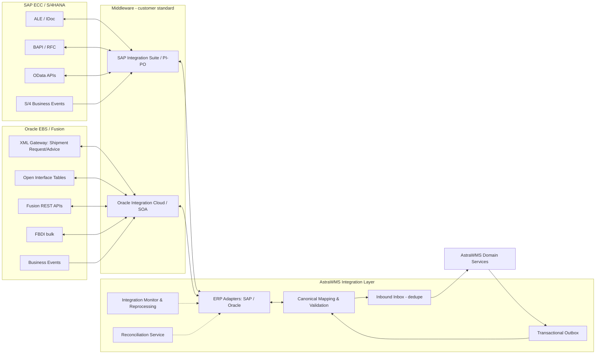
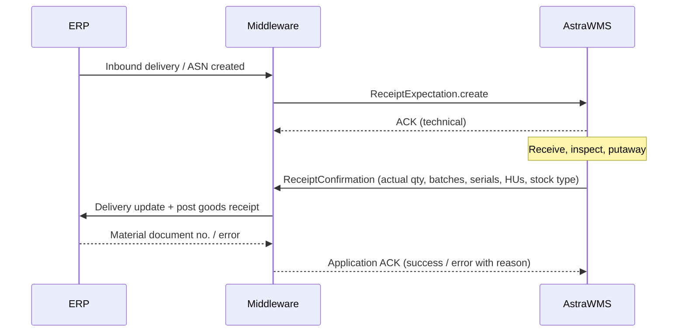
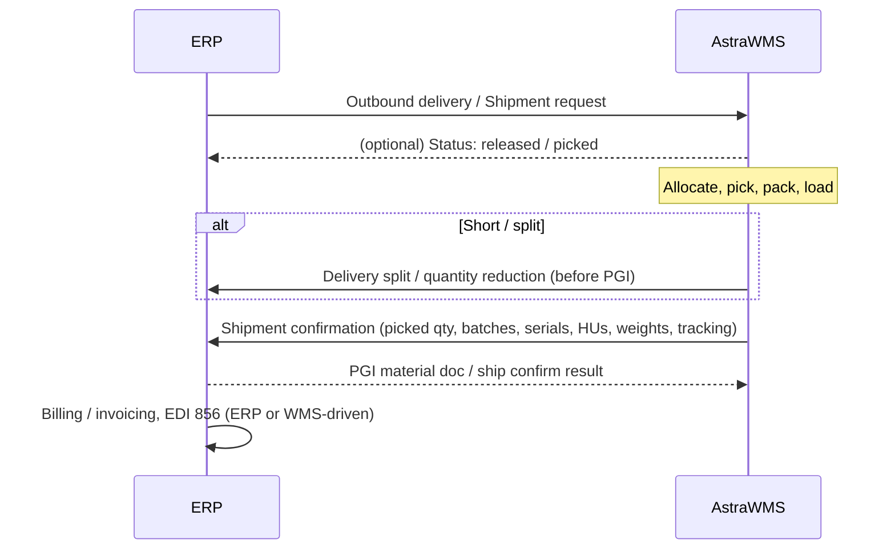

# D — ERP Integration Scope (SAP & Oracle)

> The ERP is the **system of record**; AstraWMS is the **execution system**. Integration is asynchronous and event-driven by default. It is idempotent, guaranteed-delivery, and ordered per business key. Synchronous calls are used only where a user is waiting for an ERP answer, for example availability checks or ad-hoc master lookups. Those calls always have a timeout and a fallback.

---

## D.1 Integration Architecture



### D.1.1 Layers

| Layer | Responsibility |
|---|---|
| **ERP-side technology** | Native interfaces: IDoc/ALE, BAPI/RFC, OData, business events (SAP); XML Gateway, Open Interface tables, REST, FBDI, business events (Oracle) |
| **Middleware (optional, customer standard)** | Transport, security mediation, protocol bridging (IDoc ↔ JSON), routing. AstraWMS supports direct connectivity when no middleware is mandated |
| **AstraWMS ERP adapters** | ERP-specific mapping to/from the **canonical WMS model**; one adapter per ERP family and version profile |
| **Canonical model** | Versioned JSON Schemas (e.g., `ReceiptExpectation.v3`, `OutboundOrder.v4`, `GoodsMovement.v2`); ERP-agnostic |
| **Inbox / Outbox** | Inbox deduplicates by `(source_system, message_id)` and orders per business key; Outbox guarantees at-least-once publication of events that commit in the same DB transaction as the business change |
| **Monitor & reprocessing** | Message store, status, error classification, edit-and-resubmit, bulk retry, alerting |
| **Reconciliation** | Scheduled stock and document reconciliation (§D.6.4) |

### D.1.2 Integration Patterns

| Pattern | Usage |
|---|---|
| Asynchronous messaging, guaranteed delivery | All transactional flows (deliveries, confirmations, goods movements) |
| Publish/subscribe events | Master data changes, status updates to OMS/TMS/portals |
| Request/reply (sync) with timeout ≤ 5 s | Ad-hoc lookups (e.g., batch characteristics, ATP check for order change) |
| Bulk/batch files (FBDI, IDoc packets, CSV/SFTP) | Initial loads, large master syncs, nightly stock snapshots |
| Store-and-forward | ERP downtime: messages queue in the Outbox; the warehouse keeps operating (§E.3) |

### D.1.3 Delivery Guarantees

| Property | Mechanism |
|---|---|
| Exactly-once *effect* | At-least-once transport + idempotent consumers (idempotency key = ERP document + item + WMS confirmation ID) |
| Ordering | Per business key (delivery number / item) via partitioned queues; ERP messages carry sequence/timestamp (SAP IDoc serialization via `SERIAL` / ALE serialization groups; Oracle via sequence in payload) |
| Poison messages | After N retries (exponential backoff 1 s → 15 min), moved to error store with classification; business flow flagged |
| Replay | Any message in the store can be re-submitted after correction, retaining the original ID for idempotency |

---

## D.2 Master Data Flows (ERP → WMS)

| Master Object | SAP Interface | Oracle EBS | Oracle Fusion | Frequency | WMS Behaviour |
|---|---|---|---|---|---|
| Item / Material (incl. UoM, GTINs, weights, dims, batch/serial flags, shelf life) | IDoc `MATMAS05` (ALE change pointers, BD21) or OData `API_PRODUCT_SRV` | Item interface / Business event `oracle.apps.ego.item.postItemCreate/Update` + extract from `MTL_SYSTEM_ITEMS_B`, `MTL_UOM_CONVERSIONS`, `MTL_CROSS_REFERENCES` | REST `itemsV2` + Product Hub events | Near-real-time on change; nightly delta safety sweep | Upsert item; warehouse profile fields (slotting, capture profile) preserved (WMS-owned) |
| Plant / storage location mapping | Config (T001W/T001L) – one-time + change control | Organizations / subinventories | Inventory organizations / subinventories | On change | Mapping table ERP SLoc ↔ WMS stock bucket |
| Customer / Ship-to | `DEBMAS07` or `API_BUSINESS_PARTNER` | `HZ_PARTIES` / `HZ_CUST_SITE_USES_ALL` extracts or TCA business events | REST `accounts` / `hubOrganizations` + events | On change | Compliance profile linked by customer key |
| Vendor / Supplier | `CREMAS06` or `API_BUSINESS_PARTNER` | `AP_SUPPLIERS` / sites | REST `suppliers` | On change | Vendor receiving profile (ASN trust, tolerances) |
| Batch master & characteristics | `BATMAS03` + `CLFMAS02` (classification) or `API_BATCH_SRV` | `MTL_LOT_NUMBERS` + lot attributes | REST lots (`inventoryLots` / item lots) | On change | Lot attributes, expiry, status |
| Batch / lot status | `BATMAS` (restricted flag) | Material status (`MTL_MATERIAL_STATUSES`) | Material status | Real-time | Hold/release (QM-004: ≤ 60 s) |
| BOM (kitting) | `BOMMAT04` | `BOM_STRUCTURES_B` / components | Product Hub structures REST | On change | Kit BOM versions |
| Dangerous goods | SAP EHS DG master (`DGM`/custom extract) or S/4 Product Compliance APIs | EHS item attributes / custom | Product Hub DG attributes | On change | DG attributes (§14.2) |
| Carriers / shipping conditions | Shipping conditions, forwarding agent (vendor) | `WSH_CARRIERS`, ship methods | Carriers & ship methods | On change | Carrier-service mapping |

**Rules**
- INT-001 (M): Master data messages are idempotent upserts keyed by ERP key plus owner (3PL). Deletions are soft (flag `ERP_DELETED`), and objects that are still referenced by open inventory or orders are never physically deleted.
- INT-002 (M): Transactions that reference an unknown master are *parked*, not rejected. They are automatically retried when the master arrives, with a timeout alert after 30 min.
- INT-003 (S): WMS-measured dimensions and weights can be sent back to the ERP (SAP `BAPI_MATERIAL_SAVEDATA` / `API_PRODUCT_SRV` PATCH; Oracle item update) under a data-governance approval flag.

---

## D.3 Transaction Flows

### D.3.1 Inbound (Purchase Receipt)



| Step | SAP (decentralised WMS pattern) | Oracle EBS | Oracle Fusion |
|---|---|---|---|
| Expectation to WMS | Inbound delivery distributed: IDoc `DELVRY07`, message type `SHP_IBDLV_SAVE_REPLICA` (or `API_INBOUND_DELIVERY_SRV;v=0002` read on event) | Extract of ASN / expected receipts (`RCV_SHIPMENT_HEADERS/LINES`, `PO_LINE_LOCATIONS_ALL`) via OIC/SOA, or XML Gateway inbound ASN pass-through | ASN / expected shipment lines via REST (`receivingReceiptExpectations` / `purchaseOrders` schedules) or business event subscription |
| Change / cancel | Same message types with change indicator; delete via deletion flag | Re-extract on change event | Event + REST re-read |
| Receipt confirmation | `SHP_IBDLV_CONFIRM_DECENTRAL` (BAPI `BAPI_INB_DELIVERY_CONFIRM_DEC`): actual qtys, batch split, HUs, posts GR (mvt 101) | `RCV_HEADERS_INTERFACE` + `RCV_TRANSACTIONS_INTERFACE` (RECEIVE / DELIVER, lot/serial interface tables `MTL_TRANSACTION_LOTS_INTERFACE`, `MTL_SERIAL_NUMBERS_INTERFACE`); Receiving Transaction Processor | REST `receivingReceiptRequests` (receipt + lots/serials); processed by receiving processor |
| Stock type at GR | QI via stock type X on delivery item; blocked S | Routing: inspection routing (receive → inspect → deliver) or direct delivery to hold subinventory | Inspection routing or subinventory with material status |
| Unplanned receipt | Create inbound delivery in ERP by `BAPI_INB_DELIVERY_SAVEREPLICA` from WMS (if policy allows) or GR mvt 501 (without PO) | Unordered receipt (RECEIVE with no PO; later matched) | Unordered receipt via REST |

### D.3.2 Outbound (Sales Delivery)



| Step | SAP | Oracle EBS | Oracle Fusion |
|---|---|---|---|
| Demand to WMS | Outbound delivery: IDoc `DELVRY07`, message type `SHP_OBDLV_SAVE_REPLICA`; change via same with update indicator; `API_OUTBOUND_DELIVERY_SRV;v=0002` for S/4 API-based variant | **Shipment Request** (XML Gateway, `WSHS` outbound, OAG-based; equivalent to EDI 940) after Pick Release to third-party warehouse org | **Shipment Request** B2B message to logistics service provider (or REST read of shipment lines on event) |
| Cancellation | Delivery deletion via replica with deletion; WMS must acknowledge whether cancellation is possible (status check) | Shipment Request with action code "Cancel"; WMS returns acceptance/rejection | Cancel shipment request; response message |
| Split / short | `BAPI_OUTB_DELIVERY_SPLIT_DEC` (decentralised split) or confirm with reduced qty (remaining qty handled per ERP config: new delivery or backorder) | Shipment Advice with shipped qty < requested → backorder / cancel per EBS config | Shipment confirmation with shipped qty < requested → backorder |
| Pick/pack confirmation + PGI | `SHP_OBDLV_CONFIRM_DECENTRAL` (BAPI `BAPI_OUTB_DELIVERY_CONFIRM_DEC`): picked qty, batch split items, serials, HU packing (`HU_CREATE_GOODS_MVT`/HU data in confirmation), gross weight, PGI (mvt 601/641) | **Shipment Advice** (XML Gateway `WSHA` inbound, EDI 945 equivalent): shipped qty, lots, serials, LPNs, freight, tracking; triggers ship confirm | Shipment confirmation (B2B inbound or REST `shipmentLines`/ship confirm action) |
| Tracking / freight | Delivery header fields (`BOLNR`, `TRAID`), HU `EXIDV2` tracking; freight cost to shipment cost document if used | Waybill, freight costs in Shipment Advice | Tracking & freight in confirmation |

### D.3.3 Inventory Movements (WMS-initiated)

| Business Event | SAP Movement Type (typical) | Oracle Transaction |
|---|---|---|
| Positive / negative adjustment (count) | 701 / 702 (or PI document post) | Cycle count adjustment / misc receipt/issue (account alias) |
| Scrap | 551 | Misc issue (alias SCRAP) |
| Status: Available → QI (reverse: QI → Available) | 322 (reverse: 321) | Material status update (lot/LPN/subinventory) or subinventory transfer to QI sub |
| Status: Available → Blocked | 344 | Status update / transfer to HOLD sub |
| Status: QI → Blocked | 350 | Status update |
| Sample consumption | 333 (unrestricted) / 331 (QI) | Misc issue (alias SAMPLE) |
| Storage location transfer (WMS bucket change) | 311 | Subinventory transfer |
| Material-to-material (relabel/repack) | 309 | Misc issue + misc receipt / org item transfer |
| Batch-to-batch (regrade) | 309 / 311 with batch change | Lot split/merge/translate transaction |
| Kitting component issue / parent receipt | 261 / 101 (order) | WIP issue / assembly completion |
| Returns receipt (customer) | Returns delivery confirmation → 651 (to blocked returns) then 453 release | RMA receipt (RECEIVE/DELIVER) |
| Return to vendor | 122 (return delivery) / 161 via returns PO | Return to Supplier transaction |

**SAP interface:** `BAPI_GOODSMVT_CREATE` (IDoc `MBGMCR03`) with the WMS confirmation ID in `REF_DOC_NO` / header text. The legacy option is `WMMBXY` (`WMMBID02`) for LE-WM decentral compatibility. **Oracle:** EBS `MTL_TRANSACTIONS_INTERFACE` (+ lot/serial interfaces), processed by the Inventory Transaction Manager. Fusion REST `inventoryStagedTransactions` (bulk via FBDI "Inventory Transaction Import").

**ERP-initiated changes toward WMS** (e.g., a QM usage decision in ERP, a batch restriction, or an ERP transfer posting at a WMS-managed location):
- SAP: goods movement notification from ERP. On S/4 this uses the business event for material document creation via Event Mesh, with an OData read-back. On ECC it uses a custom outbound (BAdI `MB_DOCUMENT_BADI` → IDoc/proxy). ERP users are **blocked by policy** (authorisation + storage location config) from posting physical movements at WMS-managed locations, except QM usage decisions and batch status changes, which are propagated.
- Oracle: material status / hold events via business events or OIC polling. Subinventories under WMS control are protected by transaction controls.

### D.3.4 Returns

| Step | SAP | Oracle |
|---|---|---|
| RMA to WMS | Returns delivery (LR) via `SHP_IBDLV_SAVE_REPLICA` | RMA lines (`OE_ORDER_LINES_ALL` with RMA line type; Fusion RMA) → expected receipt |
| Receipt confirmation | `SHP_IBDLV_CONFIRM_DECENTRAL` → mvt 651 (blocked returns); disposition → 453 (to unrestricted) or 551 scrap | RMA receipt (RECEIVE/DELIVER to returns subinventory), then subinventory transfer or misc issue per disposition |
| Condition / disposition | Custom fields in delivery item extension (`EXTENSION2`) or separate status message (for credit decision / Advanced Returns Management inspection result) | Inspection results / lot attributes; custom DFF |
| RTV | Returns delivery to vendor (outbound) via `SHP_OBDLV_SAVE_REPLICA` | Return-to-supplier via `RCV_TRANSACTIONS_INTERFACE` (RETURN TO VENDOR) |

### D.3.5 Stock Transfers

- **SAP STO:** outbound replenishment delivery to the WMS at the supplying site. The PGI posts 641 (in-transit), and the receiving site receives an inbound delivery (if it is AstraWMS-managed) or a GR at the receiving plant (mvt 101).
- **Oracle:** inter-org transfer via shipping network (in-transit), with receipt at the destination org.

---

## D.4 Message Formats & Technology Matrix

| Technology | ERP | Use in AstraWMS | Notes |
|---|---|---|---|
| **IDoc (ALE)** | SAP ECC & S/4 | Deliveries (`DELVRY07`), masters (`MATMAS05`, `DEBMAS07`, `CREMAS06`, `BATMAS03`, `CLFMAS02`, `BOMMAT04`), goods movements (`MBGMCR03`) | Transport: SOAP/HTTP via Integration Suite or IDoc-XML over HTTP (`/sap/bc/idoc_xml`); status tracking via ALEAUD (`ALEAUD01`) application acknowledgement |
| **BAPI / RFC** | SAP | Confirmations (`BAPI_OUTB_DELIVERY_CONFIRM_DEC`, `BAPI_INB_DELIVERY_CONFIRM_DEC`), splits, goods movements, PI documents, sync lookups | Called via middleware (RFC adapter) or SAP Cloud Connector; commit with `BAPI_TRANSACTION_COMMIT` |
| **OData (V2/V4)** | S/4HANA | `API_PRODUCT_SRV`, `API_BUSINESS_PARTNER`, `API_BATCH_SRV`, `API_INBOUND_DELIVERY_SRV;v=0002`, `API_OUTBOUND_DELIVERY_SRV;v=0002`, `API_MATERIAL_DOCUMENT_SRV`, `API_MATERIAL_STOCK_SRV`, `API_PHYSICAL_INVENTORY_DOC_SRV` | Preferred for S/4 Cloud / clean-core; ETag-based concurrency; OAuth 2.0 / X.509 |
| **SOAP** | SAP (Enterprise Services), Oracle EBS SOA Gateway | Legacy / customer-standard web services | WS-Security (X.509 / UsernameToken over TLS) |
| **XML Gateway (OAG BODs)** | Oracle EBS | Shipment Request (outbound), Shipment Advice (inbound); ASN | Transport via OTA/AS2 or OIC EBS adapter |
| **Open Interface tables** | Oracle EBS | Receiving (`RCV_*_INTERFACE`), inventory (`MTL_TRANSACTIONS_INTERFACE`), cycle counts (`MTL_CC_ENTRIES_INTERFACE`) | Written via OIC EBS adapter / DB adapter; concurrent program triggers; error tables polled |
| **REST (JSON)** | Oracle Fusion | Items, receipts (`receivingReceiptRequests`), inventory transactions (`inventoryStagedTransactions`), shipments, on-hand | Resource versions confirmed per customer release; OAuth 2.0 / JWT |
| **FBDI / ESS** | Oracle Fusion | Bulk loads, nightly transaction import, reconciliation extracts (BI Publisher) | UCM upload + ESS job; callback on completion |
| **Business events** | S/4 (Event Mesh), Oracle (EBS WF Business Event System; Fusion events) | Change notifications for masters & orders | Notification-then-read pattern (thin event + API read) |
| **EDI X12 / EDIFACT** | Via EDI VAN / B2B gateway | 3PL clients and trading partners: 940, 943, 944, 945, 947, 856, 861 / DESADV, RECADV, INVRPT | Translated to canonical at B2B gateway |

### D.4.1 Canonical Message Envelope

```json
{
  "header": {
    "messageId": "0f3c2a0e-7b3e-4c8e-9a51-2e6f4b1d9c77",
    "messageType": "ShipmentConfirmation",
    "schemaVersion": "4.1",
    "sourceSystem": "ASTRAWMS",
    "targetSystem": "SAP_S4_PRD_100",
    "tenantId": "acme",
    "siteId": "DC-DAL-01",
    "ownerId": "ACME",
    "businessKey": "0080012345",
    "correlationId": "wms-conf-7781233",
    "sequence": 3,
    "createdAtUtc": "2026-09-30T14:03:22.114Z"
  },
  "payload": {
    "deliveryNumber": "0080012345",
    "shipDateTimeUtc": "2026-09-30T13:58:00Z",
    "carrier": {"scac": "UPSN", "service": "GND", "proNumber": null},
    "items": [
      {"erpItemRef": "000010", "material": "100045", "qtyPicked": 24, "uom": "EA",
       "batchSplits": [{"batch": "B2409A", "qty": 12}, {"batch": "B2409B", "qty": 12}],
       "serials": []}
    ],
    "handlingUnits": [
      {"sscc": "(00)106141411234567897", "packagingMaterial": "CARTON-M", "grossWeightKg": 11.4,
       "trackingNumber": "1Z999AA10123456784", "contents": [{"erpItemRef": "000010", "batch": "B2409A", "qty": 12}]}
    ]
  }
}
```

Mapping specifications (field-level) per message are an SRS deliverable: *Interface Specification Documents (ISD)*, one per interface ID (`IF-SAP-OB-001`, …).

### D.4.2 Interface Catalogue (Summary)

| Interface ID | Direction | Object | SAP Tech | Oracle Tech | Trigger | Volume (design peak) | Latency SLA |
|---|---|---|---|---|---|---|---|
| IF-MD-001 | ERP→WMS | Item | MATMAS / OData | Event + REST / extract | Change | 50k/day | ≤ 5 min |
| IF-MD-002 | ERP→WMS | Customer/Ship-to | DEBMAS / BP API | TCA extract / REST | Change | 10k/day | ≤ 15 min |
| IF-MD-003 | ERP→WMS | Vendor | CREMAS / BP API | Supplier REST | Change | 2k/day | ≤ 15 min |
| IF-MD-004 | ERP→WMS | Batch / status | BATMAS+CLFMAS | Lot / status | Change | 20k/day | ≤ 60 s (status) |
| IF-IB-001 | ERP→WMS | Inbound delivery / ASN | DELVRY07 SHP_IBDLV_SAVE_REPLICA | ASN extract / REST | Create/change | 5k/day | ≤ 2 min |
| IF-IB-002 | WMS→ERP | Receipt confirmation | BAPI_INB_DELIVERY_CONFIRM_DEC | RCV interface / receivingReceiptRequests | Receipt close / LPN | 5k/day | ≤ 2 min |
| IF-OB-001 | ERP→WMS | Outbound delivery / shipment request | DELVRY07 SHP_OBDLV_SAVE_REPLICA | Shipment Request | Create/change | 200k/day | ≤ 1 min |
| IF-OB-002 | WMS→ERP | Cancel / change response | ALEAUD / status | Shipment Request ack | On request | 5k/day | ≤ 1 min |
| IF-OB-003 | WMS→ERP | Shipment confirmation + PGI | BAPI_OUTB_DELIVERY_CONFIRM_DEC | Shipment Advice / ship confirm | Trailer close / parcel ship | 200k/day | ≤ 2 min |
| IF-OB-004 | WMS→ERP | Delivery split | BAPI_OUTB_DELIVERY_SPLIT_DEC | (via Shipment Advice backorder) | Short | 5k/day | ≤ 2 min |
| IF-INV-001 | WMS→ERP | Goods movements (adjust, status, scrap, transfer) | BAPI_GOODSMVT_CREATE / MBGMCR | MTL_TRANSACTIONS_INTERFACE / inventoryStagedTransactions | Event | 30k/day | ≤ 2 min |
| IF-INV-002 | ERP→WMS | ERP-originated status changes (QM UD, batch restriction) | Event Mesh / custom IDoc | Business event / polling | Event | 2k/day | ≤ 60 s |
| IF-INV-003 | Bidirectional | Stock reconciliation snapshot | API_MATERIAL_STOCK_SRV / RFC extract | Onhand extract (BIP / REST) | Scheduled (daily + on-demand) | Full snapshot | ≤ 30 min |
| IF-INV-004 | WMS→ERP | Physical inventory | BAPI_MATERIAL_PHYSINV_* | MTL_CC_ENTRIES_INTERFACE | Count approval | 10k/day | ≤ 5 min |
| IF-RET-001 | ERP→WMS | Returns expectation | DELVRY07 (LR) | RMA | Create | 10k/day | ≤ 5 min |
| IF-RET-002 | WMS→ERP | Returns receipt + disposition | BAPI_INB_DELIVERY_CONFIRM_DEC + GM | RCV interface + transfers | Receipt | 10k/day | ≤ 5 min |
| IF-KIT-001 | WMS→ERP | Kit consumption/production | GM 261/101 / confirmation | WIP interfaces / work order txns | Completion | 5k/day | ≤ 5 min |

---

## D.5 Security & Audit Requirements for Integration

| Area | Requirement |
|---|---|
| Transport | TLS 1.2+ (TLS 1.3 preferred); mTLS between middleware and AstraWMS; SAP Cloud Connector / private link / VPN for on-premise ERPs |
| Authentication | OAuth 2.0 client credentials (JWT, short-lived ≤ 1 h) for REST/OData; X.509 client certificates for SOAP/IDoc-HTTP; RFC via SNC where direct |
| Authorisation (ERP side) | Dedicated technical users (SAP `SYSTEM`/`COMMUNICATION` type; Oracle integration user) with least-privilege roles, e.g., SAP auth objects restricted to specific plants, movement types, delivery types |
| Authorisation (WMS side) | Per-interface API scopes (`int.delivery.write`, `int.goodsmovement.read`); per-tenant/owner restriction |
| Payload security | Field-level encryption for PII (ship-to names/addresses) at rest; PII masking in monitor for non-privileged roles |
| Non-repudiation | All inbound/outbound messages stored with SHA-256 hash, timestamps, source IP/certificate subject; retention ≥ 7 years for financial-relevant flows (configurable to local statute: e.g., 10 years DE HGB/AO) |
| Audit | Every reprocess/edit of a message logs user, reason, before/after payload diff |
| Secrets | Credentials in managed vault (HSM-backed), rotated ≤ 90 days, no secrets in config files |

---

## D.6 Error Handling & Reconciliation

### D.6.1 Error Classification

| Class | Examples | Handling |
|---|---|---|
| **Transient technical** | Timeout, HTTP 503, lock (SAP `M3 897` material locked, `ME 006` user already processing), Oracle interface busy | Automatic retry with exponential backoff + jitter; max age before escalation (e.g., 60 min) |
| **Permanent technical** | Schema violation, auth failure, unknown endpoint | Immediate error queue; alert integration on-call |
| **Business – correctable** | Posting period closed (`M7 053`), batch doesn't exist, delivery already PGI'd, insufficient stock in ERP (`M7 021`), missing master | Error queue with root-cause hint; business owner resolves in ERP (e.g., open period) then one-click reprocess |
| **Business – conflict** | ERP cancelled a delivery that WMS already shipped; quantity changed below picked | Conflict workflow with both-system context; resolution creates compensating transactions |
| **Dependency (parked)** | Transaction referencing master not yet received | Park & auto-retry on dependency arrival (INT-002) |

### D.6.2 Error Handling Rules

| ID | Rule | Pri |
|---|---|---|
| INT-010 | Physical warehouse operation must never be blocked by an ERP outage or error; confirmations queue and post when resolved (store-and-forward). | M |
| INT-011 | Every WMS→ERP confirmation must have a terminal state: `POSTED` (with ERP doc no.), `REJECTED_RESOLVED`, or `CANCELLED_WITH_APPROVAL`. None may remain in error beyond SLA (default 24 h; before period close: 4 h). | M |
| INT-012 | Application acknowledgements are mandatory: technical ACK ≠ business success. SAP confirmations capture returned material document numbers; ALEAUD for IDoc status 53/51. Oracle interface rows are polled for `PROCESS_FLAG`/`ERROR_CODE` and `MTL_TRANSACTIONS_INTERFACE.ERROR_EXPLANATION`. | M |
| INT-013 | Sequencing: a later confirmation for the same document is held until the earlier one is posted (prevents out-of-order PGI before split, etc.). | M |
| INT-014 | Reprocessing is idempotent; ERP-side duplicate check uses WMS confirmation ID stored in ERP reference field (SAP `XBLNR`/`BKTXT`/delivery extension; Oracle `ATTRIBUTE`/source line ref). | M |
| INT-015 | Period-end cut-off: a configurable freeze window blocks WMS postings dated in the old period after close; confirmations are posted in the new period with the original physical date captured in reference. | M |

### D.6.3 Integration Monitoring Dashboard

| Panel | Content |
|---|---|
| Flow health | Per interface: messages in last 1 h/24 h, success %, p95 latency, backlog, oldest unprocessed age |
| Error queue | Grouped by class, interface, site, error code; aging buckets (< 1 h, 1–4 h, 4–24 h, > 24 h) |
| Document tracker | Search by ERP doc number / WMS ID / SSCC / tracking no. → full message chain (received, processed, confirmed, ERP doc no.) |
| Unposted confirmations | Physical events not yet financially posted, with value estimate (from ERP standard price if available) |
| Connectivity | Endpoint heartbeat, certificate expiry countdown, token errors |
| Reprocess console | Edit payload (role-restricted, audited), resubmit, bulk retry by filter, cancel with approval |
| Alerts | Thresholds → email/Teams/Slack/PagerDuty; e.g., error queue > 50 or oldest > 30 min for IF-OB-003 |

### D.6.4 Stock Reconciliation

**Frequency:** daily at a quiet time per site, plus on demand and before period close.

**Method (snapshot with in-flight compensation):**

1. Take the WMS snapshot at time T: quantity by (plant/org, SLoc/subinventory, material, batch, stock type, special stock/owner).
2. Take the ERP snapshot at time T′ (as close as possible): SAP `API_MATERIAL_STOCK_SRV` / MARD+MCHB extract via RFC; Oracle on-hand extract (`MTL_ONHAND_QUANTITIES_DETAIL` or Fusion on-hand REST/BIP).
3. Adjust for in-flight messages: WMS confirmations created before T but not yet posted in ERP at T′, and ERP postings between T and T′.
4. Compute the variance per key and classify it:
   - **Timing**: explained by in-flight messages, so no action.
   - **Failed message**: linked to an error-queue item, so resolve and repost.
   - **Unexplained**: investigation task. Resolution is either a WMS count (physical check) or an ERP correction posting with dual approval.
5. KPI: *ERP–WMS reconciliation accuracy* = keys with zero unexplained variance ÷ total keys. Target 100% at period close.

**Document reconciliation:** open deliveries in ERP vs WMS order status, e.g., "ERP delivery open > 48 h, WMS shows SHIPPED" identifies a missed PGI.

---

## D.7 Integration Non-Functional Targets

| Metric | Target |
|---|---|
| Outbound delivery ingestion throughput | ≥ 50 deliveries/s sustained per tenant (peak 150/s bursts) |
| Confirmation posting end-to-end (WMS event → ERP doc no. returned) | p95 ≤ 2 min under normal ERP load |
| Store-and-forward capacity | ≥ 72 h of peak volume queued without data loss |
| Message store retention (hot) | 90 days searchable; archive thereafter per D.5 |
| Interface availability (WMS side) | 99.95% |
