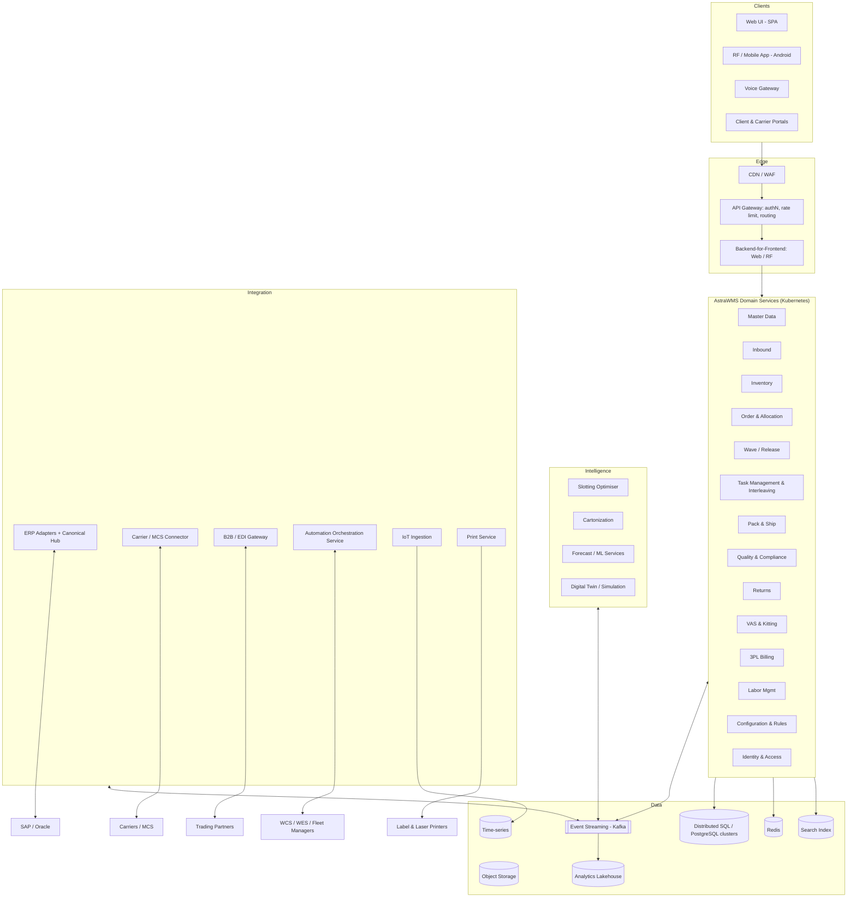
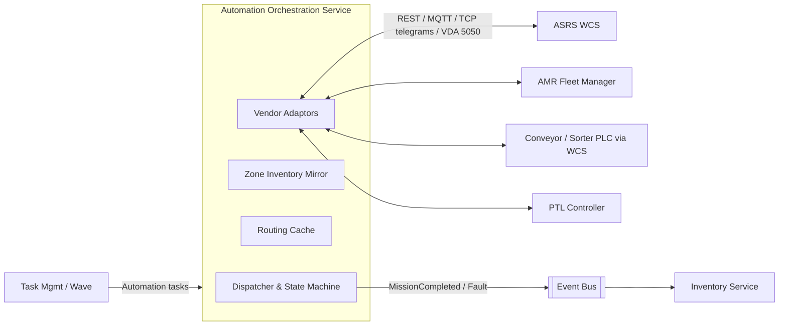
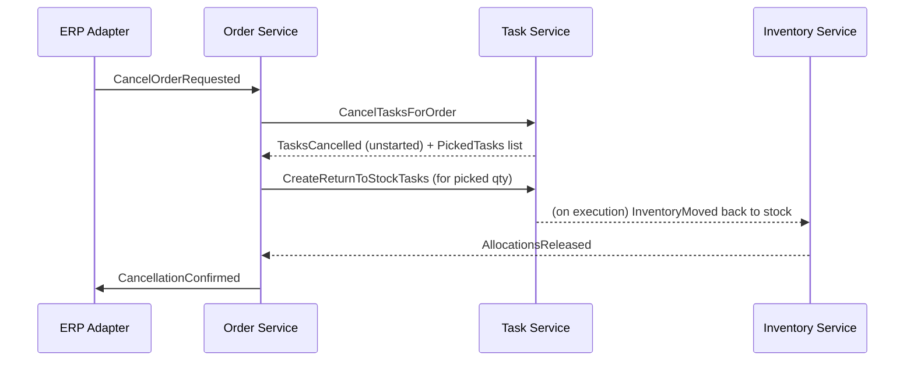

# F — System Architecture

---

## F.1 High-Level Architecture



**Architectural principles**

1. **Domain-driven, service-per-bounded-context.** Each service owns its data. There are no cross-service joins, and integration happens through APIs and events.
2. **Event-driven core.** State changes emit domain events through a transactional outbox. Consumers are idempotent.
3. **Consistency where it matters.** Inventory mutations and task confirmations are strongly consistent (ACID within the inventory service). Cross-domain flows are eventually consistent through sagas.
4. **Cloud-native, cloud-portable.** Kubernetes, managed PostgreSQL-compatible database, and Kafka-compatible streaming. The platform can deploy on AWS, Azure, or GCP. A single-tenant/private-cloud option uses the same artifacts.
5. **Edge where latency is physical.** Sorter routing and automation continuity run in an optional site edge cluster.

---

## F.2 Module (Service) Breakdown

| Service | Bounded Context | Owns (data) | Key APIs / Events |
|---|---|---|---|
| Master Data | Items, UoM, partners, locations, equipment | item, item_site_profile, location, zone, partner | `ItemUpserted`, `LocationChanged` |
| Configuration & Rules | Rule tables, strategies, templates, UDF definitions | rule_set, strategy, template (versioned) | Rule evaluation SDK; `ConfigPublished` |
| Inbound | Appointments, expectations, receipts | appointment, receipt_expectation, receipt_txn | `ReceiptConfirmed`, `LpnReceived` |
| Inventory | Balances, LPNs, lots, serials, holds, counts | inventory, lpn, lot, serial, hold, inv_txn, count | `InventoryChanged`, `HoldPlaced`, `CountVarianceApproved` |
| Order & Allocation | Outbound orders, allocation | order, order_line, allocation | `OrderReceived`, `OrderAllocated`, `ShortAllocated` |
| Wave / Release | Wave planning, waveless controller | wave, release_plan | `WaveReleased` |
| Task Management | Tasks, work queues, interleaving, assignment | task, work_unit, queue, operator_state | `TaskCreated`, `TaskCompleted` |
| Pack & Ship | Pack, cartons, shipments, loads, manifests | carton, shipment, load, manifest | `CartonClosed`, `ShipmentConfirmed` |
| Quality & Compliance | Inspection plans, lots in QI, recall, DG rules, TOR | inspection, recall, dg_rules, excursion | `InspectionDecided`, `RecallInitiated` |
| Returns | RMA, grading, disposition | rma, return_unit | `ReturnDispositioned` |
| VAS & Kitting | Work orders, BOM execution | vas_order, kit_order, genealogy | `KitCompleted` |
| Billing (3PL) | Billable events, rating | billable_event, rate_card, invoice_batch | `BillableEventRated` |
| LMS | Standards, performance | labor_standard, labor_event, performance | `PerformanceUpdated` |
| Identity & Access | Users, roles, permissions, devices | user, role, permission, device | Token issuance via IdP federation |
| Integration Hub | ERP/EDI adapters, message store | message, mapping, error | Canonical messages |
| AOS | Automation adaptors | automation_command, zone_inventory_map | `MissionCompleted`, `DivertConfirmed` |
| Print | Templates, printers, jobs | label_template, printer, print_job | `PrintJobCompleted` |

---

## F.3 Integration Layer Design

See §D for business flows. Technical design:

| Component | Design |
|---|---|
| Adapter runtime | Separate deployable per ERP family (`adapter-sap`, `adapter-oracle-ebs`, `adapter-oracle-fusion`, `adapter-edi`). Stateless, horizontally scaled |
| Mapping | Declarative mappings (JSONata / XSLT for IDoc-XML), versioned with the canonical schema version; unit-tested with golden files |
| Inbound path | Endpoint → schema validation → persist raw message (message store) → dedupe (inbox) → map → publish canonical command to Kafka topic partitioned by business key → domain service consumes |
| Outbound path | Domain event (outbox) → Kafka → adapter consumes → map → call ERP (with retry policy) → persist response → emit `ErpPostingSucceeded/Failed` |
| Retry | Per-interface policy: max attempts, backoff, circuit breaker per ERP endpoint (open after 50% failures in 60 s window; half-open probes) |
| Throttling | Token bucket toward ERP to protect ERP work processes (e.g., ≤ 20 concurrent RFC calls, configurable) |
| Monitoring | Metrics per interface (throughput, latency, error rate), traces linking WMS transaction → Kafka → adapter → ERP call |

---

## F.4 Database Model Overview

### F.4.1 Storage Technologies

| Store | Purpose |
|---|---|
| Distributed SQL / PostgreSQL (per service schema) | Transactional data (OLTP), row-level security by tenant |
| Redis | Session state, task queue caches, routing caches, rate limits, distributed locks with fencing tokens |
| Kafka | Domain events, integration commands, CDC to analytics |
| Time-series DB | IoT sensor data, equipment telemetry |
| Object storage | Documents, labels (PDF/ZPL archive), photos, CV frames, message archives |
| Search index (OpenSearch) | Full-text and faceted search across orders, LPNs, messages |
| Lakehouse (Delta/Iceberg) | Analytics, ML features, historical reporting |

### F.4.2 Core Logical Entities (Inventory & Execution)

```mermaid
erDiagram
  SITE ||--o{ ZONE : contains
  ZONE ||--o{ LOCATION : contains
  OWNER ||--o{ ITEM : owns
  ITEM ||--o{ ITEM_UOM : has
  ITEM ||--o{ LOT : has
  LOT ||--o{ SERIAL : has
  LOCATION ||--o{ LPN : holds
  LPN ||--o{ LPN : nests
  LPN ||--o{ INVENTORY : contains
  ITEM ||--o{ INVENTORY : "is stocked as"
  LOT ||--o{ INVENTORY : qualifies
  INVENTORY ||--o{ INV_TXN : "changed by"
  ORDER ||--o{ ORDER_LINE : has
  ORDER_LINE ||--o{ ALLOCATION : "reserved by"
  ALLOCATION }o--|| INVENTORY : reserves
  ALLOCATION ||--o{ TASK : "executed by"
  TASK }o--|| LOCATION : from
  TASK }o--|| LOCATION : to
  WAVE ||--o{ ORDER : includes
  SHIPMENT ||--o{ CARTON : contains
  CARTON ||--o{ CARTON_LINE : contains
  RECEIPT_EXPECTATION ||--o{ RECEIPT_LINE : has
  RECEIPT_LINE ||--o{ INV_TXN : "results in"
```

### F.4.3 Key Design Decisions

| Decision | Rationale |
|---|---|
| Inventory balance table keyed by (tenant, site, owner, item, lot, serial?, status, lpn, location) + immutable `inv_txn` ledger | Fast availability queries; auditability; ledger enables point-in-time reconstruction |
| Serials as separate table for high-volume serialized goods; inventory rows aggregate qty | Avoids one row per unit in balance table for non-serial goods; still supports unit-level traceability |
| Allocation as separate reservation records (not qty fields only) | Explainability and precise de-allocation |
| Optimistic concurrency (version columns) + short row locks on inventory rows during confirm | High concurrency without deadlocks; retries on conflict |
| Partitioning by site and time (transaction tables monthly partitions) | Scale, archive, and purge efficiency |
| Multi-tenant row-level security + tenant-scoped connection context | Isolation enforced in DB, not only app |
| UDFs stored as typed JSONB with generated indexes for registered searchable fields | Extensibility without DDL per customer |

---

## F.5 Microservices vs. Modular Architecture

AstraWMS uses **coarse-grained microservices aligned to bounded contexts** (≈ 15–20 deployables), not fine-grained nano-services.

| Concern | Approach |
|---|---|
| Transactions spanning services (e.g., pick confirm updates inventory and task) | Inventory and Task are separate services with **Inventory as the authority**. Pick confirmation is a command to Inventory (strong consistency on stock); Task consumes `InventoryChanged` to close the task, and a saga compensates on failure. For latency-critical RF steps, the RF BFF orchestrates synchronously: `Inventory.confirmMove` → `Task.complete` with idempotency keys. |
| Shared libraries | Rule engine SDK, canonical schemas, observability, security, all as versioned libraries |
| Deployment | Independent CI/CD per service; contract tests guard APIs and events |
| Data | Database-per-service (schema-per-service on shared clusters for small tenants; separate clusters for large) |
| When modular monolith is used | Single-tenant on-prem/edge distribution packages multiple services into one runtime for small sites (same code, different packaging) |

---

## F.6 RF / Mobile Architecture

| Layer | Design |
|---|---|
| Devices | Rugged Android (Zebra, Honeywell, Datalogic) Android 11+; wearables (ring scanners, wrist-mounted); vehicle-mount computers; tablets for pack/VAS |
| App | Native Android app (Kotlin) with **server-driven UI flows**: the flow engine sends screen definitions (step, prompts, validations, allowed actions); the device renders and captures. New flows/config changes require no app release |
| Scanning | Vendor SDK integration (Zebra DataWedge / EMDK, Honeywell SDK) for 1D/2D, GS1 AI parsing on device and server; camera scanning fallback; RFID sled support |
| Session | Stateless server with flow state stored in Redis keyed by device session; resumable after device swap or reboot |
| Offline | Local queue (SQLite, encrypted) for confirm operations in whitelisted flows; cached task list and location/item validation data for the current work unit; conflict resolution on sync (server authoritative; conflicts → exception task) |
| Communication | HTTPS/2 with persistent connections; payload compression; push via WebSocket/SSE for task assignment and alerts |
| Printing | Mobile printers via Bluetooth/Wi-Fi (ZPL), or print service routing to nearest station printer |
| Device management | MDM (enrolment, app deployment, kiosk mode, certificate provisioning); device health telemetry (battery, Wi-Fi RSSI, scan counts) |
| Legacy | Telnet/VT220 emulation not supported; browser-based RF (PWA) available as fallback for non-Android devices |

---

## F.7 Automation Orchestration Layer



| Element | Function |
|---|---|
| Canonical automation commands | `Store`, `Retrieve`, `Transport(from,to)`, `Route(container)`, `Pick@Station`, `Light(position,qty)`, `Cancel`, `Reprioritise` |
| State machine per command | `CREATED → SENT → ACKED → IN_PROGRESS → COMPLETED / FAILED / CANCELLED`, with timeouts per state |
| Zone inventory mirror | LPN ↔ automation zone mapping; periodic reconciliation with WCS slot map |
| Routing cache | Precomputed container → destination map pushed to edge; answers sorter requests without DB hops |
| Capacity model | Station throughput, robot availability, buffer occupancy published for waveless throttling |
| Edge deployment | AOS + routing cache deployable on site edge cluster for WAN independence (NFR-027) |

---

## F.8 Event-Driven Messaging Design

### F.8.1 Topic Design

| Topic (pattern) | Key | Producers | Consumers | Retention |
|---|---|---|---|---|
| `wms.<tenant>.inventory.events.v1` | site:item | Inventory | Allocation, Replenishment, Analytics, Integration | 7 days + compacted snapshot topic |
| `wms.<tenant>.task.events.v1` | site:task_id | Task Mgmt | LMS, Dashboards, AOS | 7 days |
| `wms.<tenant>.order.events.v1` | site:order_id | Order | Wave, Integration, Portals | 14 days |
| `wms.<tenant>.shipment.events.v1` | site:shipment_id | Pack & Ship | Integration, Billing, EDI | 14 days |
| `wms.<tenant>.integration.inbound.<object>.v1` | business key | Adapters | Domain services | 7 days |
| `wms.<tenant>.automation.events.v1` | site:command_id | AOS | Task, Inventory | 3 days |
| `wms.<tenant>.iot.alerts.v1` | site:zone | IoT rules | QMS, Alerts | 30 days |
| `*.dlq` | same | Consumers | Ops tooling | 30 days |

### F.8.2 Event Standard

- **CloudEvents 1.0** envelope (`id`, `source`, `type`, `subject`, `time`, `datacontenttype`), plus extensions `tenantid`, `siteid`, `correlationid`, `causationid`.
- Schema Registry (Avro or JSON Schema) with **backward compatibility** enforcement.
- Events are **facts** in the past tense (`InventoryMoved`, not `MoveInventory`). Commands use dedicated command topics or direct APIs.
- **Ordering** is guaranteed per partition key only. Consumers are designed for at-least-once delivery (idempotent handlers use a processed-event table with TTL).
- **Outbox pattern**: the domain change and the outbox row are written in one DB transaction. A relay (CDC via Debezium, or a poller) publishes to Kafka.

### F.8.3 Example Saga: Order Cancellation After Release



---

## F.9 Deployment Topology

| Environment | Purpose | Data |
|---|---|---|
| DEV | Build & unit/integration tests | Synthetic |
| SIT | System integration with ERP QA/sandbox | Masked copy / synthetic |
| UAT | Business acceptance, performance baseline | Masked production-like |
| PERF | Load & soak tests at reference load | Scaled synthetic |
| TRAINING | Training with resettable scenarios | Synthetic |
| PROD | Production (multi-AZ) | Live |
| DR | Warm standby region | Replicated |

Infrastructure is managed as code (Terraform + Helm/Argo CD, GitOps). Secrets live in the vault, and policy-as-code (OPA/Gatekeeper) is enforced at admission.
