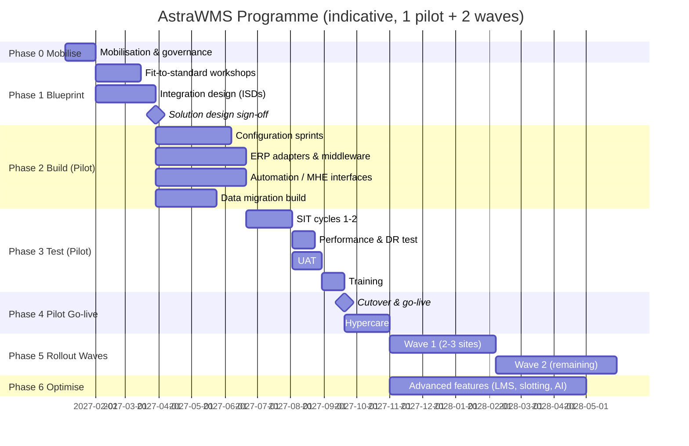

# I — Implementation Roadmap

---

## I.1 Phased Rollout Plan

### I.1.1 Delivery Approach

The approach is a hybrid. Blueprint and fit-to-standard workshops run in a **stage-gated** way. Configuration, extensions, and integrations are built in **agile sprints** (2 weeks). Sites go live through **pilot-then-wave** deployment. Big-bang cutover per site is the default, because running WMS and legacy in parallel at the same site creates stock-control risk. A process-phased go-live within a site (e.g., inbound first) is not recommended.

### I.1.2 Phases

| Phase | Objectives | Key Deliverables | Exit Criteria (Gate) |
|---|---|---|---|
| **0 Mobilise** | Governance, team, environments, tooling | Charter, RACI, integrated plan, RAID log, environments DEV/SIT provisioned, ERP sandbox access | Steering committee approval |
| **1 Blueprint** | Fit-to-standard per process (§B), gaps identified, integration and data design | Process design documents (PDD) per process area, gap register with disposition (config / extension / process change / reject), ISDs per interface ID, data migration strategy, test strategy, cutover strategy, site readiness assessment (Wi-Fi survey, printers, devices) | ≤ 10% of requirements as extensions; all M-priority requirements mapped; design sign-off by process owners and architecture board |
| **2 Build** | Configure pilot site; build integrations, extensions, labels, reports; MHE interfaces | Configured tenant (versioned config package), adapters with unit tests, label templates, reports, data migration scripts with mock loads (≥ 2) | Unit tests passed; code/config reviews complete; mock load 2 reconciles 100% |
| **3 Test** | Validate end-to-end with ERP, MHE, carriers, performance, DR | SIT reports, performance test report, DR test report, UAT sign-off, training materials | Zero open Sev-1/Sev-2 defects; Sev-3 with approved workarounds; performance SLAs met at 1.5× pilot peak |
| **4 Pilot Go-live** | Cutover and stabilise pilot | Cutover runbook executed, go-live decision record, hypercare reports | Hypercare exit criteria (I.4.3) |
| **5 Rollout waves** | Template-based deployment to remaining sites | Site localisation delta designs, site-specific testing, training, cutover | Per-site gates (same as pilot, reduced scope) |
| **6 Optimise** | Advanced capabilities, continuous improvement | LMS standards rollout, slotting programme, waveless tuning, AI models in production, digital twin | Benefits tracking vs business case |

### I.1.3 Capability Release Plan

| Release | Scope |
|---|---|
| R1 (Pilot) | §1–§9 core processes, §12 quality (basic), cold chain basics, SAP **or** Oracle integration for the pilot ERP, carrier/MCS, printing, core dashboards, reconciliation |
| R2 (Wave 1) | 3PL multi-owner & billing (if applicable), VAS, kitting, returns advanced disposition, full HazMat, automation (ASRS/AMR/sorter) for automated sites |
| R3 (Wave 2 + Optimise) | LMS engineered standards, slotting optimiser, advanced cartonization, waveless, IoT, AI forecasting, digital twin, computer vision pilots |

### I.1.4 Governance & RACI (summary)

| Activity | Business Process Owner | Customer IT (ERP) | Integrator / Vendor | PMO |
|---|---|---|---|---|
| Process design | A | C | R | I |
| ERP-side interface build | C | R/A | C | I |
| WMS configuration | C | I | R/A | I |
| Data migration (extract/cleanse) | A | R | C | I |
| Data migration (transform/load) | C | C | R | A |
| Testing (SIT) | C | R | R | A |
| UAT | R/A | C | C | I |
| Training delivery | A | I | R | I |
| Go-live decision | A (Sponsor) | C | C | R |

---

## I.2 Testing Strategy

| Test Type | Scope | Environment | Entry / Exit | Owner |
|---|---|---|---|---|
| Unit | Services, mappings, rules, extensions | DEV | Code coverage ≥ 80% for custom code; mapping golden files 100% pass | Vendor |
| Configuration verification | Each configured rule set tested via the rule test harness | DEV/SIT | All rule scenarios in the PDD pass | Vendor + BPO |
| Integration (component) | Each interface ID with the ERP sandbox: positive, negative, error, idempotency, ordering | SIT | Every ISD test case passed; error handling demonstrated | Vendor + ERP team |
| System Integration Test (SIT) | End-to-end scenarios across ERP ↔ WMS ↔ MHE ↔ carriers (≥ 2 cycles) | SIT | Scenario catalogue 100% executed; ≥ 95% passed in cycle 1; 100% in cycle 2 | Test lead |
| Data migration test | Mock loads with reconciliation (counts, qty, value by SLoc/material/batch) | SIT/UAT | 100% reconciliation on mock 2 and dress rehearsal | Data lead |
| Performance | Load (reference peak × 1.5), stress (to break point), soak (24 h), spike | PERF | NFR E.2 SLAs met; no memory/connection leaks in soak | Performance lead |
| Resilience / DR | AZ failure, service kill (chaos), ERP outage (store-and-forward), region failover | PERF/DR | RTO/RPO met; no data loss; queued confirmations drain successfully | Platform lead |
| Security | SAST/DAST, pen test, RBAC/SoD verification, tenant isolation tests | UAT | No critical/high findings open | Security |
| Automation / MHE | Emulator-based testing (WCS emulator), then on-site commissioning tests (FAT/SAT) | SIT + site | Throughput rates achieved in SAT; fault scenarios tested | MHE vendor + integrator |
| Device & RF | Device models, Wi-Fi roaming, scanners on actual labels, printers | Site | Label scan first-pass rate ≥ 99%; roaming without session loss | Site IT |
| UAT | Business scenarios by real users, including exceptions (all exception codes in §B) | UAT | Sign-off by BPOs; Sev-1/2 defects = 0 | BPOs |
| Day-in-the-life (DILO) / volume rehearsal | Full-shift simulation on site with real devices, test inventory, realistic volume | UAT/site | Operators complete tasks at ≥ 70% of target rates; no blocking issues | Site ops |
| Regulated validation (if applicable) | IQ/OQ/PQ with traceability matrix, Part 11 controls | Validation env | Validation summary report approved by QA | QA |
| Regression (automated) | Critical-path API/UI suite for each release | CI + UAT | 100% pass before promotion | Vendor |

**Scenario coverage principle:** every requirement ID and every exception code in this document maps to at least one test case in the Requirements Traceability Matrix (RTM).

**Defect severity**

| Severity | Definition | Go-live Tolerance |
|---|---|---|
| Sev-1 | Blocks a core process with no workaround; data corruption; systemic ERP posting failure | 0 |
| Sev-2 | Major function impaired; workaround costly or risky | 0 |
| Sev-3 | Function impaired, acceptable workaround | ≤ agreed number, with fix plan |
| Sev-4 | Cosmetic | Any |

---

## I.3 Training & Change Management

### I.3.1 Change Impact & Stakeholders

- A **change impact assessment** per role (from the §B user roles) covers what changes, the degree of impact (high/medium/low), and the readiness actions.
- Engagement: a site **Change Champions** network (1 per 25 operators per shift), works council / union consultation (LMS, CV, RTLS), and regular townhalls.
- Communication plan: awareness → understanding → readiness → go-live → reinforcement.

### I.3.2 Training Programme

| Audience | Format | Duration | Content | Assessment |
|---|---|---|---|---|
| Operators (RF/voice) | Hands-on in the training environment + floor practice with test stock | 4–8 h per role | Role flows, scanning discipline, exceptions, safety | Practical proficiency check (complete N tasks error-free) |
| Supervisors | Classroom + sandbox | 3 days | Queues, task management, exception resolution, dashboards, approvals | Scenario-based test |
| Inventory control / planners | Classroom + sandbox | 3–5 days | Inventory functions, counts, reconciliation, wave planning | Scenario-based test |
| Super-users | Train-the-trainer + configuration basics | 2 weeks | All of the above + troubleshooting, rule testing | Certification |
| Solution admins | Vendor admin academy | 2–3 weeks | Configuration, rules, flows, labels, integration monitor | Certification |
| Integration support (IT) | Workshop | 3 days | Message monitoring, error resolution, reconciliation, ERP-side checks | Runbook walkthrough |
| Finance | Briefing | 0.5 day | Reconciliation, period-end procedures | — |

Training materials: role-based job aids (1-page laminated RF guides), video micro-lessons (≤ 3 min), an in-app guided walkthrough, and a sandbox with daily data reset. Readiness criterion: ≥ 95% of go-live users are certified on their role before cutover.

---

## I.4 Go-Live & Hypercare Plan

### I.4.1 Cutover Strategy

A weekend cutover per site, with a reduced-operations window of 24–48 h.

| T-minus | Activity |
|---|---|
| T-8 weeks | Cutover plan & runbook v1; dress rehearsal #1 (full data migration + reconciliation, timed) |
| T-4 weeks | Dress rehearsal #2; go/no-go criteria agreed; communication to carriers, customers, and vendors (appointment and label changes) |
| T-2 weeks | Master data freeze (changes only through a controlled process); location labelling complete and scan-verified; devices and printers deployed |
| T-1 week | Inbound slowdown (limit receipts from T-2 days), outbound pull-forward; open orders minimised; cycle counts on high-value/A items |
| T-48 h | Legacy stops receiving new tasks; in-flight work completed; shipments closed |
| T-24 h | **Physical inventory / wall-to-wall count** (or a high-accuracy baseline plus targeted counts); legacy freeze |
| T-12 h | Static data is already in the PROD config (locations, rules). Load inventory (LPN/location/lot/serial/status) from the count result. Load open orders from the ERP (SAP: re-send deliveries; Oracle: re-send shipment requests). |
| T-6 h | **Reconciliation**: WMS inventory vs ERP stock by plant/SLoc/material/batch/stock type = 0 variance (or approved adjustments posted in the ERP) |
| T-4 h | Technical smoke test in PROD: receipt, putaway, pick, pack, and ship confirm to the ERP with real documents (test orders then cancelled/reversed per plan) |
| T-0 | **Go/No-Go** decision |
| T+0 | Go-live with a controlled ramp (e.g., 50% volume on day 1, 75% on day 2, 100% by day 5) |

**Go/No-Go criteria:** inventory reconciled (0 unexplained variance), all interfaces green on the smoke test, Sev-1/2 defects = 0, trained staff ≥ 95%, devices and printers 100% operational, rollback plan confirmed.

**Rollback plan:** a rollback decision point before T+8 h. Legacy data is kept frozen but intact. The ERP storage location assignment can be reverted. Transactions performed in AstraWMS before the rollback are replayed into legacy from the transaction log (scripted).

### I.4.2 Hypercare Organisation

| Element | Specification |
|---|---|
| Duration | 4–6 weeks per site (pilot: 6 weeks) |
| Command centre | On-site war room (first 2 weeks, 24×7 across shifts), then remote |
| Staffing | Floor-walkers (1 per 20 operators in the first week), super-users per shift, solution architects, integration support, ERP team, MHE vendor on call |
| Daily cadence | Shift handover stand-ups; 08:00 daily war-room review (KPIs, open issues, ERP posting backlog, reconciliation) |
| Issue management | Single triage queue; severity-based SLAs (Sev-1: response 15 min, workaround 2 h) |
| Monitoring | Hypercare dashboard: throughput vs plan, SLA adherence, error queue, reconciliation variance, user issues by process |

### I.4.3 Hypercare Exit Criteria

| KPI | Target to Exit Hypercare |
|---|---|
| Throughput vs pre-go-live baseline | ≥ 100% for 10 consecutive working days |
| Pick accuracy | ≥ baseline and ≥ 99.8% |
| Inventory reconciliation variance | 0 unexplained for 10 consecutive days |
| Integration error backlog | Oldest error < 4 h; no systemic errors |
| Open Sev-1/Sev-2 | 0 |
| Support ticket trend | Declining for 3 consecutive weeks |

Handover also requires the following. Knowledge transfer to steady-state support is complete: L1 is site super-users, L2 is customer application support, and L3 is the vendor. The runbooks are updated. The lessons learned are documented and fed into the rollout template.

---

## I.5 Post-Go-Live Optimisation

| Horizon | Initiative | Measure |
|---|---|---|
| 0–3 months | Rule tuning (allocation, putaway, replenishment min/max), label/scan fixes, RF flow simplification from user feedback | Short picks ↓, travel per line ↓, operator scan errors ↓ |
| 3–6 months | LMS engineered standards rollout and coaching; first slotting optimisation cycle | Performance to standard ≥ 90%; travel distance per line −10% |
| 6–12 months | Waveless release for e-commerce; cartonization tuning; predictive replenishment; digital twin for peak planning | Cut-off adherence ≥ 99.5%; carton fill rate ↑; peak staffing accuracy ±5% |
| 12+ months | AI forecasting in labor planning, CV pilots (cycle count, dock), automation expansion evaluated in the twin | Cost per unit ↓ year-on-year; count labor ↓ |

**Continuous improvement governance:** a monthly performance review against the business case (benefits register), a quarterly roadmap review with the vendor, a release adoption plan for new features (feature-flag evaluation in UAT), and an annual re-assessment of the configuration against the evolving process standard.
